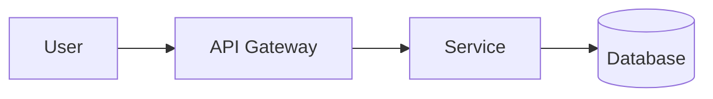

# PIMPyourDocs Principles

*A deeper exploration of why this matters*

---

## The Ownership Problem

Let's be honest about what "cloud documentation" actually means:

```
Your Knowledge → Their Servers → Their Format → Their Terms → Their Price
```

You're not storing documentation. You're paying someone to hold your institutional knowledge hostage.

### The True Cost of "Free" Platforms

When you use Notion, Confluence, or Google Docs:

1. **Your data trains their models** — That proprietary process you documented? It's training data now.
2. **Your export is degraded** — They make it easy to import, hard to export. By design.
3. **Your availability depends on their uptime** — Production incident at 3am? Hope their status page is green.
4. **Your access is a subscription** — Stop paying, lose access. Not to the software—to your own documentation.

### The Alternative

```
Your Knowledge → Your Git Repo → Plain Text → Your Terms → Free Forever
```

---

## Spec as Code: A Paradigm Shift

### Traditional Documentation

```
Reality → Documentation
```

You observe what exists and write it down. The documentation is downstream of reality. When reality changes, documentation becomes a lie—until someone remembers to update it.

**This is backwards.**

### Specification-First Documentation

```
Documentation → Reality
```

Documentation defines what should exist. Reality is downstream of the spec. When reality doesn't match the spec, reality is wrong—and automated tests should catch it.

**Examples:**

| Traditional | Spec-First |
|------------|------------|
| "The API returns JSON" | "The API MUST return JSON" |
| "We use PostgreSQL 14" | "Services MUST use PostgreSQL 14.x" |
| "Requests are authenticated" | "All requests MUST include a valid JWT" |

### Making it Testable

The spec becomes a contract that can be verified:

```markdown
## API Requirements

1. The `/health` endpoint MUST return HTTP 200 when healthy
2. Response time MUST be under 100ms at p99
3. Response body MUST match schema: `{"status": "healthy"}`
```

This can be converted to automated tests:

```python
def test_health_endpoint():
    response = client.get("/health")
    assert response.status_code == 200
    assert response.elapsed.total_seconds() < 0.1
    assert response.json() == {"status": "healthy"}
```

**The documentation IS the test spec.**

---

## Why Markdown Won

### The Format Wars Are Over

Every few years, someone invents a new documentation format:

- reStructuredText (2002)
- AsciiDoc (2002)
- Textile (2004)
- Org-mode (2003)
- MDX (2018)
- Countless proprietary formats

**Markdown won anyway.**

Not because it's the most powerful. Not because it's the most elegant. But because:

1. **It's readable raw** — No tooling required to understand it
2. **It's writable anywhere** — Any text editor works
3. **It's "good enough"** — 90% of documentation needs, 10% of the complexity
4. **It's everywhere** — GitHub, GitLab, Reddit, Discord, Slack, every dev tool

### The Network Effect

When GitHub made Markdown the default for README files, the war ended. Every developer now knows Markdown. Every tool supports it. Every platform renders it.

Switching costs are nearly zero. Migration is trivial. Portability is guaranteed.

**This is the definition of a won standard.**

---

## The AI Imperative

### Everything Becomes Plain Text

When you feed documentation to an LLM:

```
Confluence Page
     ↓
HTML Extraction
     ↓
Text Normalization
     ↓
Token Embedding
     ↓
Plain Text Vector
```

Your formatting is stripped. Your interactive elements are lost. Your carefully designed layouts are flattened into a stream of tokens.

**The LLM sees plain text. Always.**

### Markdown is Pre-Normalized Text

When you write in Markdown:

```
Markdown File
     ↓
Token Embedding
     ↓
Plain Text Vector (with semantic hints intact)
```

The semantic structure survives: headings, lists, code blocks, emphasis. The LLM gets better signal with less processing.

### RAG-Optimized Documentation

For Retrieval Augmented Generation, Markdown is ideal:

- **Chunking is natural** — Headings provide semantic boundaries
- **Context is preserved** — Structure survives embedding
- **Retrieval is accurate** — Clean text = better matches
- **Generation is faithful** — Less hallucination from format noise

**If your documentation is going to an AI anyway, write it in the format AI understands best.**

---

## Diagrams as Code: Why Mermaid

### The Problem with Images

```
architect draws diagram
     ↓
exports PNG
     ↓
uploads to wiki
     ↓
system changes
     ↓
diagram is wrong
     ↓
nobody knows source file location
     ↓
diagram stays wrong forever
```

### The Mermaid Solution

```
write diagram in markdown
     ↓
commit to repo
     ↓
renders automatically
     ↓
system changes
     ↓
update diagram in PR
     ↓
review diff
     ↓
diagram is correct
```

### Key Benefits

1. **Version controlled** — See exactly what changed and when
2. **Diff-able** — Code review for diagrams
3. **No binary blobs** — Clean git history
4. **Renders anywhere** — GitHub, GitLab, VS Code, Obsidian, etc.
5. **AI-parseable** — LLMs can read and generate Mermaid

### Example: Same Diagram, Different Approaches

**Traditional (image file):**
- `architecture.png` — What tool made this? Where's the source?
- Can't see what changed in the diff
- Can't search for components
- Can't generate programmatically

**Mermaid:**

- Readable in raw markdown
- Diffable in PR
- Searchable by component name
- Can be generated by AI

---

## Privacy by Design

### Client-Side Rendering

PIMPyourDocs documents render locally. No server required. No telemetry. No "analytics" on your internal documentation.

```
Your Markdown → Local Renderer → Your Eyes Only
```

### No Cloud Sync

Your `.md` files stay on your filesystem. In your git repo. On your infrastructure.

Not someone else's S3 bucket. Not "encrypted at rest" on servers you don't control. Not subject to someone else's data retention policy.

### Compliance Without Complexity

When auditors ask "where is your documentation stored?":

- **Cloud docs:** "On [vendor]'s servers, in [region], subject to their DPA, BAA, and terms of service which we reviewed on [date]..."
- **PIMPyourDocs:** "In our git repository, on our infrastructure."

---

## The Portability Promise

### Platform Migration Should Be Trivial

```bash
# From GitHub to GitLab
git remote set-url origin git@gitlab.com:org/docs.git
git push

# That's it. You're done.
```

### Rendering Platform Migration

| From | To | Effort |
|------|-----|--------|
| GitHub | GitLab | Zero |
| GitLab | Gitea | Zero |
| Any Git Host | MkDocs | Add config file |
| Any Git Host | Docusaurus | Add config file |
| Any Git Host | Obsidian | Open folder |

### The Litmus Test

**Can you switch platforms in under an hour?**

- Confluence → GitLab: Days of export/cleanup
- Notion → Anywhere: Hours of format fixing
- Google Docs → Anywhere: Manual reformatting

- **PIMPyourDocs → Anywhere: Minutes**

---

## Implementation Philosophy

### Start Simple

Don't over-engineer. A single `README.md` that follows these principles is better than an elaborate documentation system nobody uses.

### Grow Organically

Add structure as needed:

```
Week 1:  README.md
Week 4:  README.md + docs/architecture.md
Month 3: docs/ folder with structure
Month 6: Full template usage
```

### Automate Gradually

1. Start with manual compliance
2. Add link checking in CI
3. Add staleness detection
4. Add diagram validation
5. Add spec testing

### Perfection is the Enemy

A good-enough document committed today beats a perfect document planned for next quarter.

---

*Documentation is a practice, not a product. Practice independently.*
