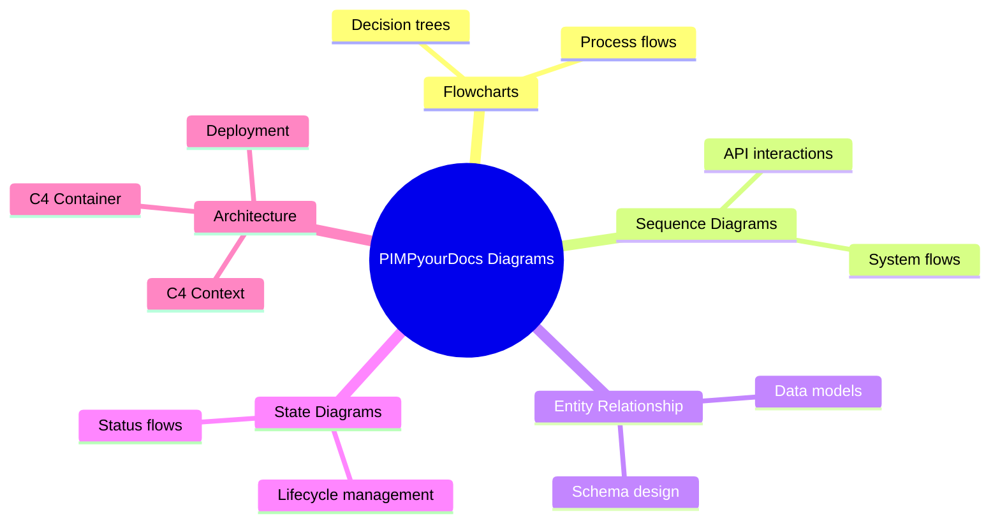
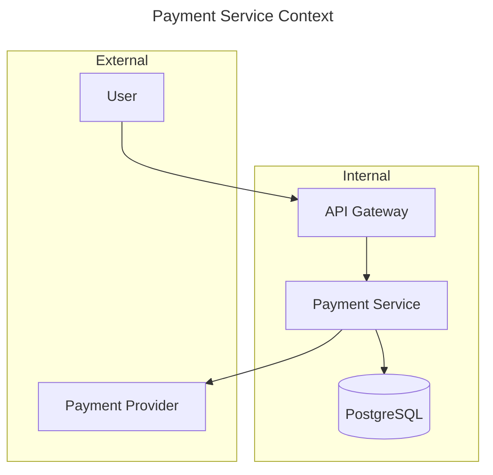
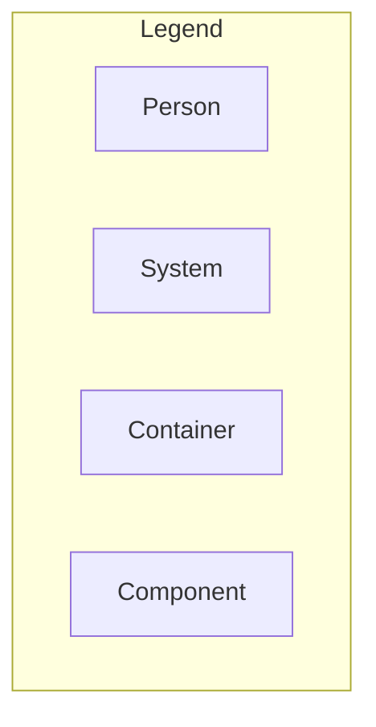

# PIMPyourDocs Specification

**Version:** 1.0.0  
**Status:** Living Document

---

## 1. Document Structure

### 1.1 File Naming

```
kebab-case-names.md
```

- Lowercase only
- Hyphens for spaces
- `.md` extension always
- No spaces, no underscores, no special characters

**Why:** Maximum filesystem compatibility. Works on case-sensitive and case-insensitive systems. URL-safe.

### 1.2 Directory Structure

```
docs/
├── index.md              # Entry point
├── architecture/         # System design & decisions
│   ├── index.md
│   └── decisions/        # ADRs live here
│       └── 0001-use-postgres.md
├── services/             # Per-service documentation
│   └── {service-name}/
│       ├── index.md
│       ├── api.md
│       └── runbook.md
├── operations/           # Operational documentation
│   ├── runbooks/
│   └── incidents/
└── guides/               # How-to guides
    └── ...
```

### 1.3 Required Front Matter

Every document MUST begin with a YAML front matter block:

```yaml
---
title: Document Title
status: draft | review | published | deprecated
owner: team-name or @username
created: YYYY-MM-DD
updated: YYYY-MM-DD
tags: [tag1, tag2]
---
```

**Why:** Machine-parseable metadata enables automation, search, and staleness detection.

---

## 2. Spec as Code

### 2.1 The Principle

Documentation describes the *intended state*—the specification—not the current state.

```
❌ "The service currently uses PostgreSQL 14"
✅ "The service MUST use PostgreSQL 14.x"
```

### 2.2 RFC 2119 Keywords

Use RFC 2119 keywords for requirements:

| Keyword | Meaning |
|---------|---------|
| MUST | Absolute requirement |
| MUST NOT | Absolute prohibition |
| SHOULD | Recommended, but exceptions exist |
| SHOULD NOT | Not recommended, but exceptions exist |
| MAY | Optional |

**Example:**

```markdown
## Authentication Requirements

- Clients MUST authenticate using OAuth 2.0
- Tokens SHOULD be refreshed before expiry
- Clients MAY cache tokens for up to 1 hour
```

### 2.3 Testable Documentation

Where possible, documentation should be testable:

```markdown
## API Contract

The `/health` endpoint MUST return:
- HTTP 200 when healthy
- Response time under 100ms
- JSON body: `{"status": "healthy"}`

<!-- test:api GET /health -->
```

These markers can be parsed by test harnesses to validate reality against spec.

### 2.4 Version Binding

Specifications should be version-bound:

```markdown
## Dependencies

| Component | Version | Constraint |
|-----------|---------|------------|
| PostgreSQL | 14.x | MUST match major version |
| Redis | 7.x | SHOULD use latest patch |
| Node.js | 20.x | MUST use LTS |
```

---

## 3. Diagrams as Code

### 3.1 Mermaid Only

All diagrams MUST be Mermaid. No external image files for architectural diagrams.

**Why:**

- Version controlled with the doc
- Diff-able
- No binary blobs in git
- Renders anywhere Mermaid is supported (GitHub, GitLab, VS Code, Obsidian, etc.)

### 3.2 Supported Diagram Types



### 3.3 Diagram Standards

Every diagram MUST have:

1. **A title** (using `---` config or comment)
2. **A legend** if symbols aren't self-explanatory
3. **Consistent styling** per type

**Example:**



**Source for above diagram:**

```text
flowchart TB
    subgraph External
        U[User]
        PS[Payment Provider]
    end
    
    subgraph Internal
        API[API Gateway]
        PAY[Payment Service]
        DB[(PostgreSQL)]
    end
    
    U --> API
    API --> PAY
    PAY --> PS
    PAY --> DB
```

### 3.4 C4 Model Support

For architecture diagrams, use C4 model conventions:



---

## 4. Linking & References

### 4.1 Internal Links

Use relative links only:

```markdown
✅ See [API documentation](./api.md)
✅ See [Architecture Decision](../architecture/decisions/0001-use-postgres.md)
❌ See [API documentation](/docs/services/payment/api.md)
❌ See [API documentation](https://wiki.company.com/docs/api)
```

**Why:** Relative links work regardless of where the docs are hosted.

### 4.2 Anchor Links

Use explicit anchors for section linking:

```markdown
## Authentication {#auth}

...

See [Authentication](#auth) for details.
```

### 4.3 External References

External references should use reference-style links:

```markdown
See the [PostgreSQL documentation][pg-docs] for details.

[pg-docs]: https://www.postgresql.org/docs/14/
```

**Why:** Centralizes external URLs for easier maintenance.

---

## 5. Code Examples

### 5.1 Language Tags

Always specify the language:

```python
def example():
    pass
```

Use the triple backtick syntax with language identifier: \`\`\`python

### 5.2 Runnable Examples

Prefer complete, runnable examples over snippets:

**❌ Bad — incomplete snippet:**

```python
response = client.get("/api/users")
```

**✅ Good — complete, runnable:**

```python
import httpx

client = httpx.Client(base_url="https://api.example.com")
response = client.get("/api/users")
print(response.json())
```

### 5.3 Configuration Examples

Configuration examples should be copy-pasteable with comments:

```yaml
# config.yaml
database:
  host: localhost      # MUST be resolvable hostname
  port: 5432           # Default PostgreSQL port
  name: myapp          # Database name
  pool_size: 10        # SHOULD be 2x CPU cores
```

---

## 6. Templates

### 6.1 Architecture Decision Record (ADR)

See [templates/ADR.md](./templates/ADR.md)

### 6.2 Service Documentation

See [templates/SERVICE.md](./templates/SERVICE.md)

### 6.3 Runbook

See [templates/RUNBOOK.md](./templates/RUNBOOK.md)

### 6.4 API Documentation

See [templates/API.md](./templates/API.md)

### 6.5 Incident Post-Mortem

See [templates/INCIDENT.md](./templates/INCIDENT.md)

---

## 7. Automation Hooks

### 7.1 Staleness Detection

Documents with `updated` front matter older than threshold trigger warnings:

```yaml
# .pimpyourdocs.yaml
staleness:
  warning_days: 90
  error_days: 180
  exclude:
    - "architecture/decisions/*"  # ADRs are immutable
```

### 7.2 Link Checking

All internal links MUST be validated in CI:

```yaml
# Example GitHub Action
- name: Check links
  uses: lycheeverse/lychee-action@v1
  with:
    args: --offline docs/
```

### 7.3 Diagram Validation

Mermaid diagrams should be validated:

```bash
npx @mermaid-js/mermaid-cli -i docs/ --validate
```

---

## 8. Rendering

### 8.1 Supported Renderers

PIMPyourDocs is designed to render correctly in:

- GitHub/GitLab native rendering
- VS Code with Markdown Preview
- Obsidian
- MkDocs / Material for MkDocs
- Docusaurus
- Any CommonMark-compliant renderer with Mermaid support

### 8.2 Local Rendering

For local preview:

```bash
# Simple option
npx serve docs/

# With Mermaid support
npx @mermaid-js/mermaid-cli serve docs/

# Full static site
mkdocs serve
```

### 8.3 No Renderer Lock-in

Documents MUST be readable and useful in raw form. Don't rely on renderer-specific features.

---

## 9. Migration Paths

### 9.1 From Confluence

```bash
# Export space as HTML
# Convert with pandoc
pandoc -f html -t markdown confluence-export.html -o output.md
```

### 9.2 From Notion

Use notion-to-md or official export → markdown.

### 9.3 From Google Docs

Export as .docx, convert with pandoc:

```bash
pandoc -f docx -t markdown document.docx -o output.md
```

---

## 10. Compliance Checklist

Before publishing, every document should pass:

- [ ] Has valid front matter
- [ ] Uses RFC 2119 keywords for requirements
- [ ] All diagrams are Mermaid (no image files)
- [ ] All links are relative
- [ ] Code blocks have language tags
- [ ] Readable in raw form
- [ ] Renders correctly in at least 2 different viewers

---

*This specification is itself a PIMPyourDocs document.*
