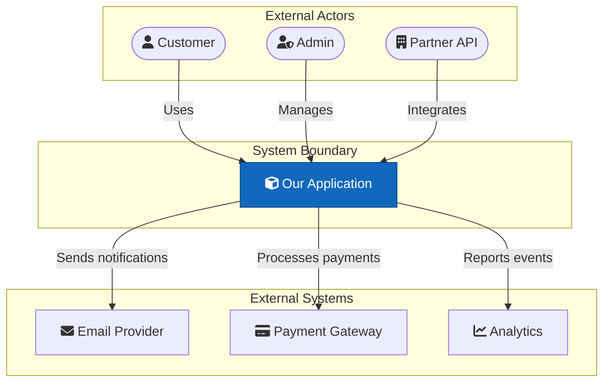
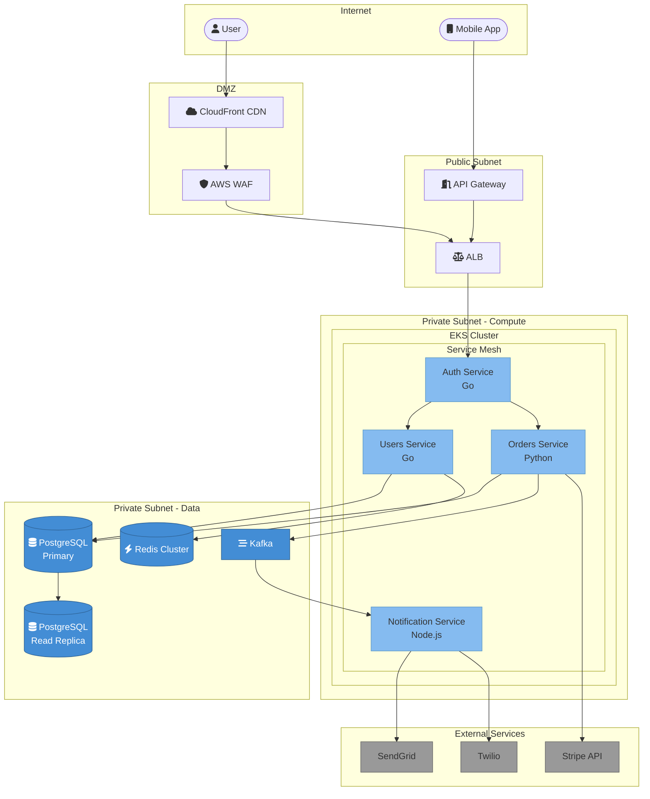
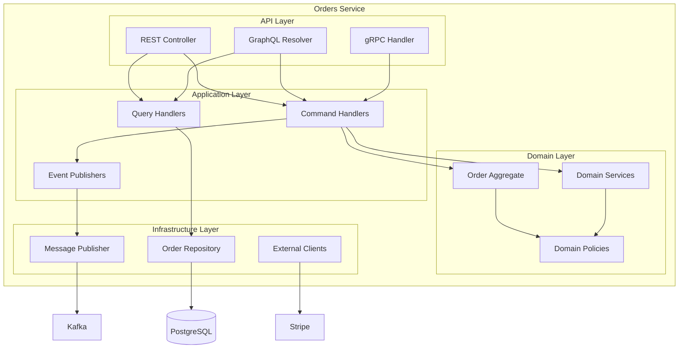
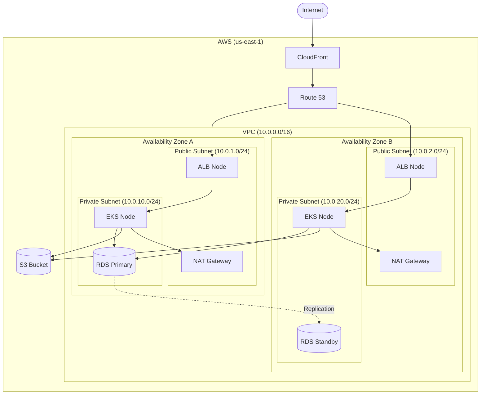
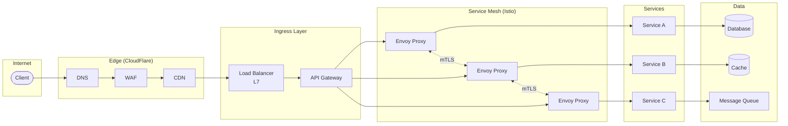
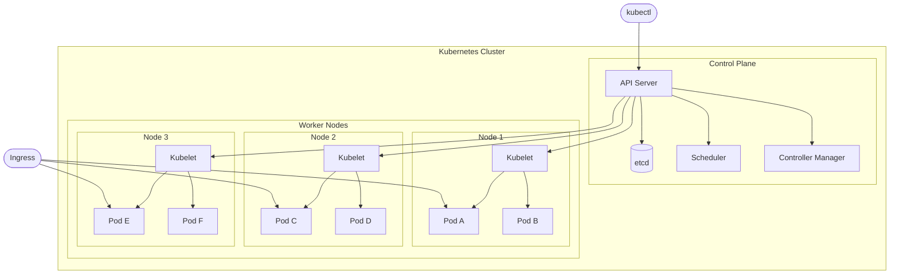

# Architecture Diagrams

---
title: "Architecture Diagrams (C4 Model)"
status: published
owner: "PIMPyourDocs"
created: 2024-01-15
updated: 2024-01-15
tags: [diagrams, mermaid, architecture, c4, deployment]
---

## Overview

Architecture diagrams show system structure at various levels of abstraction. PIMPyourDocs follows the **C4 Model** approach.

**Best for:**

- System context (who uses what)
- Container architecture (services, databases, queues)
- Deployment topology (infrastructure)
- Component diagrams (internal structure)

---

## C4 Model Hierarchy

| Level         | Shows                             | Audience   |
| ------------- | --------------------------------- | ---------- |
| **Context**   | System + external actors          | Everyone   |
| **Container** | Applications, databases, services | Technical  |
| **Component** | Internal modules                  | Developers |
| **Code**      | Classes, functions                | Developers |

**Rule:** Start at Context, zoom in only when needed.

---

## Level 1: System Context

Shows who uses the system and what external systems it integrates with.

---

## Level 2: Container Diagram

Shows the major containers (applications, services, databases) within the system.

---

## Level 3: Component Diagram

Shows the internal structure of a single container.

---

## Deployment Diagram

Shows infrastructure topology.

---

## Network Architecture

---

## Kubernetes Architecture

---

## Best Practices

1. **Start with Context** — Don't jump to component diagrams
2. **One level per diagram** — Don't mix abstraction levels
3. **Color by type** — Blue for compute, green for data, grey for external
4. **Show data flow direction** — Arrows indicate request direction
5. **Label technologies** — "Go", "PostgreSQL", "Kafka"
6. **Use icons sparingly** — Font Awesome icons help recognition
7. **Include legends** — Document your color scheme

---

## References

- [C4 Model](https://c4model.com/) — Official C4 documentation
- [arc42](https://arc42.org/) — Architecture documentation template
- [Mermaid Flowchart Docs](https://mermaid.js.org/syntax/flowchart.html) — For architecture diagrams
