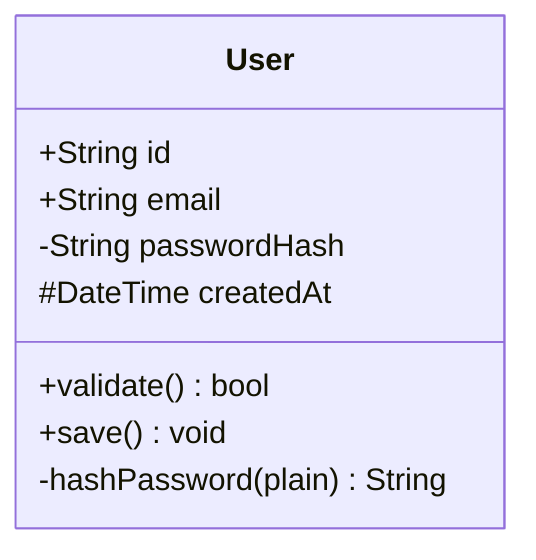
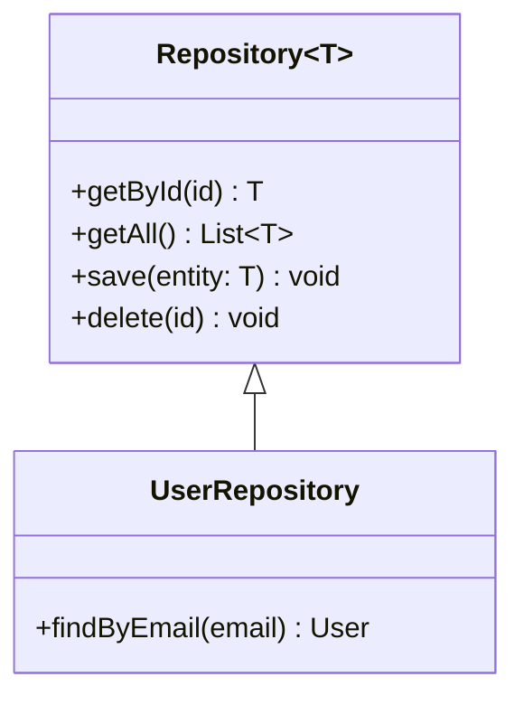
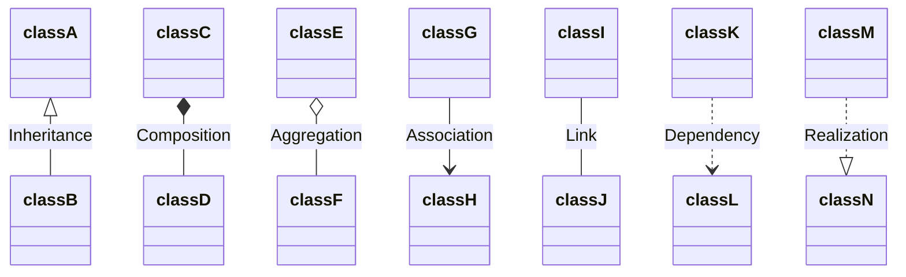
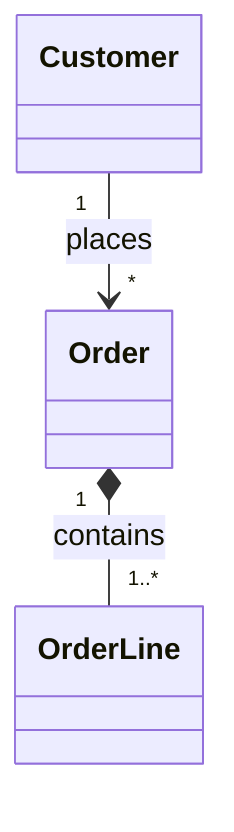
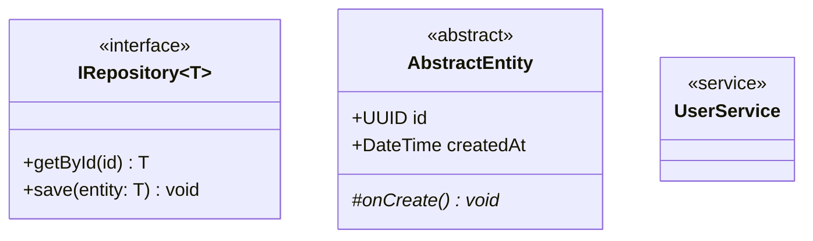
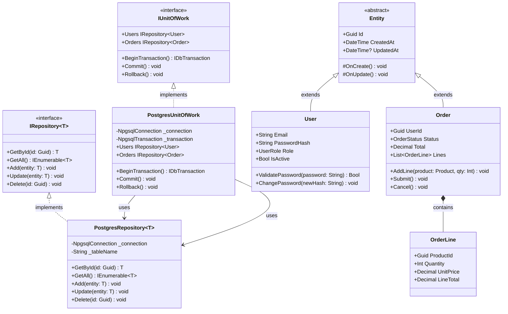
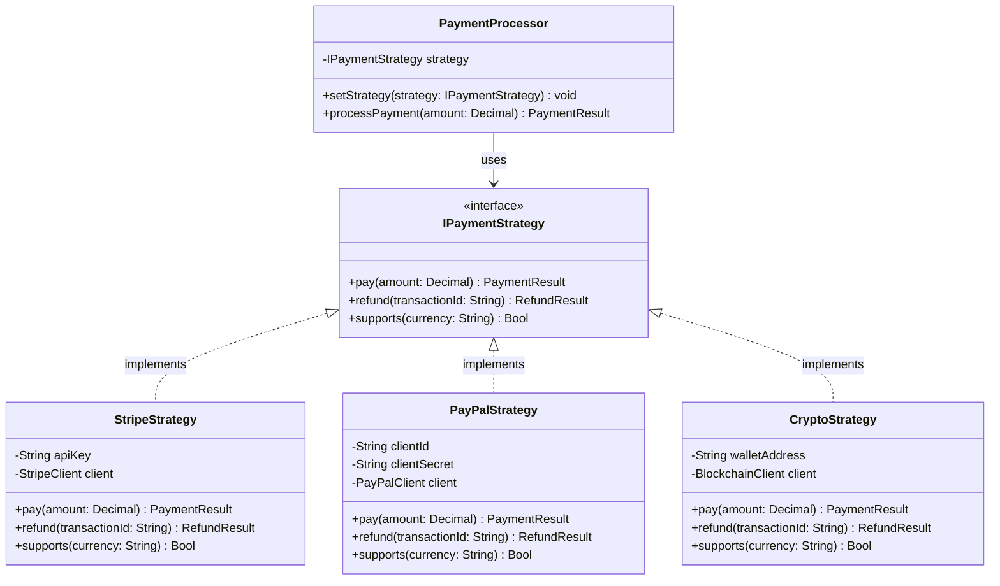
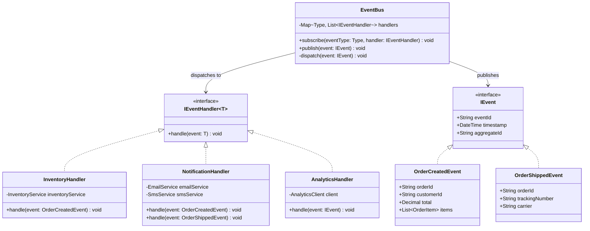

# Class Diagrams

---
title: "Class Diagrams"
status: published
owner: "PIMPyourDocs"
created: 2024-01-15
updated: 2024-01-15
tags: [diagrams, mermaid, class, uml, oop]
---

## Overview

Class diagrams document object-oriented designs, showing classes, their attributes, methods, and relationships.

**Best for:**

- API client SDK documentation
- Domain model design
- Interface contracts
- Design pattern illustration
- Type hierarchy documentation

---

## Syntax Reference

### Class Definition

### Visibility Modifiers

| Symbol | Visibility |
|--------|------------|
| `+` | Public |
| `-` | Private |
| `#` | Protected |
| `~` | Package/Internal |

### Generics

### Relationships

| Symbol | Meaning | Read as |
|--------|---------|---------|
| `<\|--` | Inheritance | "extends" |
| `*--` | Composition | "owns" (lifecycle bound) |
| `o--` | Aggregation | "has" (independent lifecycle) |
| `-->` | Association | "uses" |
| `..>` | Dependency | "depends on" |
| `..\|>` | Realization | "implements" |

### Cardinality

### Stereotypes and Annotations

---

## Example: Repository Pattern

---

## Example: Strategy Pattern

---

## Example: Event-Driven Architecture

---

## Best Practices

1. **Use stereotypes** — `<<interface>>`, `<<abstract>>`, `<<service>>`
2. **Show visibility** — Always include `+`, `-`, `#` modifiers
3. **Use generics** — `Repository~T~` instead of repeating for each type
4. **Label relationships** — `*-- "1..*"` with cardinality
5. **Group by layer** — Keep domain, application, infrastructure separate
6. **Focus on contracts** — Interfaces and public methods matter most
7. **Limit scope** — One design pattern or subsystem per diagram

---

## References

- [UML 2.5 Class Diagrams](https://www.omg.org/spec/UML/2.5.1/) — Formal specification
- [Mermaid Class Diagram Docs](https://mermaid.js.org/syntax/classDiagram.html) — Full syntax reference
- [Design Patterns](https://refactoring.guru/design-patterns) — Pattern catalog
