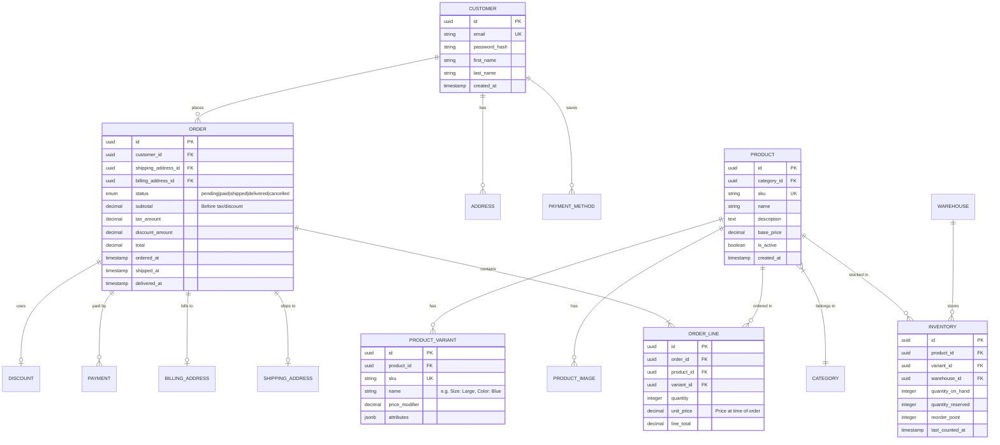

# Entity Relationship Diagrams

---
title: "Entity Relationship Diagrams"
status: published
owner: "PIMPyourDocs"
created: 2024-01-15
updated: 2024-01-15
tags: [diagrams, mermaid, er, database, schema]
---

## Overview

ER diagrams document database schemas, data models, and relationships between entities.

**Best for:**

- Database schema documentation
- API resource relationships
- Domain modeling
- Data dictionary visualization

---

## Syntax Reference

### Basic Relationships

### Cardinality Notation

| Symbol | Meaning |
|--------|---------|
| `\|\|` | Exactly one |
| `o\|` | Zero or one |
| `\|{` | One or more |
| `o{` | Zero or more |

Reading: `A ||--o{ B` = "A has zero or more B"

### Entity Attributes

| Marker | Meaning |
|--------|---------|
| `PK` | Primary key |
| `FK` | Foreign key |
| `UK` | Unique key |

---

## Example: Multi-tenant SaaS Schema

---

## Example: E-commerce Domain

---
3
## Example: Authentication System

---

## Best Practices

1. **Use clear relationship labels** — `places`, `contains`, `belongs to`
2. **Include key markers** — PK, FK, UK for clarity
3. **Add comments** — Inline comments explain non-obvious fields
4. **Show data types** — uuid, string, timestamp, jsonb, etc.
5. **Document enums** — List valid values: `"pending|paid|shipped"`
6. **Group logically** — Related entities should be visually close
7. **Don't overcrowd** — Split large schemas into domain-focused diagrams

---

## References

- [Chen ER Notation](https://en.wikipedia.org/wiki/Entity%E2%80%93relationship_model) — Original ER notation
- [Crow's Foot Notation](https://www.vertabelo.com/blog/crow-s-foot-notation/) — What Mermaid uses
- [Mermaid ER Diagram Docs](https://mermaid.js.org/syntax/entityRelationshipDiagram.html) — Full syntax reference
