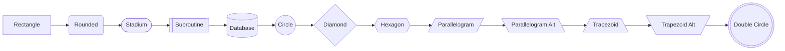
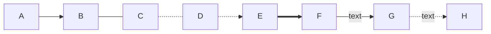
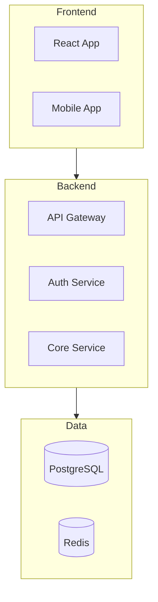
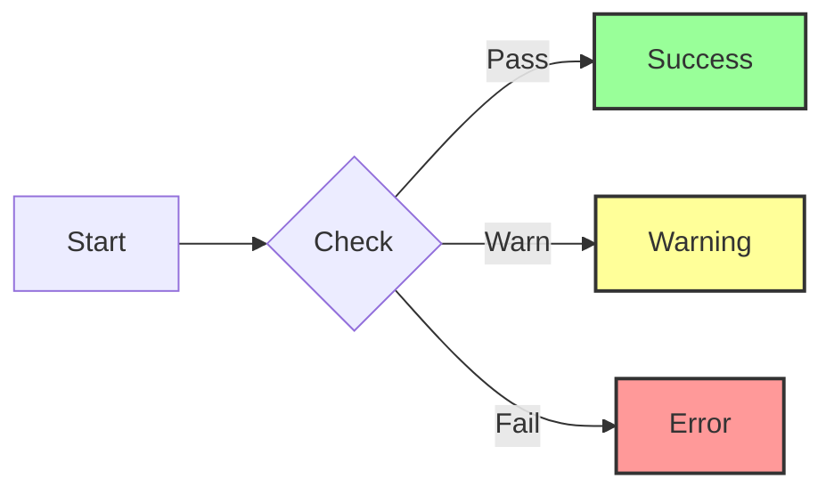
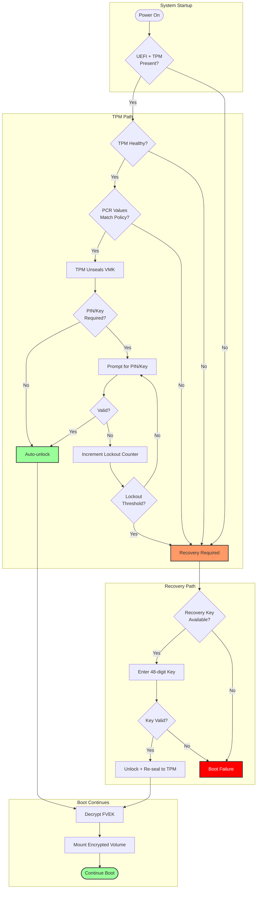
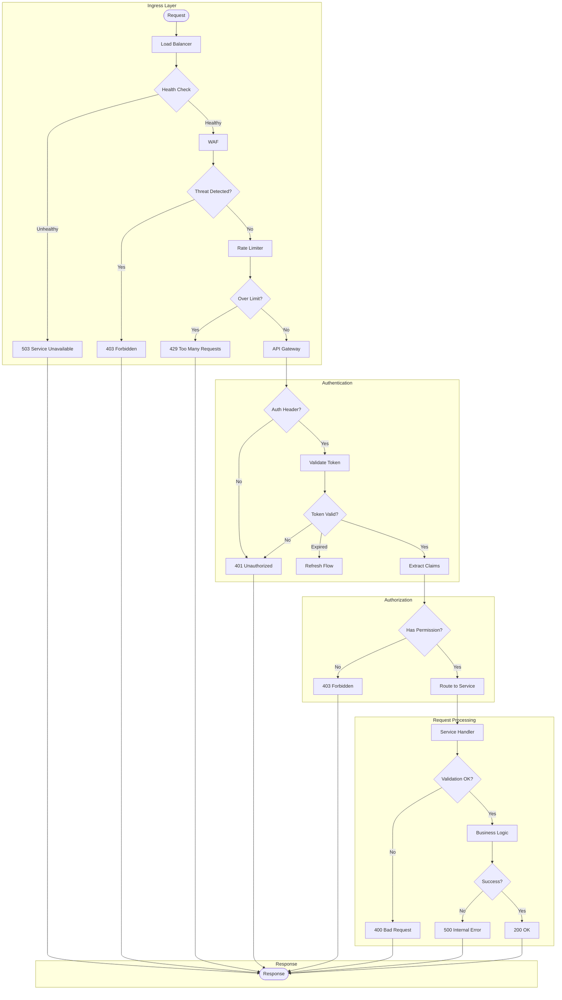
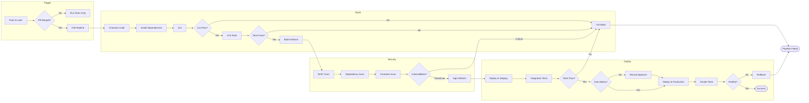
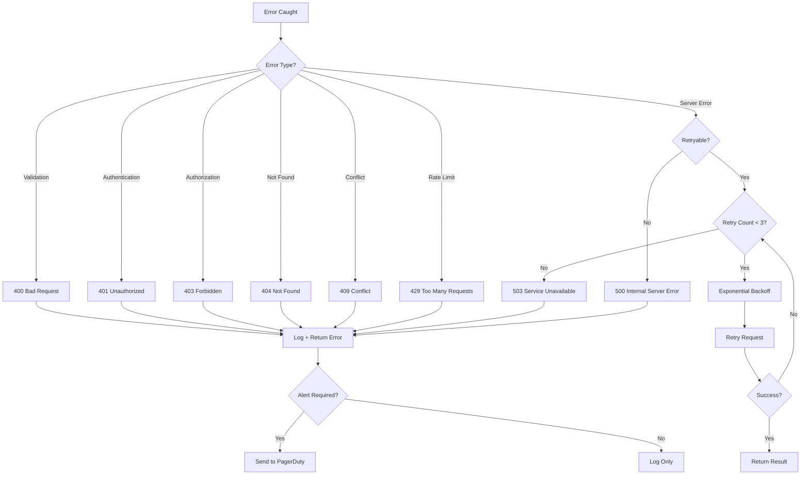

# Flowchart Diagrams

---
title: "Flowchart Diagrams"
status: published
owner: "PIMPyourDocs"
created: 2024-01-15
updated: 2024-01-15
tags: [diagrams, mermaid, flowchart]
---

## Overview

Flowcharts show processes, decisions, and data flow. They're the most versatile diagram type.

**Best for:**

- Decision trees and algorithms
- Process flows and workflows
- System architecture overviews
- Data flow visualization
- Error handling paths

---

## Syntax Reference

### Direction

| Syntax | Direction |
|--------|-----------|
| `flowchart TB` | Top to bottom |
| `flowchart BT` | Bottom to top |
| `flowchart LR` | Left to right |
| `flowchart RL` | Right to left |

### Node Shapes

| Shape | Syntax | Standard Meaning |
|-------|--------|------------------|
| Rectangle | `[text]` | Process / Action |
| Rounded | `(text)` | Alternate process |
| Stadium | `([text])` | Terminal (Start/End) |
| Subroutine | `[[text]]` | Predefined process |
| Cylinder | `[(text)]` | Database / Storage |
| Circle | `((text))` | Connector |
| Diamond | `{text}` | Decision |
| Hexagon | `{{text}}` | Preparation |
| Parallelogram | `[/text/]` | Input/Output |
| Trapezoid | `[/text\]` | Manual operation |
| Double Circle | `(((text)))` | Event / Trigger |

### Arrow Types

| Syntax | Meaning |
|--------|---------|
| `-->` | Arrow |
| `---` | Line (no arrow) |
| `-.-` | Dotted line |
| `-.->` | Dotted arrow |
| `==>` | Thick arrow |
| `--text-->` | Arrow with label |
| `-.text.->` | Dotted arrow with label |

### Subgraphs

### Styling

---

## Example: BitLocker Key Protector Decision Flow

This documents the complete BitLocker unlock decision tree during Windows boot.

---

## Example: HTTP Request Processing Pipeline

---

## Example: CI/CD Pipeline

---

## Example: Error Handling Decision Tree

---

## Best Practices

1. **Use TB for hierarchies, LR for processes** — Follow natural reading direction
2. **Group with subgraphs** — Logical separation improves readability
3. **Color-code outcomes** — Green for success, red for error, yellow for warning
4. **Label all decision branches** — Every arrow from a diamond should have text
5. **Use consistent shapes** — Diamond for decisions, stadium for terminals
6. **Limit to ~15 nodes** — Split complex flows into multiple diagrams
7. **Show error paths** — Don't just document the happy path

---

## References

- [ISO 5807](https://www.iso.org/standard/11955.html) — Flowchart symbols standard
- [Mermaid Flowchart Docs](https://mermaid.js.org/syntax/flowchart.html) — Full syntax reference
