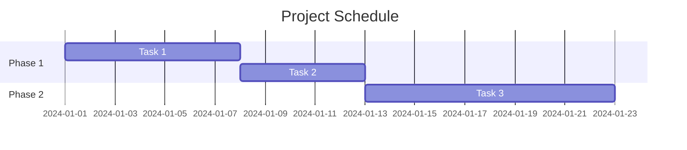
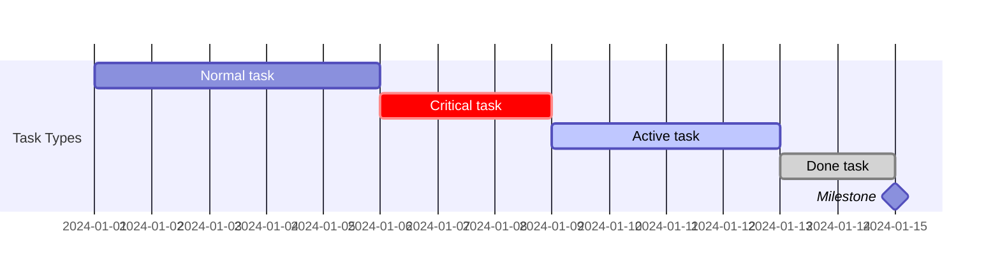
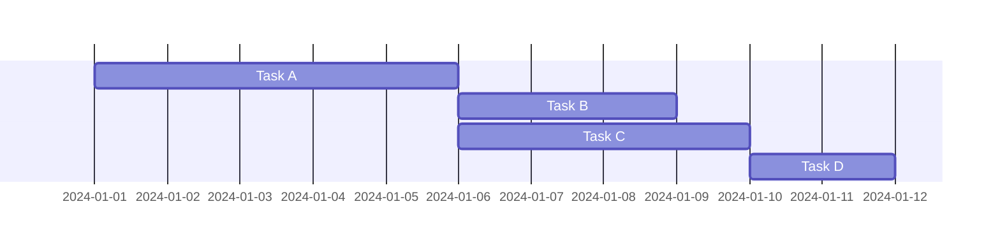
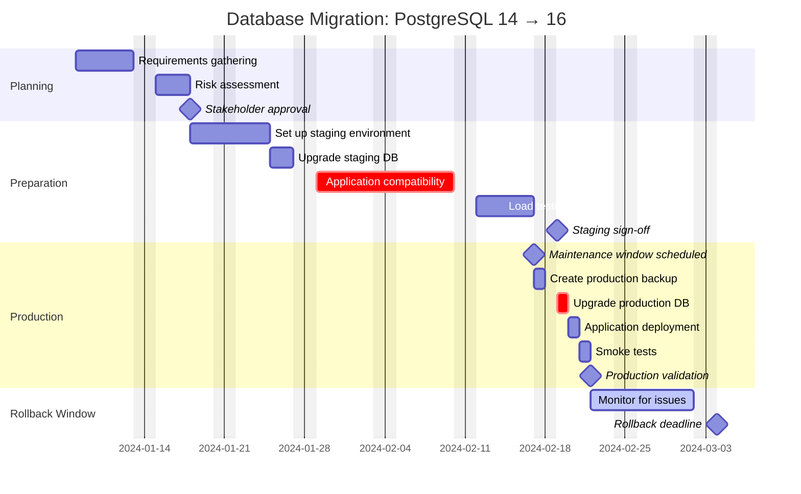
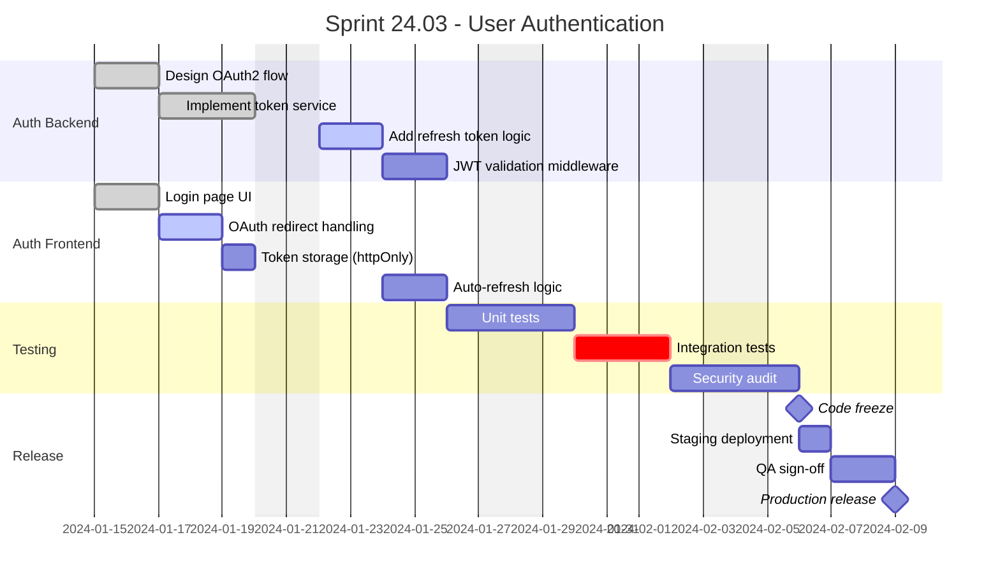
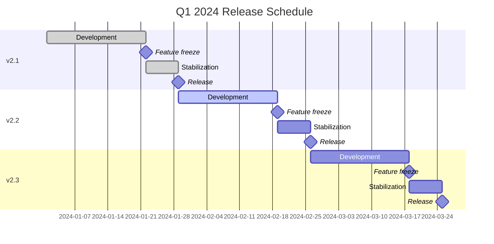

# Gantt Charts

---
title: "Gantt Charts"
status: published
owner: "PIMPyourDocs"
created: 2024-01-15
updated: 2024-01-15
tags: [diagrams, mermaid, gantt, timeline, project]
---

## Overview

Gantt charts visualize schedules, showing tasks over time with dependencies.

**Best for:**

- Incident timelines (post-mortems)
- Project schedules
- Release planning
- Sprint planning
- Migration timelines

---

## Syntax Reference

### Basic Structure

### Date Formats

| Format | Example |
|--------|---------|
| `YYYY-MM-DD` | 2024-01-15 |
| `HH:mm` | 14:30 |
| `YYYY-MM-DD HH:mm` | 2024-01-15 14:30 |

### Task Types

| Modifier | Effect |
|----------|--------|
| `crit` | Critical path (red) |
| `active` | Currently active |
| `done` | Completed |
| `milestone` | Zero-duration marker |

### Dependencies

---

## Example: Incident Timeline

```mermaid
gantt
    title INC-2024-0142: Database Connection Pool Exhaustion
    dateFormat HH:mm
    axisFormat %H:%M
    
    section Detection
    PagerDuty alert fired           :milestone, alert, 14:23, 0m
    On-call acknowledged            :ack, 14:23, 2m
    
    section Triage
    Check Grafana dashboards        :triage1, 14:25, 5m
    Identify connection leak        :crit, triage2, 14:30, 10m
    Root cause confirmed            :milestone, rc, 14:40, 0m
    
    section Mitigation
    Kill idle connections           :mit1, 14:40, 5m
    Restart affected pods           :mit2, 14:45, 8m
    Verify recovery                 :mit3, 14:53, 5m
    Service restored                :milestone, restored, 14:58, 0m
    
    section Follow-up
    Stakeholder notification        :follow1, 14:58, 10m
    Incident channel opened         :follow2, 15:08, 5m
    All-clear announcement          :milestone, clear, 15:13, 0m
    
    section Post-Incident
    Draft post-mortem               :post1, after clear, 120m
    Review meeting scheduled        :milestone, review, 17:13, 0m
```

---

## Example: Migration Project

---

## Example: Sprint Planning

---

## Example: Release Train

---

## Best Practices

1. **Use `excludes weekends`** for work schedules
2. **Mark milestones** — Zero-duration tasks for key dates
3. **Use `crit`** — Highlight critical path items
4. **Group with sections** — Logical phases improve readability
5. **Show dependencies** — `after task1 task2` for blockers
6. **Use appropriate format** — `HH:mm` for incidents, `YYYY-MM-DD` for projects
7. **Keep it focused** — One project/incident per chart

---

## References

- [Mermaid Gantt Docs](https://mermaid.js.org/syntax/gantt.html) — Full syntax reference
