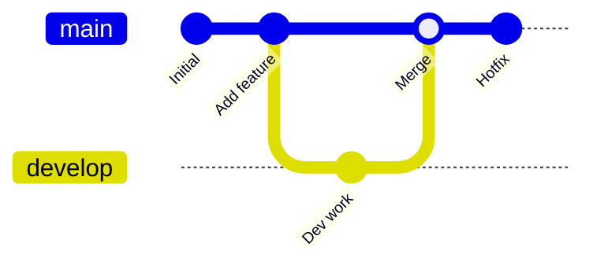
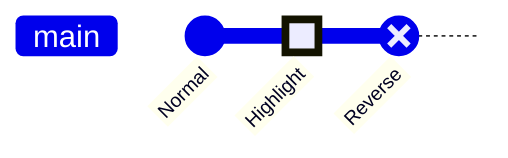
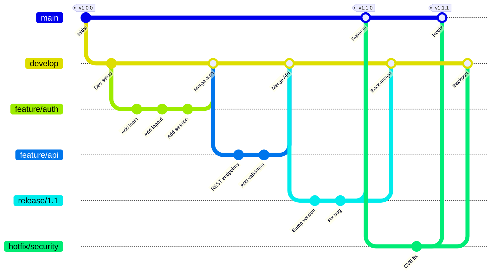
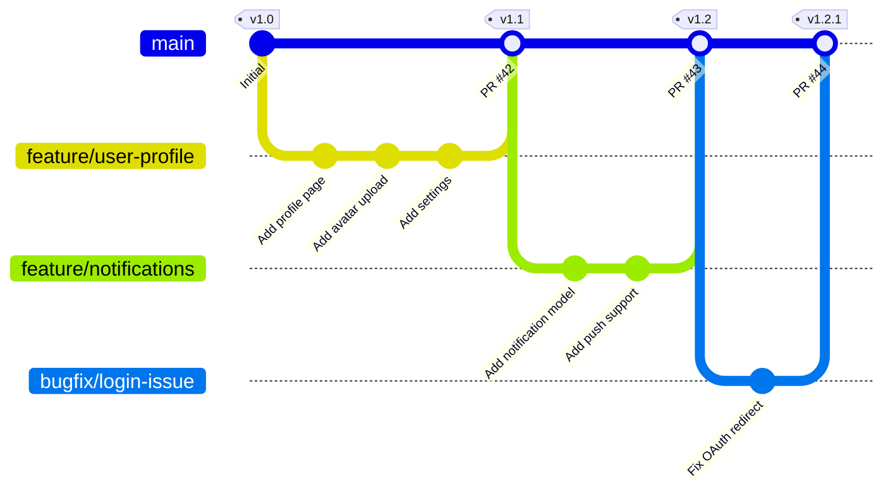
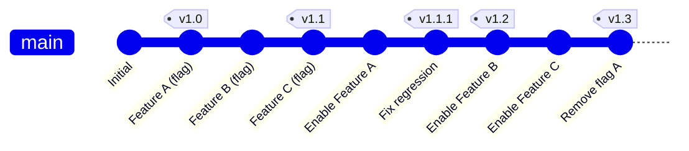
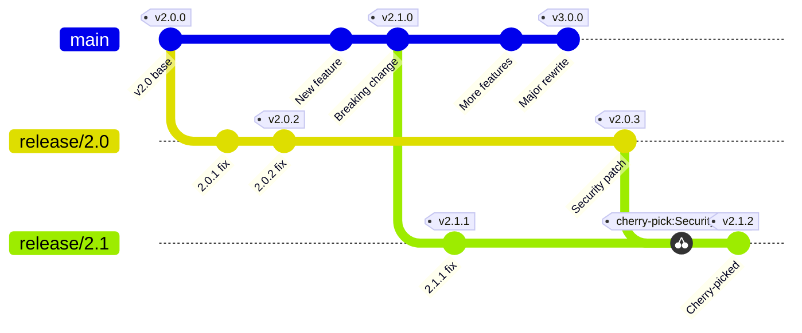
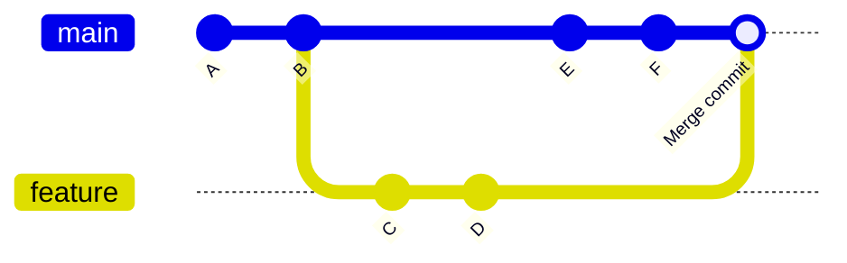
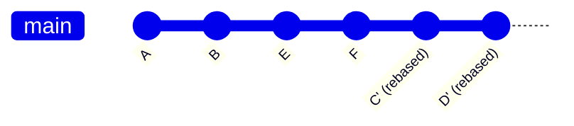

# Git Graphs

---
title: "Git Graphs"
status: published
owner: "PIMPyourDocs"
created: 2024-01-15
updated: 2024-01-15
tags: [diagrams, mermaid, git, branching]
---

## Overview

Git graphs visualize branching strategies, merge flows, and release processes.

**Best for:**

- Branching strategy documentation
- Release process visualization
- Merge conflict scenarios
- Git workflow training

---

## Syntax Reference

### Basic Operations

### Commands

| Command | Description |
|---------|-------------|
| `commit` | Add a commit |
| `commit id: "text"` | Commit with message |
| `commit tag: "v1.0"` | Commit with tag |
| `branch name` | Create branch |
| `checkout name` | Switch to branch |
| `merge name` | Merge branch |
| `cherry-pick id` | Cherry-pick commit |

### Commit Types

---

## Example: GitFlow

---

## Example: GitHub Flow

---

## Example: Trunk-Based Development

---

## Example: Release Branching

---

## Example: Merge vs Rebase

### Merge Strategy

### Rebase Strategy

---

## Best Practices

1. **Show the happy path** — Don't include every possible branch
2. **Use meaningful IDs** — `"Add OAuth"` not `"abc123"`
3. **Tag releases** — Mark version numbers
4. **Keep it simple** — Complex graphs defeat the purpose
5. **Document your strategy** — The graph should match your CONTRIBUTING.md

---

## References

- [GitFlow](https://nvie.com/posts/a-successful-git-branching-model/) — Original GitFlow article
- [GitHub Flow](https://docs.github.com/en/get-started/quickstart/github-flow) — Simplified workflow
- [Trunk-Based Development](https://trunkbaseddevelopment.com/) — Alternative approach
- [Mermaid Git Graph Docs](https://mermaid.js.org/syntax/gitgraph.html) — Full syntax reference
