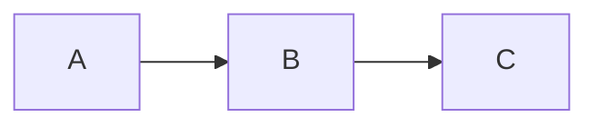

# Mermaid Diagram Standards

---
title: "Mermaid Diagram Standards"
status: published
owner: "PIMPyourDocs"
created: 2024-01-15
updated: 2024-01-15
tags: [diagrams, mermaid, standards, uml]
---

## Why Mermaid?

| Feature | Image Files | Mermaid |
|---------|-------------|---------|
| Version control | Binary blobs | Text diffs |
| Source of truth | External tool | In the doc |
| Collaboration | "Who has the Visio?" | PR review |
| AI-readable | No | Yes |
| Portable | Tool-dependent | Universal |
| Searchable | No | Yes |
| Generates from code | No | Yes |

---

## Standards & References

PIMPyourDocs diagram conventions draw from established standards:

| Standard | Usage |
|----------|-------|
| **UML 2.5** | Sequence diagram notation, class diagrams |
| **C4 Model** | Architecture diagram hierarchy (Context → Container → Component → Code) |
| **ISO/IEC 19501** | UML semantics for formal documentation |
| **arc42** | Architecture documentation structure |
| **RFC 2119** | Requirement levels in diagram annotations |

---

## Diagram Types

| Type | File | Best For |
|------|------|----------|
| Sequence | [sequence.md](./sequence.md) | Protocol flows, API interactions, temporal ordering |
| Flowchart | [flowchart.md](./flowchart.md) | Decision trees, process flows, algorithms |
| State | [state.md](./state.md) | Object lifecycles, protocol states, workflows |
| Entity Relationship | [er.md](./er.md) | Database schema, data models |
| Class | [class.md](./class.md) | OOP design, type hierarchies, interfaces |
| Gantt | [gantt.md](./gantt.md) | Project timelines, incident timelines |
| Architecture | [architecture.md](./architecture.md) | C4 model, system context, deployment |
| Git Graph | [git.md](./git.md) | Branching strategies, release flows |
| User Journey | [journey.md](./journey.md) | UX flows, customer experience |
| Quadrant | [quadrant.md](./quadrant.md) | Priority matrices, technology radar |
| Timeline | [timeline.md](./timeline.md) | Historical docs, version history |

---

## Universal Standards

### MUST Requirements

Every diagram MUST:

1. **Have a title** — Either in YAML frontmatter or as a heading
2. **Be self-contained** — Readable without surrounding context
3. **Use consistent notation** — Follow the shape/arrow conventions
4. **Label all connections** — No unlabeled arrows
5. **Include a legend** if using custom styling or non-obvious notation

### SHOULD Recommendations

Diagrams SHOULD:

1. **Use aliases** — `participant C as Client` not just `participant Client`
2. **Group related elements** — Use subgraphs for logical grouping
3. **Follow directional conventions** — TB for hierarchy, LR for flow
4. **Use semantic colors** — Red for errors, green for success
5. **Include notes** — Add context for complex sections

### MUST NOT Prohibitions

Diagrams MUST NOT:

1. **Exceed viewport** — If it needs scrolling, split it
2. **Mix abstraction levels** — One level per diagram (C4 model)
3. **Use images** — All diagrams are code, no PNG/SVG
4. **Rely on color alone** — Use shapes/labels for accessibility

---

## Rendering & Compatibility

### Tested Platforms

| Platform | Support | Notes |
|----------|---------|-------|
| GitHub | ✅ Full | Native rendering |
| GitLab | ✅ Full | Native rendering |
| VS Code | ✅ Full | Requires extension |
| Obsidian | ✅ Full | Native rendering |
| Notion | ⚠️ Partial | Embed via mermaid.live |
| Confluence | ⚠️ Partial | Plugin required |
| Docusaurus | ✅ Full | Plugin available |
| MkDocs | ✅ Full | Material theme |

### CLI Tooling

```bash
# Install Mermaid CLI
npm install -g @mermaid-js/mermaid-cli

# Render to PNG
mmdc -i input.md -o output.png

# Render to SVG
mmdc -i input.md -o output.svg -e svg

# Validate diagrams
mmdc -i docs/ --validate

# Batch convert
find docs/ -name "*.md" -exec mmdc -i {} -o {}.png \;
```

### CI Integration

```yaml
# GitHub Action: Validate Mermaid diagrams
- name: Validate Mermaid
  uses: deckchairlabs/mermaid-action@v1
  with:
    files: 'docs/**/*.md'
    validate: true

# GitHub Action: Generate diagram images
- name: Generate Diagrams  
  run: |
    npm install -g @mermaid-js/mermaid-cli
    mmdc -i docs/architecture.md -o docs/architecture.png
```

---

## Anti-Patterns

### ❌ Overcomplicated Diagrams

If your diagram has more than ~15 nodes, split it using C4 model layers.

### ❌ Unlabeled Relationships



Useless. What do the arrows mean?

### ❌ Missing Context

Diagrams without titles, legends, or surrounding documentation are not self-documenting.

### ❌ Binary Exports

Never commit PNG/SVG exports. The Mermaid source IS the canonical diagram.

### ❌ Platform-Specific Syntax

Avoid renderer-specific extensions that break portability.

---

*Diagrams as code. Version controlled. Diff-able. AI-readable. Future-proof.*
