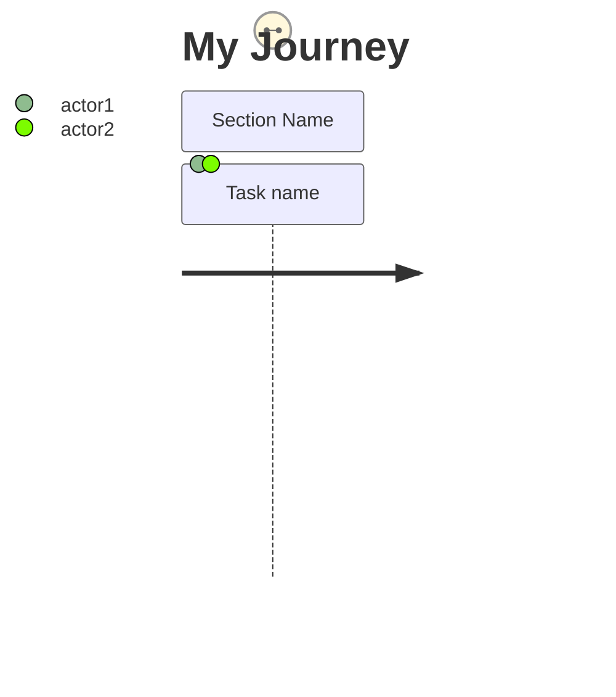
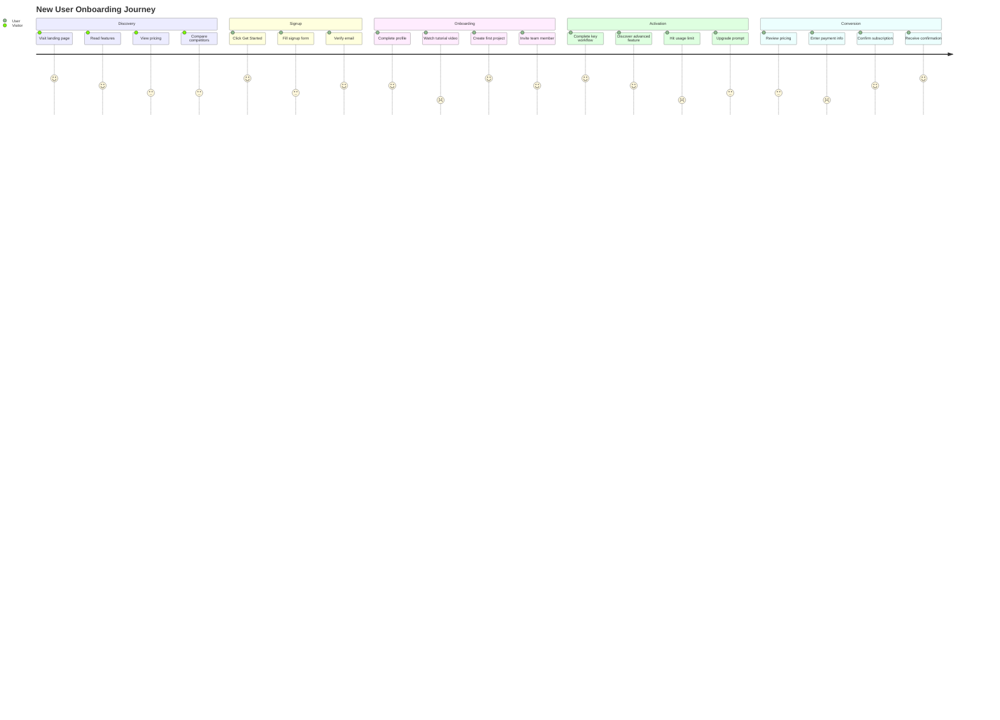
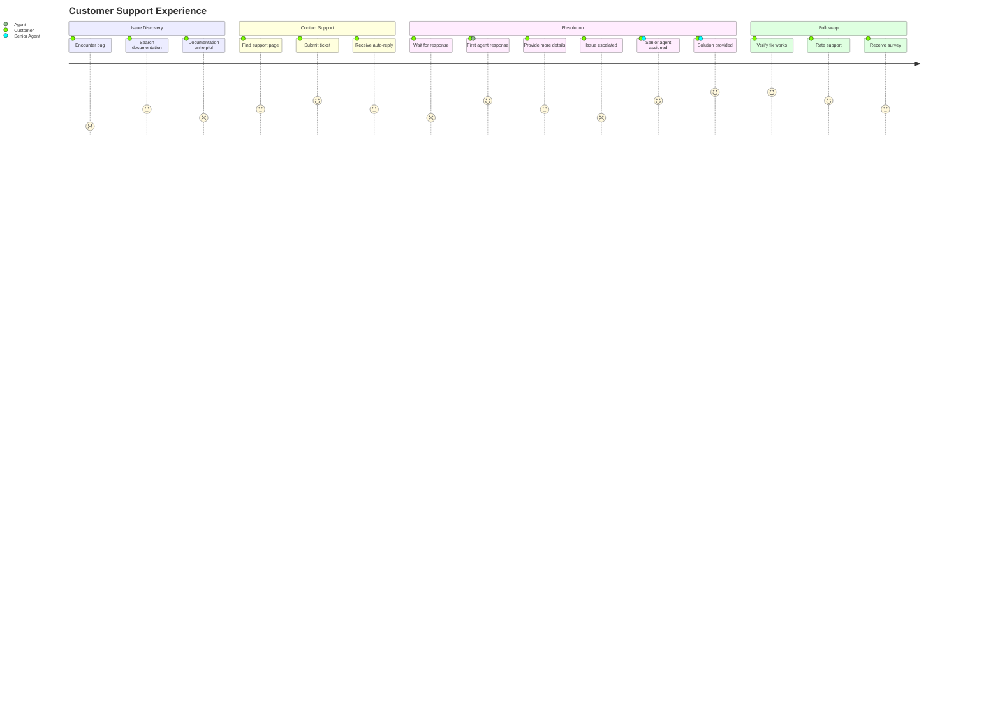
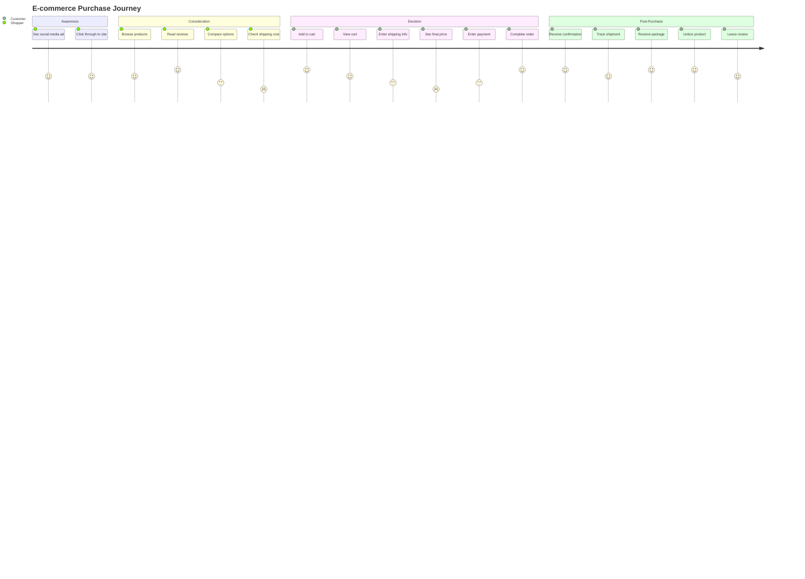
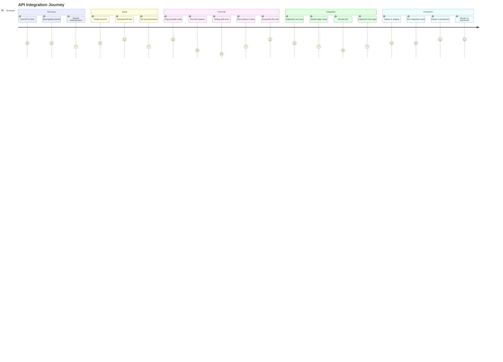
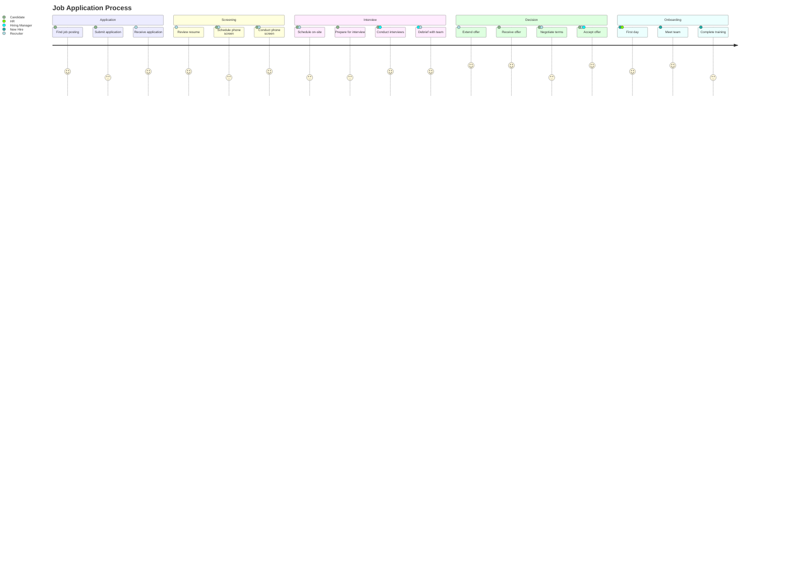

# User Journey Diagrams

---
title: "User Journey Diagrams"
status: published
owner: "PIMPyourDocs"
created: 2024-01-15
updated: 2024-01-15
tags: [diagrams, mermaid, journey, ux, cx]
---

## Overview

User journey diagrams map the experience of users through a process, showing their emotional state at each step.

**Best for:**

- Customer experience mapping
- Onboarding flow documentation
- Support process visualization
- Feature discovery flows
- Pain point identification

---

## Syntax Reference

### Basic Structure

### Scores

Scores range from 1 (worst) to 5 (best), indicating user satisfaction:

| Score | Meaning |
|-------|---------|
| 1 | Very frustrated |
| 2 | Frustrated |
| 3 | Neutral |
| 4 | Satisfied |
| 5 | Delighted |

---

## Example: User Onboarding

---

## Example: Support Ticket Journey

---

## Example: E-commerce Purchase

---

## Example: Developer API Integration

---

## Example: Multi-Actor Journey

---

## Best Practices

1. **Use realistic scores** — Don't make everything a 5
2. **Identify pain points** — Low scores highlight improvement areas
3. **Show multiple actors** — Different perspectives reveal gaps
4. **Group by phase** — Sections should be logical journey stages
5. **Be specific** — "Fill 10-field form" beats "Sign up"
6. **Validate with users** — Scores should reflect real feedback
7. **Keep it focused** — One persona's journey per diagram

---

## References

- [Customer Journey Mapping](https://www.nngroup.com/articles/customer-journey-mapping/) — Nielsen Norman Group guide
- [Mermaid User Journey Docs](https://mermaid.js.org/syntax/userJourney.html) — Full syntax reference
