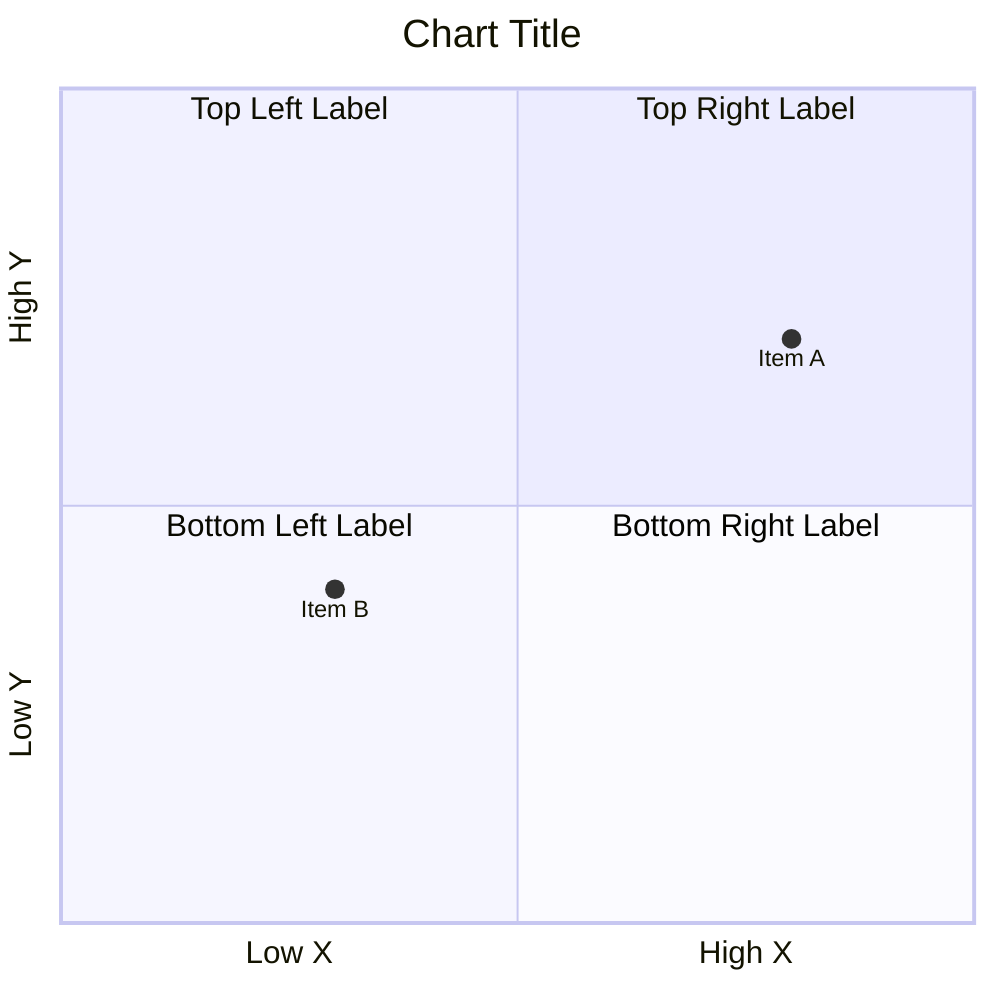
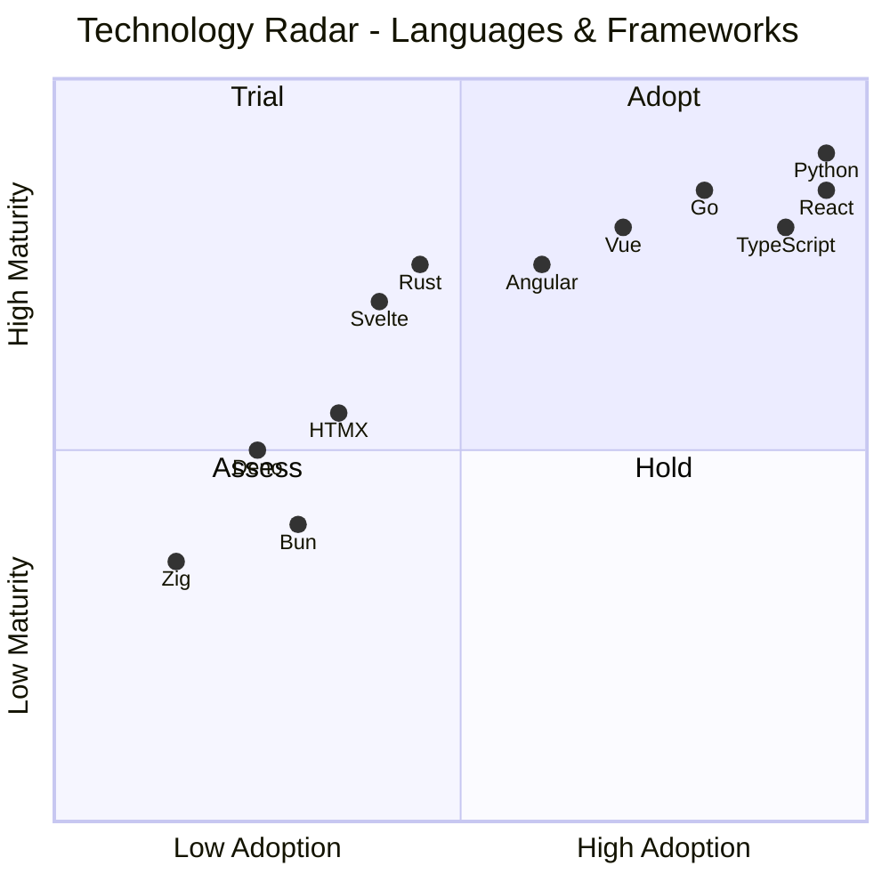
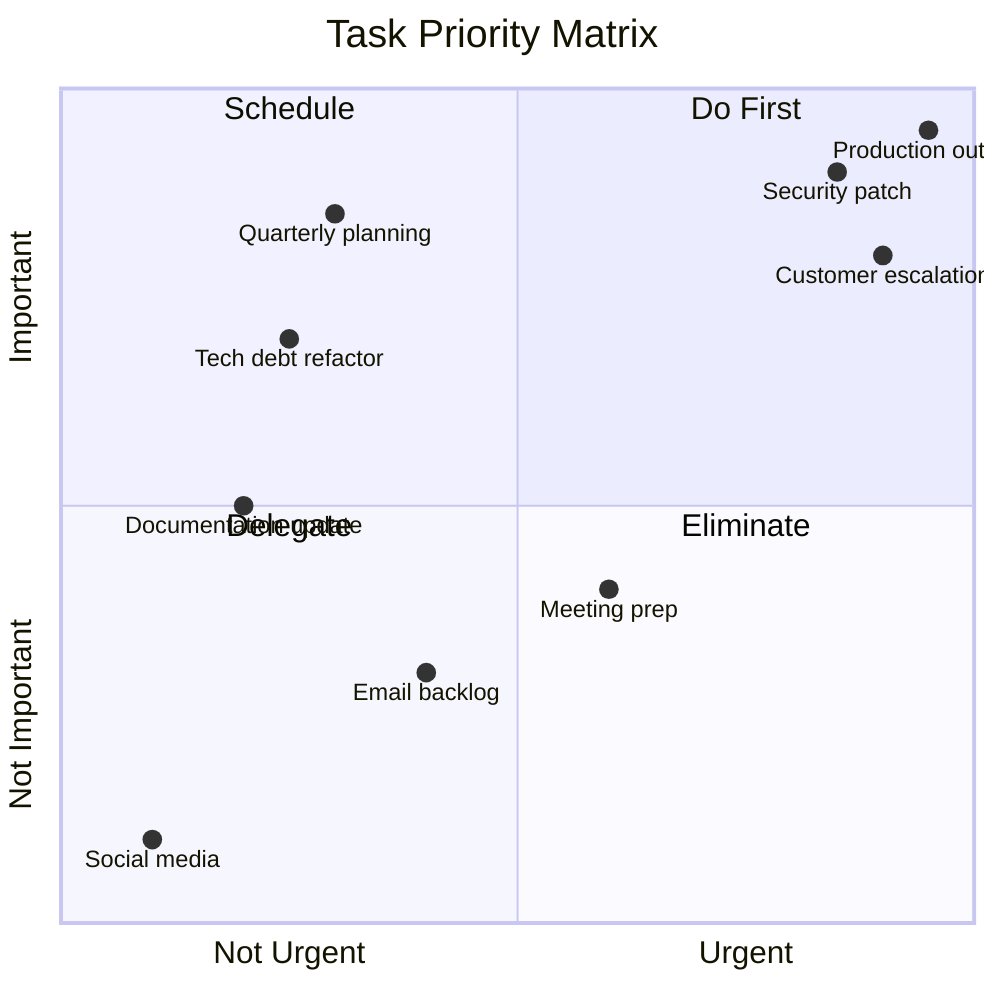
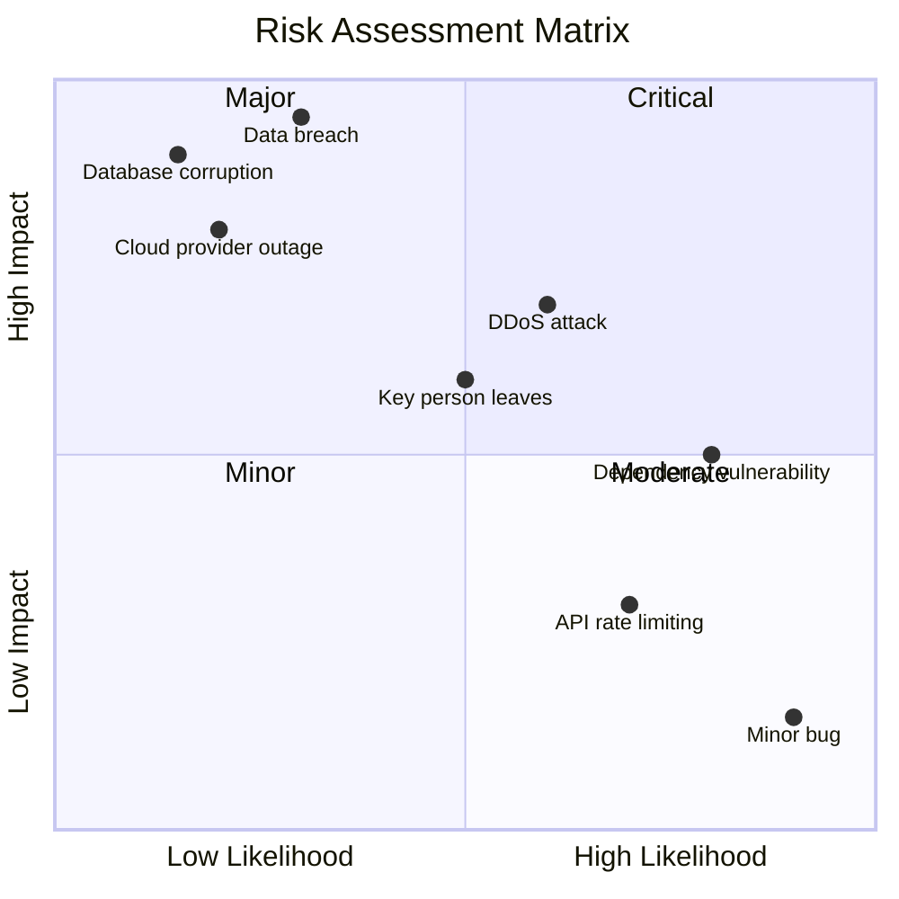
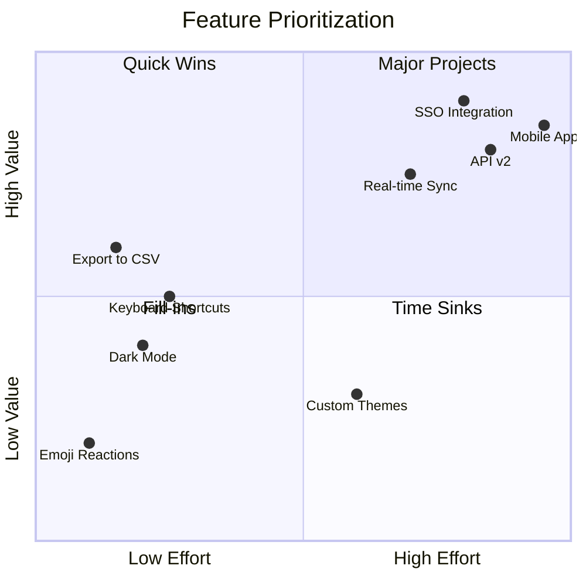
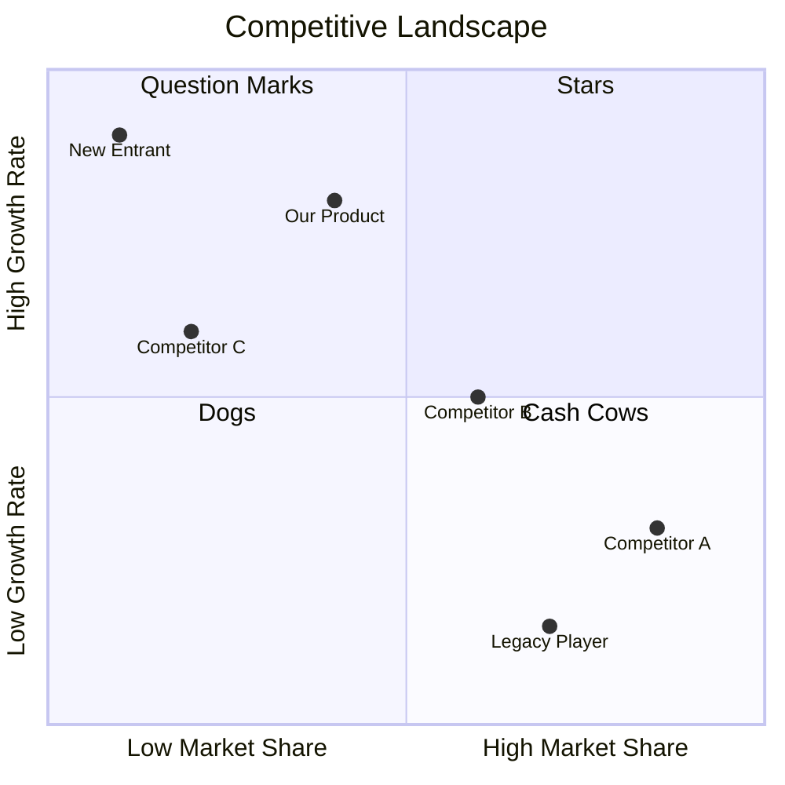
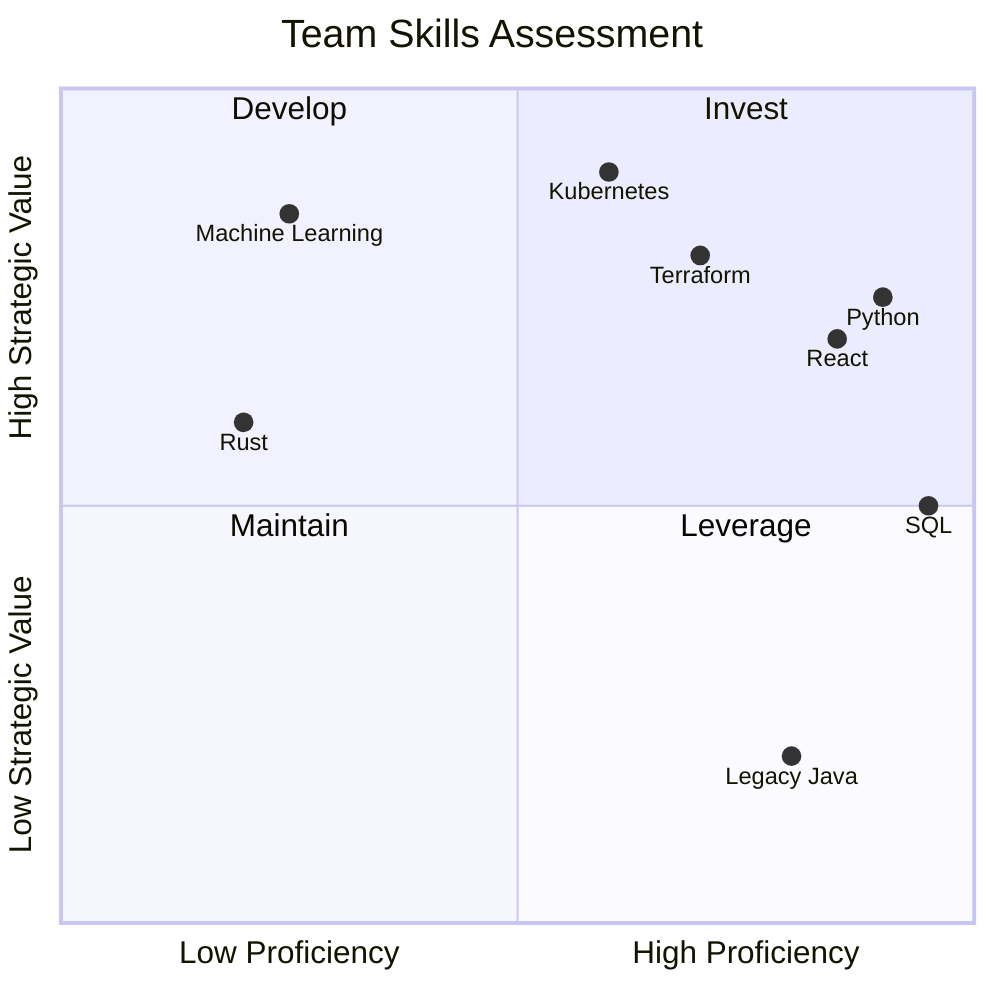

# Quadrant Charts

---
title: "Quadrant Charts"
status: published
owner: "PIMPyourDocs"
created: 2024-01-15
updated: 2024-01-15
tags: [diagrams, mermaid, quadrant, matrix, radar]
---

## Overview

Quadrant charts plot items on two axes, creating four regions for categorization.

**Best for:**

- Technology radar
- Priority matrices (Eisenhower matrix)
- Risk assessment
- Feature prioritization
- Competitive analysis

---

## Syntax Reference

### Basic Structure

### Coordinates

- X and Y values range from 0 to 1
- [0, 0] is bottom-left
- [1, 1] is top-right

---

## Example: Technology Radar

---

## Example: Eisenhower Priority Matrix

---

## Example: Risk Assessment

---

## Example: Feature Prioritization (Value vs Effort)

---

## Example: Competitive Analysis

---

## Example: Team Skills Matrix

---

## Best Practices

1. **Label axes clearly** — State what low/high means
2. **Name quadrants** — Use action-oriented labels (Adopt, Assess, Hold)
3. **Limit items** — 10-15 items max for readability
4. **Use consistent criteria** — All items evaluated on same scale
5. **Include legend** — Document what scores mean
6. **Update regularly** — Radar charts especially need periodic review
7. **Explain positioning** — Document why items are where they are

---

## Common Quadrant Frameworks

| Framework | X-Axis | Y-Axis | Use |
|-----------|--------|--------|-----|
| Eisenhower | Urgency | Importance | Task prioritization |
| BCG Matrix | Market Share | Growth Rate | Portfolio analysis |
| Risk Matrix | Likelihood | Impact | Risk assessment |
| Value/Effort | Effort | Value | Feature prioritization |
| Tech Radar | Adoption | Maturity | Technology decisions |

---

## References

- [Technology Radar](https://www.thoughtworks.com/radar) — ThoughtWorks example
- [Eisenhower Matrix](https://en.wikipedia.org/wiki/Time_management#The_Eisenhower_Method) — Priority framework
- [Mermaid Quadrant Docs](https://mermaid.js.org/syntax/quadrantChart.html) — Full syntax reference
