# Sequence Diagrams

---
title: "Sequence Diagrams"
status: published
owner: "PIMPyourDocs"
created: 2024-01-15
updated: 2024-01-15
tags: [diagrams, mermaid, sequence, uml]
---

## Overview

Sequence diagrams show interactions between components over time. They're based on UML 2.5 sequence diagram notation.

**Best for:**

- Protocol flows and handshakes
- API request/response documentation
- Authentication sequences
- Debugging complex multi-service interactions
- Incident timeline reconstruction

---

## Syntax Reference

### Participants

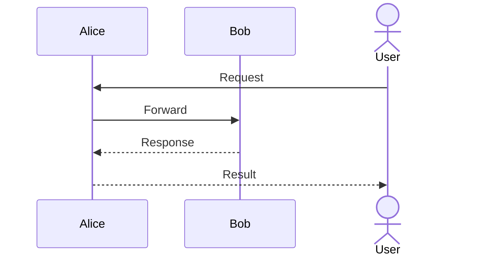

### Arrow Types

| Arrow | Syntax | Meaning |
|-------|--------|---------|
| Solid line, solid head | `->>` | Synchronous call |
| Dashed line, solid head | `-->>` | Synchronous response |
| Solid line, open head | `->` | Asynchronous message |
| Dashed line, open head | `-->` | Asynchronous response |
| Solid line, cross | `-x` | Lost message |
| Dashed line, cross | `--x` | Lost response |

### Activation

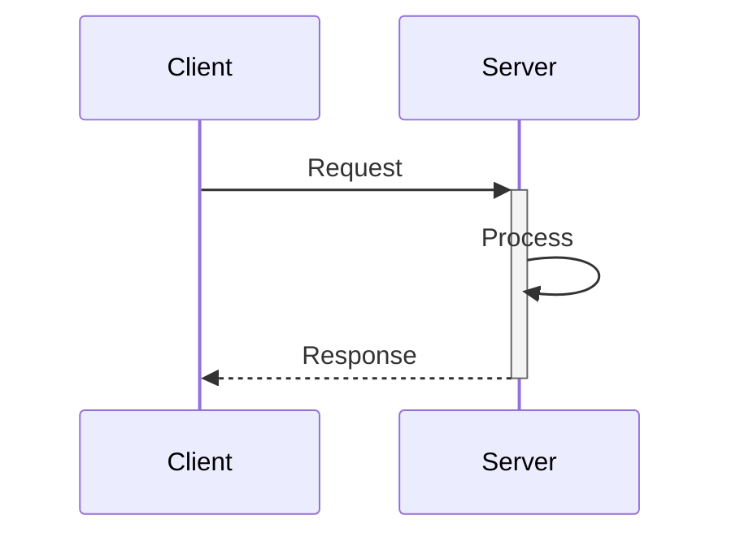

Use `+` to activate, `-` to deactivate. Shows when a component is "working".

### Notes

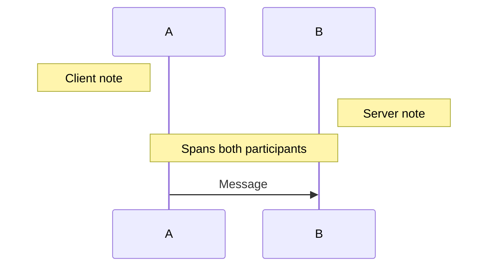

### Loops

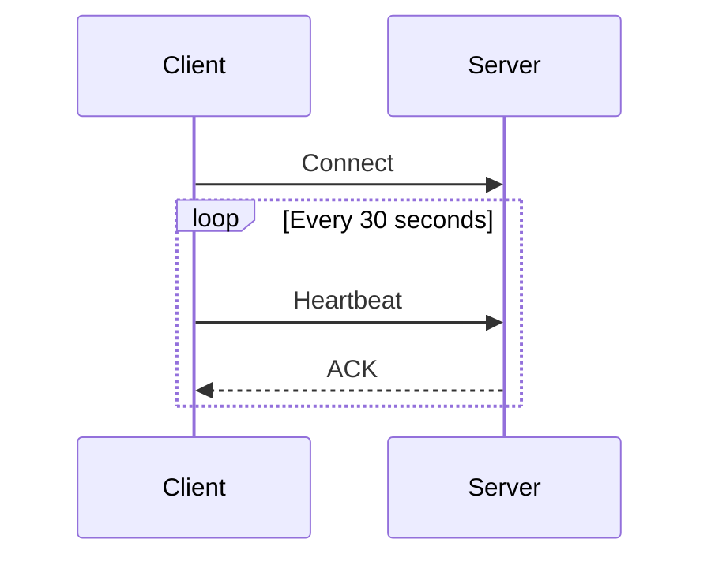

### Conditionals

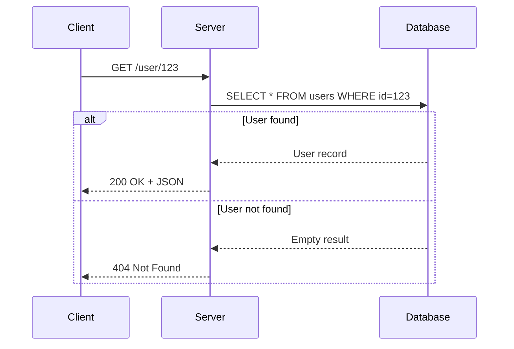

### Optional Blocks

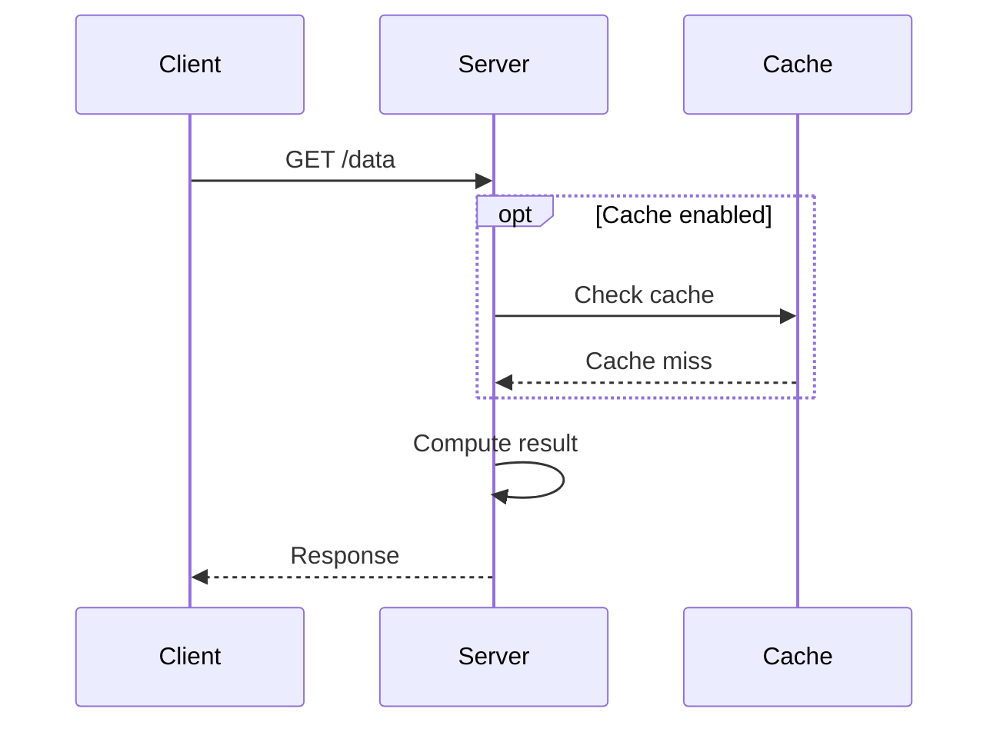

### Parallel Execution

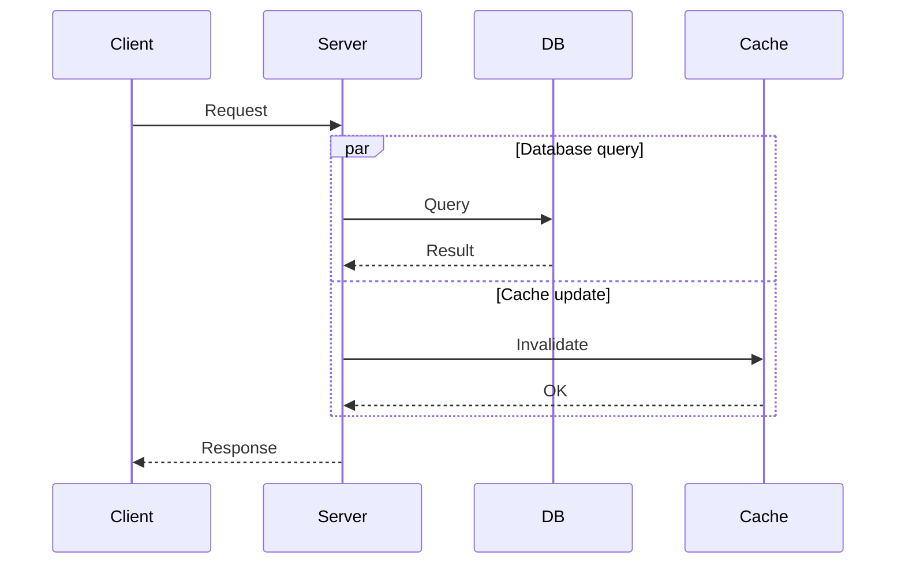

### Critical Sections

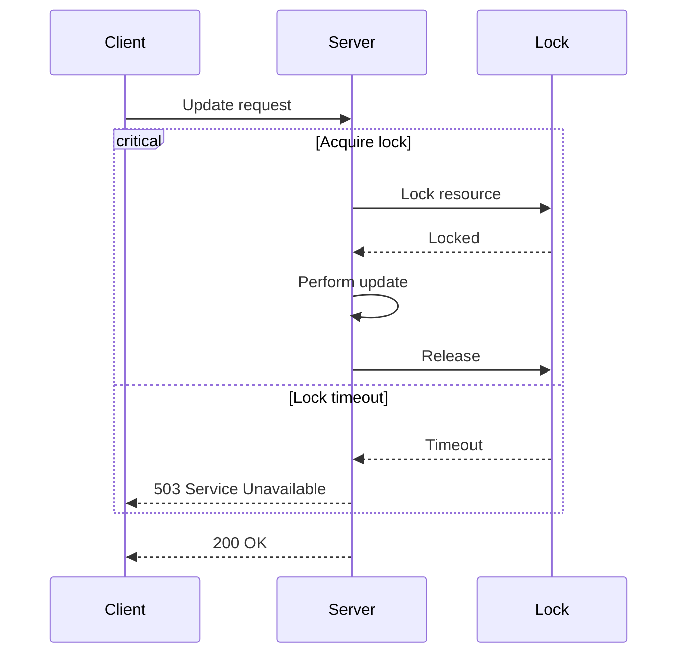

### Autonumbering

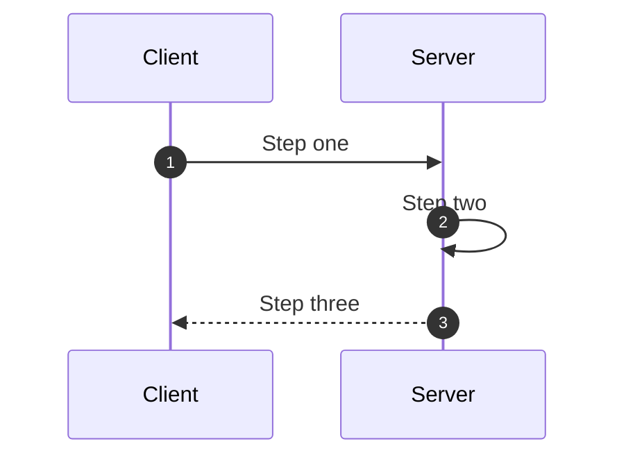

---

## Example: Windows UEFI Secure Boot Sequence

This diagram documents the complete Windows boot process from power-on through user login, including BitLocker TPM unsealing. Based on Microsoft's Boot Process documentation and UEFI Specification 2.9.

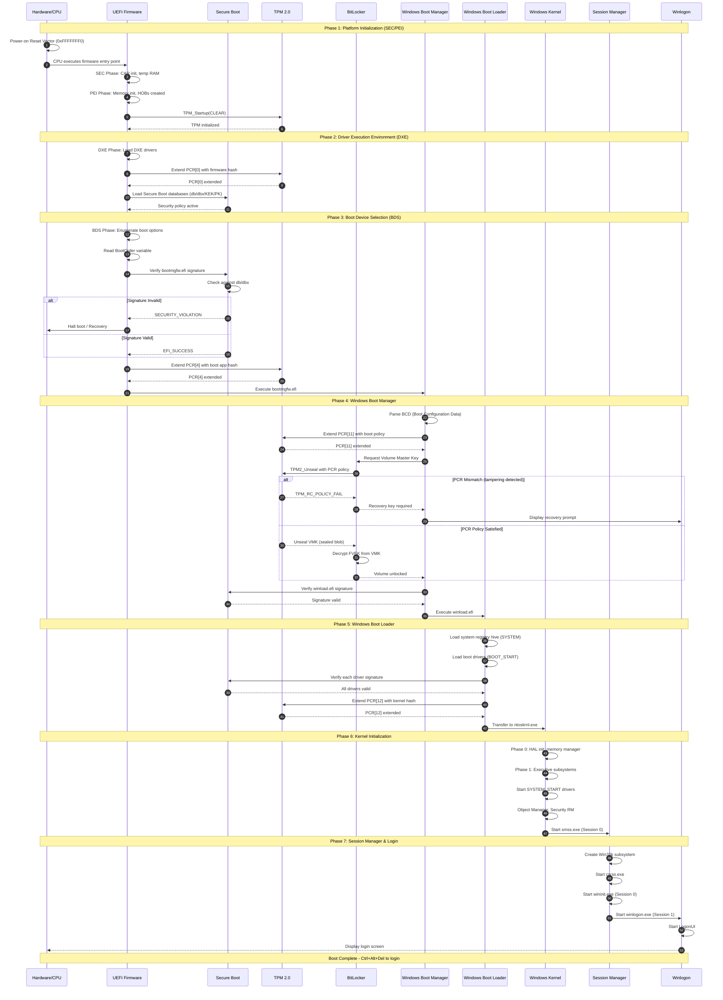

---

## Example: OAuth 2.0 Authorization Code Flow

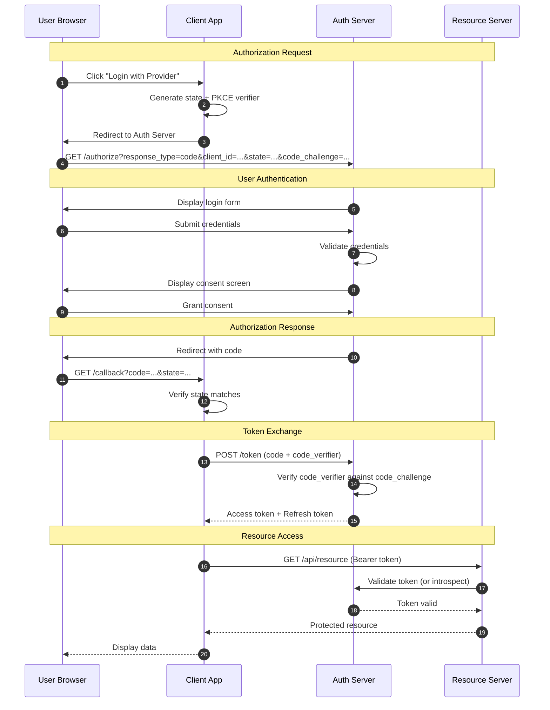

---

## Example: Kafka Consumer Group Rebalance

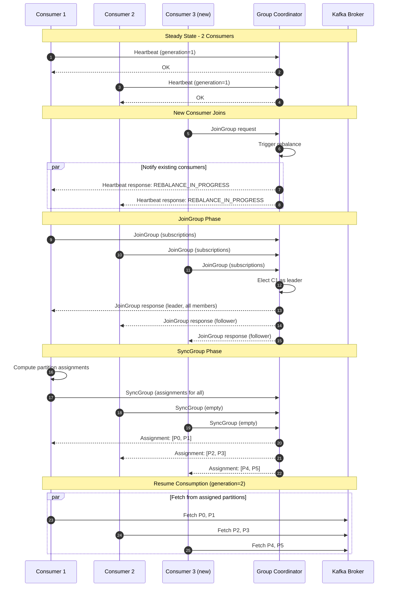

---

## Best Practices

1. **Use `autonumber`** for complex flows — makes referencing steps in documentation easier
2. **Group phases with `Note over`** — provides visual separation and context
3. **Use `alt/else` for error paths** — don't just show the happy path
4. **Limit participants to ~8** — split into multiple diagrams if needed
5. **Use aliases** — `participant DB as PostgreSQL` is clearer than a long name
6. **Show activation** — helps visualize which component is "working"
7. **Include protocol details** — method names, status codes, PCR numbers add precision

---

## References

- [UML 2.5 Specification](https://www.omg.org/spec/UML/2.5.1/) — Formal sequence diagram semantics
- [Mermaid Sequence Diagram Docs](https://mermaid.js.org/syntax/sequenceDiagram.html) — Full syntax reference
- [UEFI Specification 2.9](https://uefi.org/specifications) — Boot process reference
- [RFC 6749](https://tools.ietf.org/html/rfc6749) — OAuth 2.0 specification
