# State Diagrams

---
title: "State Diagrams"
status: published
owner: "PIMPyourDocs"
created: 2024-01-15
updated: 2024-01-15
tags: [diagrams, mermaid, state, uml, fsm]
---

## Overview

State diagrams (statecharts) show the lifecycle of an object or system, including all possible states and the transitions between them.

**Best for:**

- Object lifecycle documentation
- Protocol state machines
- Workflow status tracking
- Order/ticket/document lifecycles
- Connection state management

---

## Syntax Reference

### Basic States

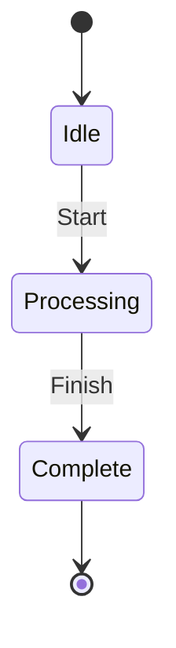

| Element | Syntax | Meaning |
|---------|--------|---------|
| Initial | `[*] -->` | Start state |
| Final | `--> [*]` | End state |
| State | `StateName` | Named state |
| Transition | `A --> B: event` | State change |

### State Descriptions

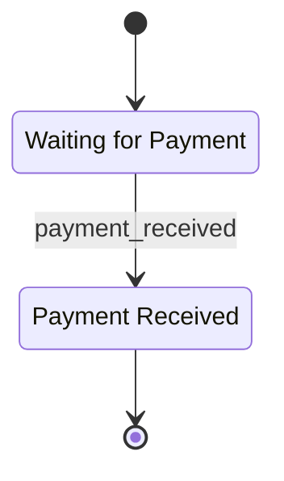

### Composite States

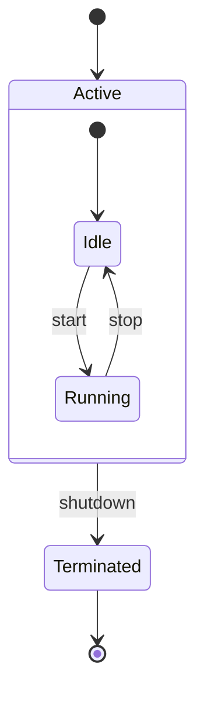

### Parallel States (Fork/Join)

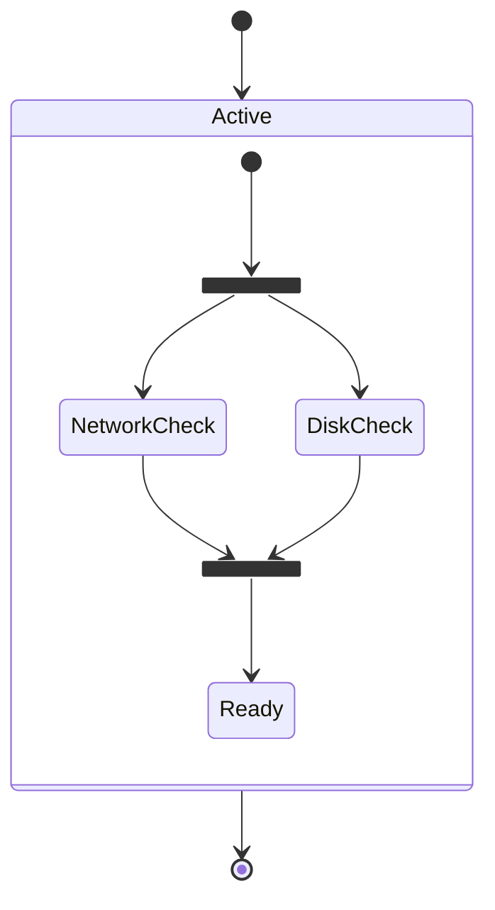

### Choice (Conditional)

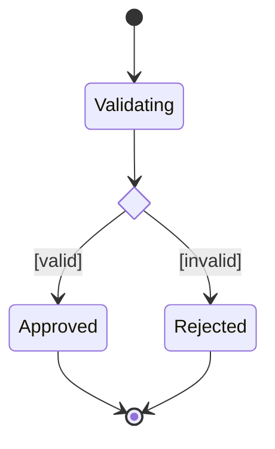

### Notes

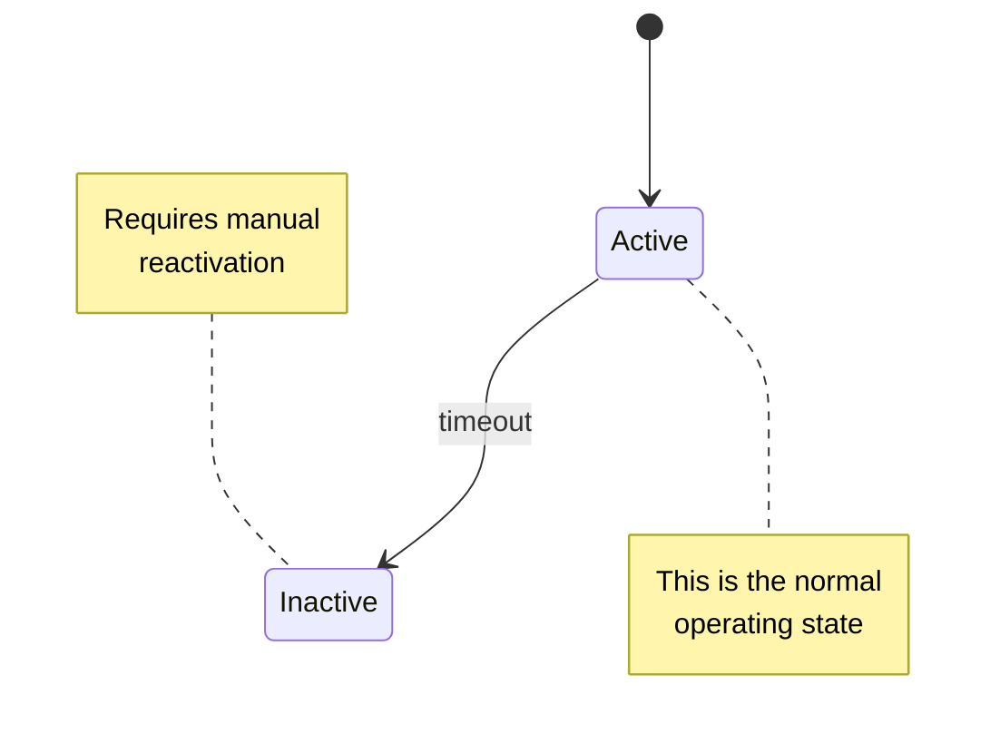

---

## Example: TLS 1.3 Handshake States (Client)

Based on RFC 8446 TLS 1.3 specification.

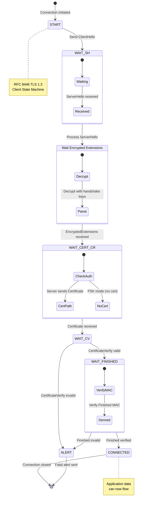

---

## Example: Order Lifecycle

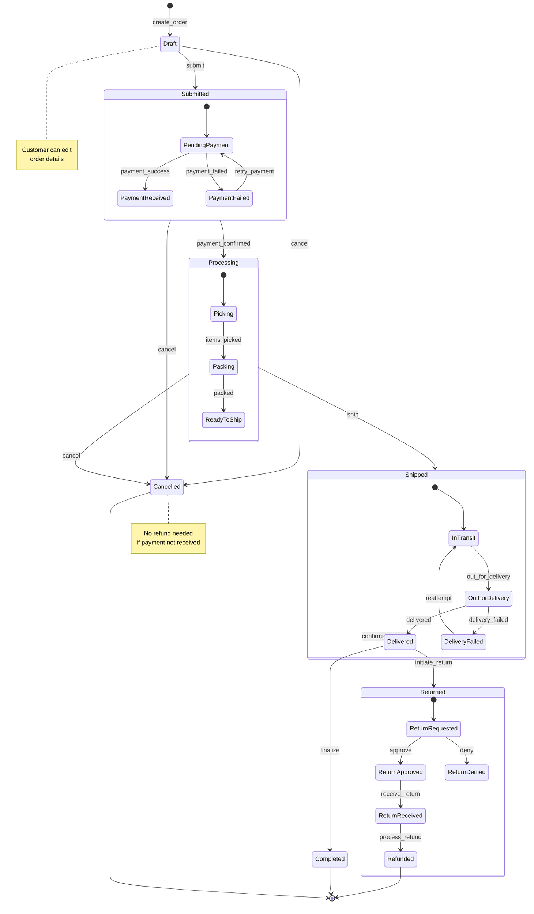

---

## Example: TCP Connection States

Based on RFC 793.

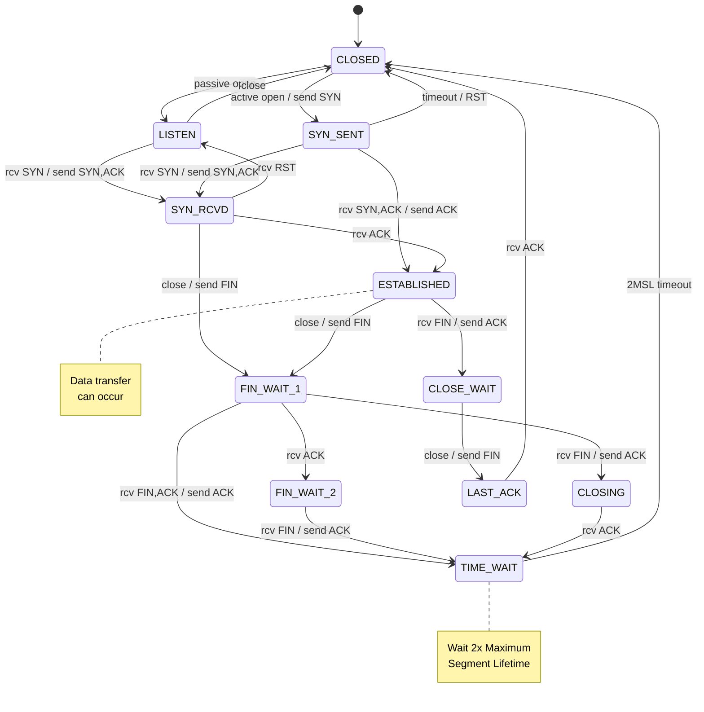

---

## Example: Git File States

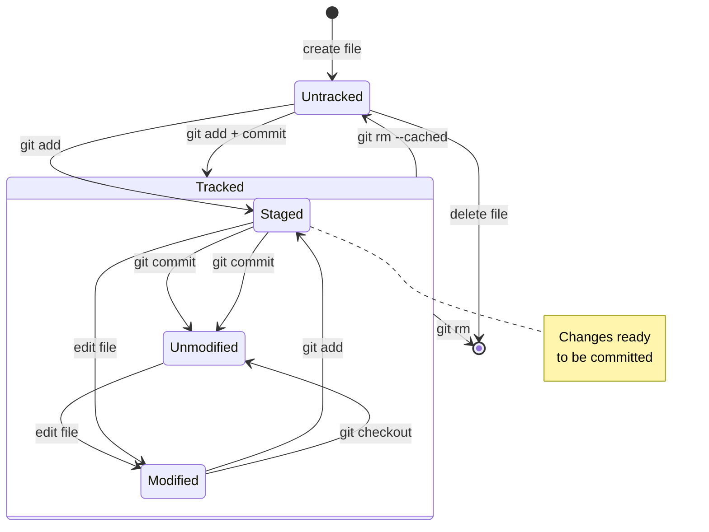

---

## Example: Kubernetes Pod Lifecycle

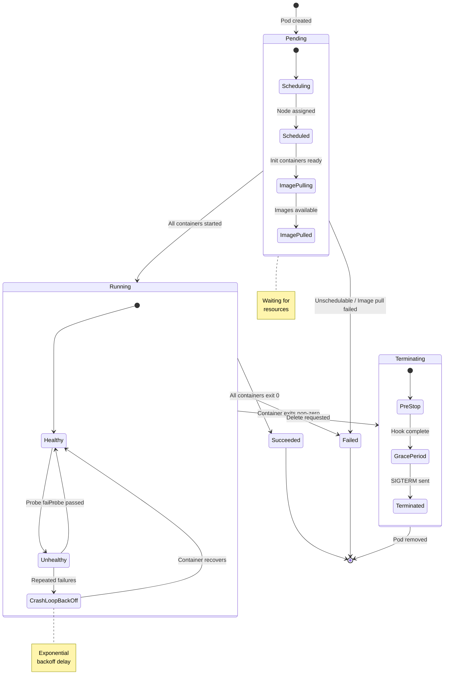

---

## Best Practices

1. **Always show `[*]`** — Clearly indicate start and end states
2. **Use composite states** — Group related states for clarity
3. **Label all transitions** — Every arrow should have an event/trigger
4. **Add notes** — Explain non-obvious states
5. **Keep it flat when possible** — Avoid deep nesting
6. **Document error states** — Show failure paths, not just happy path
7. **Reference specifications** — Link to RFCs/specs for protocol states

---

## References

- [UML 2.5 State Machine Diagrams](https://www.omg.org/spec/UML/2.5.1/) — Formal semantics
- [Mermaid State Diagram Docs](https://mermaid.js.org/syntax/stateDiagram.html) — Full syntax reference
- [RFC 8446](https://tools.ietf.org/html/rfc8446) — TLS 1.3 specification
- [RFC 793](https://tools.ietf.org/html/rfc793) — TCP specification
