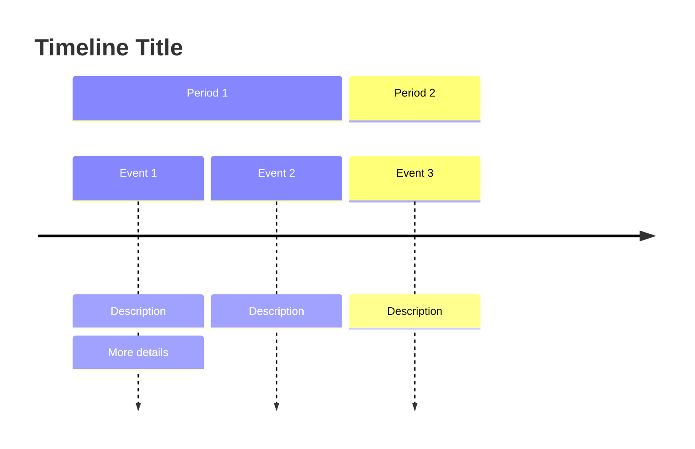
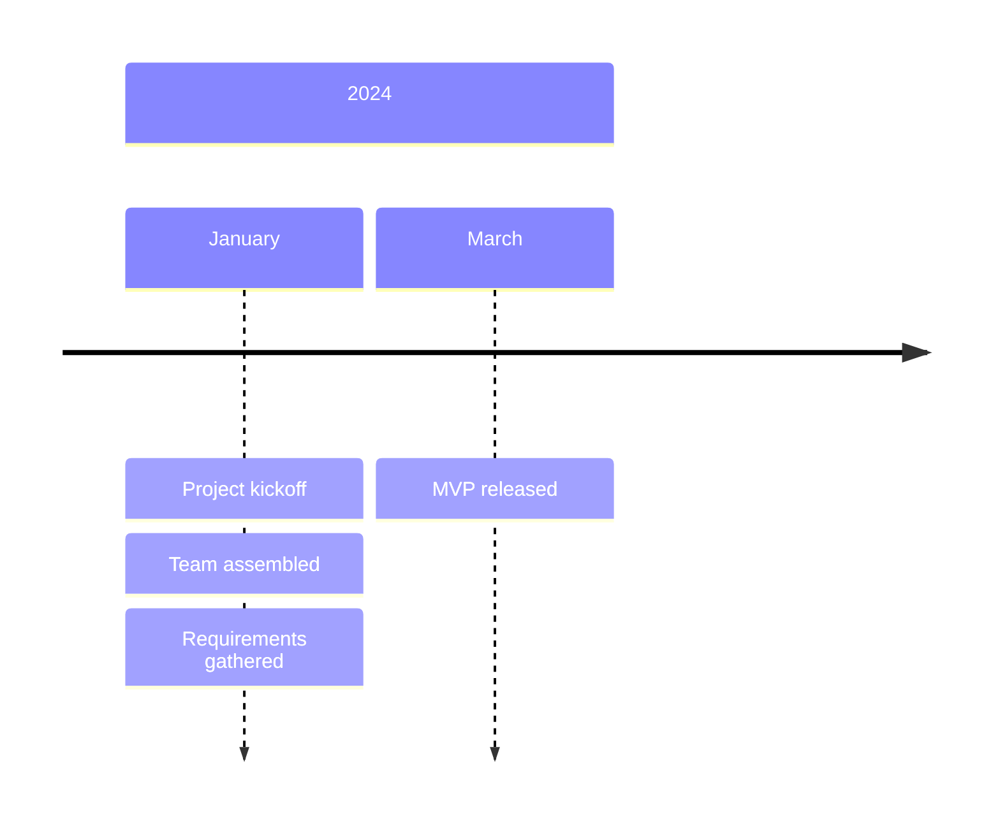
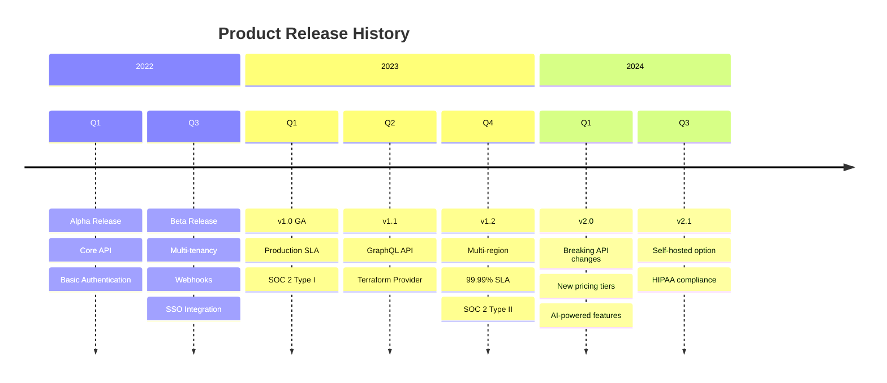
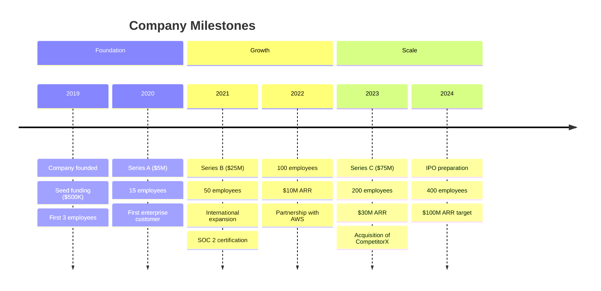
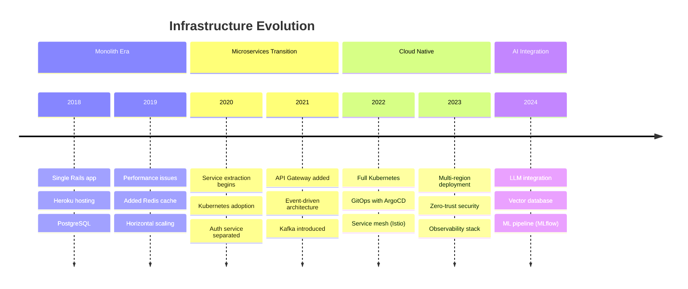
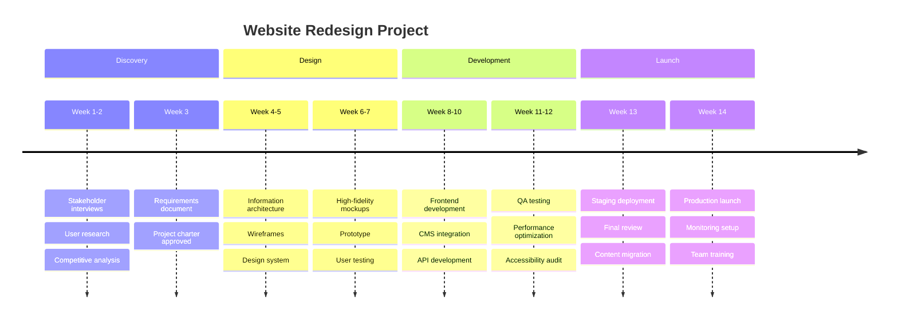
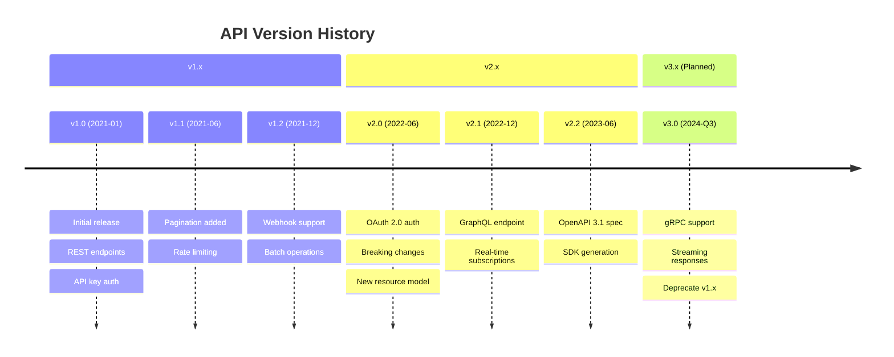

# Timeline Diagrams

---
title: "Timeline Diagrams"
status: published
owner: "PIMPyourDocs"
created: 2024-01-15
updated: 2024-01-15
tags: [diagrams, mermaid, timeline, history, milestones]
---

## Overview

Timeline diagrams show events chronologically, organized by time periods.

**Best for:**

- Product release history
- Company milestones
- Project phases
- Version history
- Historical documentation

---

## Syntax Reference

### Basic Structure



### Multi-line Events

Events can have multiple description lines:



---

## Example: Product Release History



---

## Example: Company History



---

## Example: Technology Evolution



---

## Example: Project Phases



---

## Example: API Versioning History



---

## Example: Security Incident Timeline

```mermaid
timeline
    title Incident INC-2024-042 Timeline
    
    section Detection
        14:23 UTC : Alert triggered
                  : On-call paged
        14:28 UTC : Incident commander assigned
                  : Initial triage
    
    section Investigation
        14:35 UTC : Logs analyzed
                  : Root cause identified
                  : Database connection leak
        14:45 UTC : Mitigation plan formed
    
    section Mitigation
        14:50 UTC : Connection pool reset
                  : Pod restarts initiated
        15:05 UTC : Services recovering
                  : Monitoring normalized
    
    section Resolution
        15:15 UTC : All systems nominal
                  : Incident resolved
        15:30 UTC : All-clear announced
                  : Post-mortem scheduled
```

---

## Best Practices

1. **Use consistent time periods** — Don't mix years, quarters, and weeks
2. **Limit events per period** — 3-5 items max for readability
3. **Be concise** — Short descriptions, not paragraphs
4. **Show progression** — Each section should build on the previous
5. **Include dates** — Specific dates when relevant
6. **Group logically** — Sections should represent meaningful phases
7. **Keep it scannable** — Timelines are for quick reference

---

## References

- [Mermaid Timeline Docs](https://mermaid.js.org/syntax/timeline.html) — Full syntax reference
