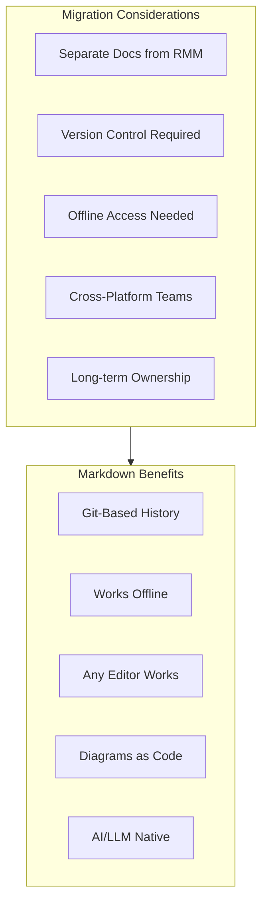
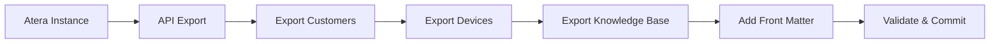
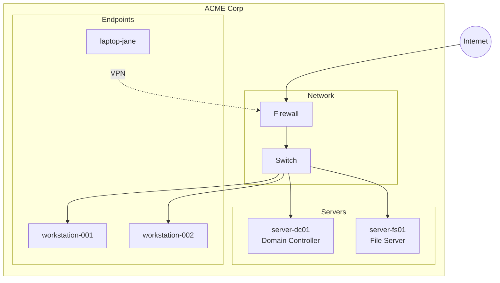

# Migrating from Atera

This guide provides a comprehensive approach to migrating your documentation from Atera to PIMPyourDocs.

## About Atera

Atera is a SaaS platform designed for managed service providers that includes:

- **Knowledge Base**: Documentation framework for system guides
- **Customer Documentation**: Per-customer technical documentation
- **Agent Notes**: Device-level documentation
- **Runbooks**: Standard operating procedures
- **Network Discovery**: Auto-discovered infrastructure documentation

## Atera Strengths

- **All-in-One Platform**: RMM, PSA, and documentation combined
- **Flat-Rate Pricing**: Per-technician, not per-endpoint
- **Knowledge Base**: Searchable docs for users and technicians
- **API Access**: REST API for automation
- **Integration Ecosystem**: Connect with various tools

## Why Consider Markdown?



## Migration Overview



## Prerequisites

```bash
# Required
python3 --version         # >= 3.8
pip install requests pyyaml

# Atera API access
# Navigate to: Admin > API to get your API key
```

## API Setup

### Step 1: Get API Key

1. Log into Atera
2. Navigate to **Admin** → **API**
3. Copy your API Key
4. Note your API endpoint region

## Export Script

```python
#!/usr/bin/env python3
"""atera_export.py - Export Atera documentation via API."""

import os
import requests
from pathlib import Path
from datetime import date
import re
import time

class AteraExporter:
    def __init__(self, api_key: str):
        self.base_url = "https://app.atera.com/api/v3"
        self.headers = {
            "X-API-KEY": api_key,
            "Accept": "application/json"
        }

    def _get(self, endpoint: str, params: dict = None) -> dict:
        """Make authenticated GET request."""
        time.sleep(0.5)  # Rate limiting
        url = f"{self.base_url}/{endpoint}"
        response = requests.get(url, headers=self.headers, params=params)
        response.raise_for_status()
        return response.json()

    def _get_paginated(self, endpoint: str) -> list:
        """Get all pages of a paginated endpoint."""
        all_items = []
        page = 1

        while True:
            result = self._get(endpoint, {"page": page, "itemsInPage": 50})

            items = result.get("items", [])
            all_items.extend(items)

            if len(items) < 50:
                break
            page += 1

        return all_items

    def get_customers(self) -> list:
        """Get all customers."""
        return self._get_paginated("customers")

    def get_customer(self, customer_id: int) -> dict:
        """Get a specific customer."""
        return self._get(f"customers/{customer_id}")

    def get_agents(self, customer_id: int = None) -> list:
        """Get agents (devices), optionally by customer."""
        endpoint = "agents"
        if customer_id:
            endpoint = f"agents?customerId={customer_id}"
        return self._get_paginated(endpoint)

    def get_agent(self, agent_id: int) -> dict:
        """Get detailed agent information."""
        return self._get(f"agents/{agent_id}")

    def get_knowledge_base_articles(self) -> list:
        """Get knowledge base articles."""
        try:
            return self._get_paginated("knowledgebase")
        except Exception as e:
            print(f"Note: Knowledge base API access may require specific permissions: {e}")
            return []

    def get_custom_fields(self, customer_id: int) -> dict:
        """Get custom fields for a customer."""
        try:
            return self._get(f"customvalues/customerid/{customer_id}")
        except Exception:
            return {}

def to_kebab(s: str) -> str:
    """Convert string to kebab-case."""
    if not s:
        return "unnamed"
    return re.sub(r'[^a-z0-9]+', '-', s.lower()).strip('-')

def html_to_markdown(html: str) -> str:
    """Basic HTML to Markdown conversion."""
    if not html:
        return ""

    text = html
    text = re.sub(r'<h1[^>]*>(.*?)</h1>', r'# \1\n', text, flags=re.DOTALL)
    text = re.sub(r'<h2[^>]*>(.*?)</h2>', r'## \1\n', text, flags=re.DOTALL)
    text = re.sub(r'<h3[^>]*>(.*?)</h3>', r'### \1\n', text, flags=re.DOTALL)
    text = re.sub(r'<p[^>]*>(.*?)</p>', r'\1\n\n', text, flags=re.DOTALL)
    text = re.sub(r'<br\s*/?>', '\n', text)
    text = re.sub(r'<strong>(.*?)</strong>', r'**\1**', text)
    text = re.sub(r'<b>(.*?)</b>', r'**\1**', text)
    text = re.sub(r'<em>(.*?)</em>', r'*\1*', text)
    text = re.sub(r'<code>(.*?)</code>', r'`\1`', text)
    text = re.sub(r'<a href="([^"]+)"[^>]*>(.*?)</a>', r'[\2](\1)', text)
    text = re.sub(r'<li[^>]*>(.*?)</li>', r'- \1\n', text)
    text = re.sub(r'<[^>]+>', '', text)
    text = re.sub(r'\n{3,}', '\n\n', text)

    return text.strip()

def export_customer(exporter: AteraExporter, customer: dict, output_dir: Path):
    """Export all documentation for a customer."""

    customer_id = customer.get("CustomerID")
    customer_name = customer.get("CustomerName", f"customer-{customer_id}")
    customer_dir = output_dir / to_kebab(customer_name)
    customer_dir.mkdir(parents=True, exist_ok=True)

    print(f"Exporting customer: {customer_name}")

    # Get custom fields
    custom_fields = exporter.get_custom_fields(customer_id)

    # Create customer overview
    overview = f"""---
title: "{customer_name}"
status: published
owner: msp-team
created: {date.today().isoformat()}
updated: {date.today().isoformat()}
tags: [client, customer]
atera_id: {customer_id}
---

# {customer_name}

## Overview

| Field | Value |
|-------|-------|
| Customer ID | {customer_id} |
| Business Number | {customer.get('BusinessNumber', 'N/A')} |
| Domain | {customer.get('Domain', 'N/A')} |
| Address | {customer.get('Address', 'N/A')} |
| City | {customer.get('City', 'N/A')} |
| Country | {customer.get('Country', 'N/A')} |
| Phone | {customer.get('Phone', 'N/A')} |

## Primary Contact

| Field | Value |
|-------|-------|
| Name | {customer.get('ContactFullName', 'N/A')} |
| Email | {customer.get('Email', 'N/A')} |
| Job Title | {customer.get('ContactJobTitle', 'N/A')} |

"""

    # Add custom fields
    if custom_fields:
        overview += "## Custom Fields\n\n"
        for field in custom_fields.get("items", []):
            name = field.get("FieldName", "Unknown")
            value = field.get("ValueAsString", "")
            if value:
                overview += f"- **{name}**: {value}\n"
        overview += "\n"

    overview += """## Documentation

- [Devices](./devices/)
- [Notes](./notes/)

"""

    (customer_dir / "README.md").write_text(overview, encoding='utf-8')

    # Export devices
    devices_dir = customer_dir / "devices"
    devices_dir.mkdir(exist_ok=True)

    agents = exporter.get_agents(customer_id)
    for agent in agents:
        export_agent(exporter, agent, devices_dir)
    print(f"  Exported {len(agents)} devices")

def export_agent(exporter: AteraExporter, agent: dict, output_dir: Path):
    """Export device (agent) documentation."""

    agent_id = agent.get("AgentID")
    machine_name = agent.get("MachineName", f"device-{agent_id}")

    # Get detailed info
    try:
        details = exporter.get_agent(agent_id)
    except Exception:
        details = agent

    content = f"""---
title: "{machine_name}"
status: published
owner: msp-team
created: {date.today().isoformat()}
updated: {date.today().isoformat()}
tags: [device, {to_kebab(agent.get('OSType', 'unknown'))}]
atera_id: {agent_id}
os_type: "{agent.get('OSType', 'Unknown')}"
---

# {machine_name}

## System Information

| Field | Value |
|-------|-------|
| Machine Name | {machine_name} |
| OS Type | {agent.get('OSType', 'N/A')} |
| OS Version | {agent.get('OS', 'N/A')} |
| Domain | {agent.get('Domain', 'N/A')} |
| IP Address | {agent.get('IPAddress', 'N/A')} |
| Last Seen | {agent.get('LastSeenDate', 'N/A')} |
| Processor | {details.get('Processor', 'N/A')} |
| Memory (GB) | {details.get('Memory', 'N/A')} |
| Vendor | {details.get('Vendor', 'N/A')} |
| Model | {details.get('VendorModel', 'N/A')} |
| Serial Number | {details.get('VendorSerialNumber', 'N/A')} |

## Status

| Metric | Value |
|--------|-------|
| Online | {agent.get('Online', 'N/A')} |
| Agent Version | {agent.get('AgentVersion', 'N/A')} |
| Antivirus | {agent.get('AntivirusStatus', 'N/A')} |

"""

    # Add notes if present
    notes = agent.get("Notes") or details.get("Notes", "")
    if notes:
        content += f"""## Notes

{html_to_markdown(notes)}

"""

    filename = to_kebab(machine_name) + ".md"
    (output_dir / filename).write_text(content, encoding='utf-8')

def export_knowledge_base(exporter: AteraExporter, output_dir: Path):
    """Export knowledge base articles."""

    kb_dir = output_dir / "knowledge-base"
    kb_dir.mkdir(exist_ok=True)

    articles = exporter.get_knowledge_base_articles()

    for article in articles:
        article_id = article.get("KnowledgeBaseArticleID")
        title = article.get("Title", f"Article-{article_id}")
        category = article.get("Category", "General")

        content = f"""---
title: "{title}"
status: published
owner: msp-team
created: {date.today().isoformat()}
updated: {date.today().isoformat()}
tags: [knowledge-base, {to_kebab(category)}]
atera_id: {article_id}
category: "{category}"
---

# {title}

**Category:** {category}

## Content

{html_to_markdown(article.get('Content', 'No content available.'))}

"""

        # Add related info
        if article.get("Keywords"):
            content += f"\n**Keywords:** {article.get('Keywords')}\n"

        filename = to_kebab(title) + ".md"
        (kb_dir / filename).write_text(content, encoding='utf-8')

    print(f"Exported {len(articles)} knowledge base articles")

def main():
    # Configuration
    API_KEY = os.environ.get("ATERA_API_KEY")
    OUTPUT_DIR = Path(os.environ.get("OUTPUT_DIR", "./atera-export"))

    if not API_KEY:
        print("Error: Set ATERA_API_KEY environment variable")
        return

    OUTPUT_DIR.mkdir(parents=True, exist_ok=True)

    print("Connecting to Atera API...")
    exporter = AteraExporter(API_KEY)

    print("Fetching customers...")
    customers = exporter.get_customers()
    print(f"Found {len(customers)} customers")

    for customer in customers:
        export_customer(exporter, customer, OUTPUT_DIR)

    # Export knowledge base
    print("\nExporting knowledge base...")
    export_knowledge_base(exporter, OUTPUT_DIR)

    print(f"\nExport complete! Files saved to: {OUTPUT_DIR}")

if __name__ == "__main__":
    main()
```

## Running the Export

```bash
export ATERA_API_KEY="your-api-key"
export OUTPUT_DIR="./atera-export"

python3 atera_export.py
```

## Directory Structure

```
atera-export/
├── acme-corp/
│   ├── README.md              # Customer overview
│   ├── devices/
│   │   ├── server-01.md
│   │   ├── workstation-001.md
│   │   └── laptop-jane.md
│   └── notes/
│       └── README.md
├── another-client/
│   └── ...
└── knowledge-base/
    ├── vpn-setup-guide.md
    ├── printer-troubleshooting.md
    └── new-user-onboarding.md
```

## Post-Migration: Network Diagrams

Create infrastructure diagrams from exported device data:



## Validation Checklist

- [ ] All customers exported
- [ ] Device documentation includes hardware specs
- [ ] Custom fields preserved
- [ ] Knowledge base articles converted
- [ ] Agent notes included
- [ ] Network diagrams created
- [ ] Front matter on all documents
- [ ] Documents render correctly

## Common Issues

### Issue: Rate Limiting

**Symptom:** API returns 429 errors

**Solution:** Increase delay between requests:
```python
time.sleep(1.0)  # Increase to 1 second
```

### Issue: Empty Custom Fields

**Symptom:** Custom values not exporting

**Solution:** Ensure custom fields are populated in Atera. Empty fields are not returned by API.

## References

- [Atera API Documentation](https://app.atera.com/apidocs)
- [PIMPyourDocs SPEC](../SPEC.md)
- [Mermaid Diagram Syntax](../diagrams/index.md)
