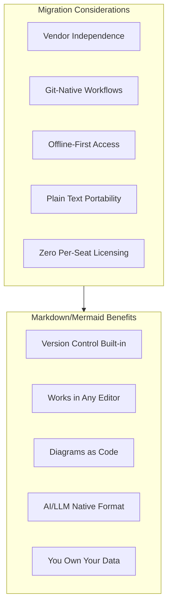
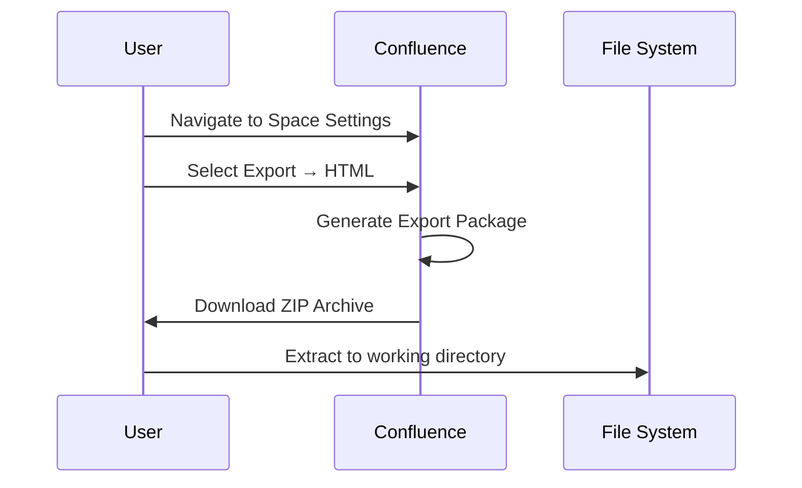
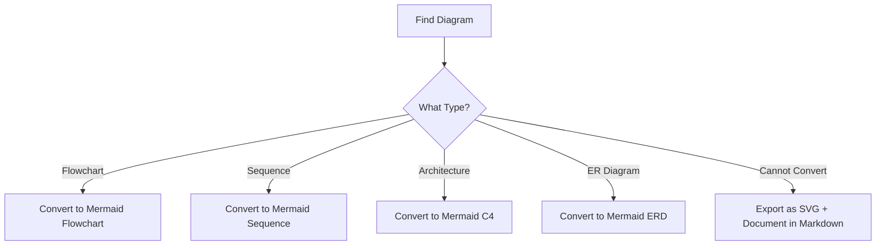
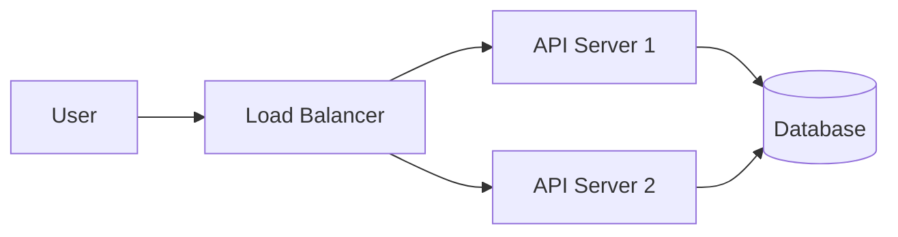

# Migrating from Confluence

This guide provides a comprehensive approach to migrating your documentation from Atlassian Confluence to PIMPyourDocs.

## Confluence Strengths

Confluence is a capable platform with several notable strengths:

- **MCP Integration**: Supports Model Context Protocol for AI tool connectivity
- **OAuth Authentication**: Secure, standards-based authentication for API access
- **Rich Ecosystem**: Extensive marketplace with integrations
- **Enterprise Features**: Permissions, compliance, and audit capabilities

## Why Consider Markdown?

While Confluence works well for many teams, Markdown offers distinct advantages:



**Key differentiator**: With Markdown, your documentation lives in git alongside your code. No separate platform, no vendor lock-in, no per-seat costs.

## Migration Overview


## Prerequisites

```bash
# Required
pandoc --version          # >= 2.x required
python3 --version         # >= 3.8 for cleanup scripts

# Install additional tools
pip install beautifulsoup4 markdownify
npm install -g turndown turndown-plugin-gfm
```

## Step 1: Export from Confluence

### Option A: Space Export (Recommended for Large Migrations)

1. Navigate to **Space Settings** → **Content Tools** → **Export**
2. Select **HTML** format (NOT PDF)
3. Choose **Custom Export** if you need specific pages
4. Include attachments if needed
5. Download the ZIP archive



### Option B: Single Page Export

For individual pages:
1. Open the page in Confluence
2. Click **...** → **Export** → **Export to Word**
3. Use pandoc to convert DOCX to Markdown

```bash
pandoc -f docx -t markdown "Confluence Page.docx" -o page.md
```

### Option C: Confluence API Export (Best for Automation)

```bash
# Export page content via REST API
curl -u username:api_token \
  "https://your-domain.atlassian.net/wiki/rest/api/content/{page-id}?expand=body.storage" \
  | jq -r '.body.storage.value' > page.html

# Convert to Markdown
pandoc -f html -t markdown page.html -o page.md
```

## Step 2: Convert HTML to Markdown

### Basic Conversion

```bash
# Single file
pandoc -f html -t markdown confluence-export.html -o output.md

# With image extraction
pandoc -f html -t markdown \
  --extract-media=./attachments \
  confluence-export.html -o output.md

# Batch conversion
find ./export -name "*.html" -exec sh -c '
  pandoc -f html -t markdown "$1" -o "${1%.html}.md"
' _ {} \;
```

### Recommended Pandoc Options

```bash
pandoc -f html -t markdown \
  --wrap=none \
  --extract-media=./images \
  --standalone \
  input.html -o output.md
```

## Step 3: Clean Up Confluence Artifacts

Confluence exports contain significant noise. This script removes common artifacts:

```python
#!/usr/bin/env python3
"""clean_confluence.py - Clean Confluence export artifacts."""

import re
import sys
from pathlib import Path

def clean_confluence_markdown(content: str) -> str:
    """Remove Confluence-specific artifacts from Markdown."""

    # Remove Confluence macros remnants
    content = re.sub(r'\{[a-z]+:[^}]*\}', '', content)

    # Remove empty divs and spans
    content = re.sub(r'<div[^>]*>\s*</div>', '', content)
    content = re.sub(r'<span[^>]*>\s*</span>', '', content)

    # Clean up excessive whitespace
    content = re.sub(r'\n{3,}', '\n\n', content)

    # Remove Confluence-style anchors
    content = re.sub(r'\[\]\{#[^}]+\}', '', content)

    # Fix broken links
    content = re.sub(r'\[([^\]]+)\]\(\s*\)', r'\1', content)

    # Remove inline styles
    content = re.sub(r'\{style="[^"]*"\}', '', content)

    # Clean table artifacts
    content = re.sub(r'\|\s*\|\s*\|', '| |', content)

    return content.strip()

def add_front_matter(content: str, title: str) -> str:
    """Add YAML front matter to document."""
    from datetime import date

    front_matter = f"""---
title: "{title}"
status: draft
owner: TBD
created: {date.today().isoformat()}
updated: {date.today().isoformat()}
tags: [migrated-from-confluence]
---

"""
    return front_matter + content

if __name__ == "__main__":
    for filepath in sys.argv[1:]:
        path = Path(filepath)
        content = path.read_text(encoding='utf-8')

        # Extract title from first heading or filename
        title_match = re.search(r'^#\s+(.+)$', content, re.MULTILINE)
        title = title_match.group(1) if title_match else path.stem

        cleaned = clean_confluence_markdown(content)
        final = add_front_matter(cleaned, title)

        path.write_text(final, encoding='utf-8')
        print(f"Cleaned: {filepath}")
```

Usage:
```bash
python clean_confluence.py *.md
```

## Step 4: Convert Diagrams to Mermaid

Confluence diagrams (draw.io, Gliffy, Lucidchart) MUST be converted to Mermaid:

### Identifying Diagram Types



### Manual Conversion Process

1. Open the original diagram in Confluence
2. Identify the diagram type and relationships
3. Recreate using appropriate Mermaid syntax

**Before (Confluence draw.io):**
```
[Embedded draw.io diagram - not portable]
```

**After (Mermaid):**


### Diagram Conversion Reference

| Confluence Source | Mermaid Target | Complexity |
|-------------------|----------------|------------|
| draw.io flowchart | `flowchart TB/LR` | Low |
| Gliffy sequence | `sequenceDiagram` | Medium |
| Lucidchart architecture | `flowchart` with subgraphs | Medium |
| Table-based ERD | `erDiagram` | Medium |
| Complex infographics | Export SVG, link as image | N/A |

## Step 5: Fix Links and References

### Convert Confluence Links to Relative Paths

```python
#!/usr/bin/env python3
"""fix_links.py - Convert Confluence links to relative Markdown links."""

import re
import sys
from pathlib import Path

def fix_confluence_links(content: str, page_mapping: dict) -> str:
    """Convert Confluence-style links to relative Markdown links."""

    # Pattern for Confluence page links
    # [Page Title](https://domain.atlassian.net/wiki/spaces/SPACE/pages/12345/Page+Title)
    confluence_pattern = r'\[([^\]]+)\]\(https://[^/]+/wiki/spaces/[^/]+/pages/(\d+)/[^)]*\)'

    def replace_link(match):
        title = match.group(1)
        page_id = match.group(2)

        # Look up in mapping or create kebab-case filename
        if page_id in page_mapping:
            target = page_mapping[page_id]
        else:
            target = re.sub(r'[^a-z0-9]+', '-', title.lower()).strip('-') + '.md'

        return f'[{title}](./{target})'

    return re.sub(confluence_pattern, replace_link, content)

def fix_attachment_links(content: str) -> str:
    """Fix attachment paths to local references."""

    # Convert attachment links to local paths
    pattern = r'\[([^\]]+)\]\(/wiki/download/attachments/[^)]+/([^)]+)\)'
    return re.sub(pattern, r'[\1](./attachments/\2)', content)

if __name__ == "__main__":
    # Build page mapping from export metadata if available
    page_mapping = {}  # page_id -> filename.md

    for filepath in sys.argv[1:]:
        path = Path(filepath)
        content = path.read_text(encoding='utf-8')

        content = fix_confluence_links(content, page_mapping)
        content = fix_attachment_links(content)

        path.write_text(content, encoding='utf-8')
        print(f"Fixed links: {filepath}")
```

### Link Patterns to Fix

| Original Pattern | Target Pattern |
|------------------|----------------|
| `https://domain/wiki/spaces/X/pages/123/Title` | `./title.md` |
| `/wiki/download/attachments/123/file.pdf` | `./attachments/file.pdf` |
| `#anchor-name` | `#anchor-name` (keep as-is) |
| External URLs | Keep as-is |

## Step 6: Validate Migration

### Compliance Checklist

For each migrated document, verify:

- [ ] Valid YAML front matter with all required fields
- [ ] No Confluence macro remnants (`{macro:...}`)
- [ ] No broken links (use `lychee` or similar)
- [ ] All images accessible at referenced paths
- [ ] Diagrams converted to Mermaid (no embedded objects)
- [ ] Code blocks have language identifiers
- [ ] Tables render correctly
- [ ] Document renders in GitHub, VS Code, and Obsidian

### Automated Validation Script

```bash
#!/bin/bash
# validate_migration.sh - Validate migrated Confluence documents

set -e

echo "=== Validating Migration ==="

# Check for YAML front matter
echo "Checking front matter..."
for f in *.md; do
    if ! head -1 "$f" | grep -q "^---$"; then
        echo "ERROR: Missing front matter in $f"
    fi
done

# Check for Confluence artifacts
echo "Checking for Confluence artifacts..."
grep -r -l "{confluence\|{jira\|{gliffy\|{drawio" *.md && \
    echo "WARNING: Found Confluence macro remnants" || \
    echo "OK: No Confluence macros found"

# Check for broken internal links
echo "Checking internal links..."
grep -oh '\]\(\./[^)]*\)' *.md | tr -d '[]()' | while read link; do
    if [ ! -f "$link" ]; then
        echo "WARNING: Broken link: $link"
    fi
done

# Validate Mermaid diagrams
echo "Validating Mermaid diagrams..."
if command -v mmdc &> /dev/null; then
    mmdc --input . --validate 2>&1 || echo "WARNING: Mermaid validation issues"
fi

echo "=== Validation Complete ==="
```

## Common Issues and Solutions

### Issue: Confluence Macros Not Converting

**Symptom:** Text like `{code:java}...{code}` remains in output

**Solution:**
```bash
# Pre-process before pandoc
sed -i 's/{code:\([^}]*\)}/```\1/g; s/{code}/```/g' input.html
```

### Issue: Tables Malformed

**Symptom:** Complex Confluence tables break in Markdown

**Solution:** Simplify tables or convert to HTML tables:
```markdown
<!-- Complex table that doesn't render well in pure Markdown -->
<table>
  <tr><th>Header 1</th><th>Header 2</th></tr>
  <tr><td>Cell 1</td><td>Cell 2</td></tr>
</table>
```

### Issue: Embedded Content Missing

**Symptom:** Jira issues, external embeds show as broken links

**Solution:** Replace with static references:
```markdown
<!-- Before: Embedded Jira macro -->
{jira:PROJ-123}

<!-- After: Static link -->
Related issue: [PROJ-123](https://jira.company.com/browse/PROJ-123)
```

### Issue: Page Hierarchy Lost

**Symptom:** Flat file structure, no navigation

**Solution:** Create explicit navigation:
```markdown
<!-- Add to each page -->
## Navigation

- [← Parent Page](../parent.md)
- [→ Next: Child Page](./child.md)

## Related Pages

- [Related Topic 1](./related-1.md)
- [Related Topic 2](./related-2.md)
```

## Batch Migration Script

```bash
#!/bin/bash
# migrate_confluence_space.sh - Full migration automation

EXPORT_DIR="$1"
OUTPUT_DIR="$2"

if [ -z "$EXPORT_DIR" ] || [ -z "$OUTPUT_DIR" ]; then
    echo "Usage: $0 <confluence-export-dir> <output-dir>"
    exit 1
fi

mkdir -p "$OUTPUT_DIR/attachments"

echo "Converting HTML files..."
find "$EXPORT_DIR" -name "*.html" | while read html_file; do
    filename=$(basename "$html_file" .html)
    output_file="$OUTPUT_DIR/$(echo "$filename" | tr '[:upper:]' '[:lower:]' | tr ' ' '-').md"

    pandoc -f html -t markdown \
        --wrap=none \
        --extract-media="$OUTPUT_DIR/attachments" \
        "$html_file" -o "$output_file"

    echo "Converted: $filename"
done

echo "Copying attachments..."
find "$EXPORT_DIR" -name "attachments" -type d -exec cp -r {}/* "$OUTPUT_DIR/attachments/" \; 2>/dev/null

echo "Running cleanup..."
python3 clean_confluence.py "$OUTPUT_DIR"/*.md

echo "Fixing links..."
python3 fix_links.py "$OUTPUT_DIR"/*.md

echo "Migration complete! Review files in $OUTPUT_DIR"
```

## Post-Migration Tasks

1. **Review all documents** for formatting issues
2. **Recreate diagrams** in Mermaid format
3. **Update internal links** to use relative paths
4. **Add proper front matter** with ownership and status
5. **Initialize Git repository** and make initial commit
6. **Set up CI/CD** for link checking and validation
7. **Deprecate Confluence space** with redirect notice

## Timeline Estimate

| Space Size | Estimated Effort |
|------------|------------------|
| < 50 pages | 1-2 days |
| 50-200 pages | 1 week |
| 200-500 pages | 2-3 weeks |
| 500+ pages | Phased approach recommended |

## References

- [Pandoc User's Guide](https://pandoc.org/MANUAL.html)
- [Confluence REST API](https://developer.atlassian.com/cloud/confluence/rest/)
- [PIMPyourDocs SPEC](../SPEC.md)
- [Mermaid Diagram Syntax](../diagrams/index.md)
