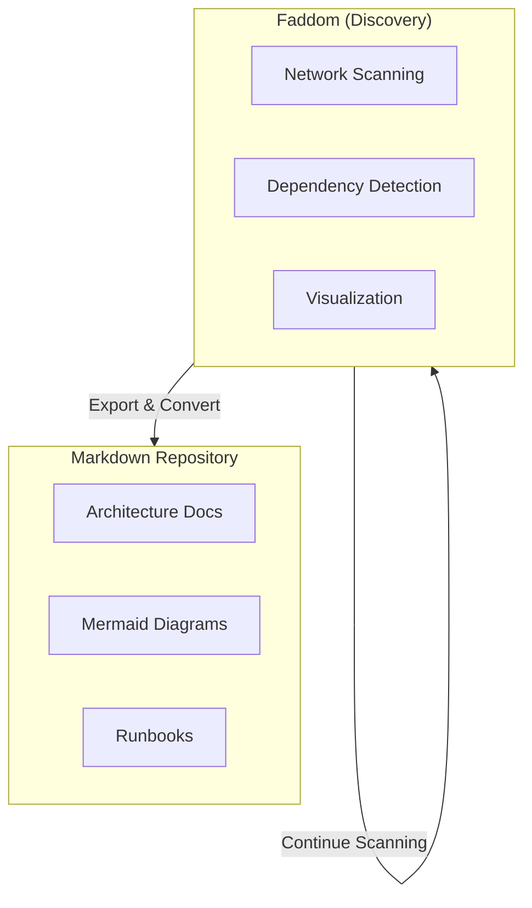
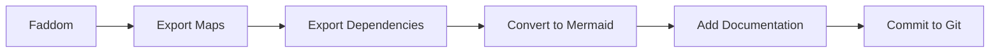
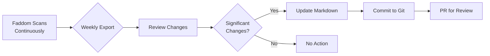

# Migrating from Faddom

This guide covers exporting your infrastructure documentation from Faddom to platform-independent Markdown with Mermaid diagrams.

## About Faddom

Faddom is a cloud-based tool that simplifies network visualization and infrastructure mapping by automatically discovering and documenting IT environments. Key features:

- **Automatic Discovery**: Agentless infrastructure scanning
- **Dependency Mapping**: Application and service dependencies
- **Network Visualization**: Auto-generated network diagrams
- **Cloud Support**: AWS, Azure, GCP discovery
- **Hybrid Mapping**: On-prem and cloud combined

## Faddom Strengths

- **Agentless Discovery**: No agents to deploy
- **Fast Setup**: Quick time to value
- **Visual Maps**: Automatic diagram generation
- **Dependency Analysis**: Understand application flows
- **Export Capabilities**: Good export options (including Visio, CSV)

## Why Consider Markdown + Mermaid?

Faddom excels at **discovery**. The goal isn't to replace it, but to capture the discovered architecture as **code** that lives with your other documentation:



**Key insight**: Use Faddom for ongoing discovery, export periodically to Markdown/Mermaid for version-controlled documentation.

## Migration Overview



## Prerequisites

```bash
# Required
python3 --version         # >= 3.8
pip install requests pyyaml

# For Visio conversion (if using Visio exports)
# Consider: https://github.com/nickvdyck/visio-to-mermaid
```

## Export Methods

### Method 1: API Export (Recommended)

```python
#!/usr/bin/env python3
"""faddom_export.py - Export Faddom infrastructure data via API."""

import os
import requests
from pathlib import Path
from datetime import date
import re
import json

class FaddomExporter:
    def __init__(self, api_url: str, api_key: str):
        self.base_url = api_url.rstrip('/')
        self.headers = {
            "Authorization": f"Bearer {api_key}",
            "Content-Type": "application/json"
        }

    def _get(self, endpoint: str) -> dict:
        """Make authenticated GET request."""
        url = f"{self.base_url}/{endpoint}"
        response = requests.get(url, headers=self.headers)
        response.raise_for_status()
        return response.json()

    def get_servers(self) -> list:
        """Get all discovered servers."""
        return self._get("servers")

    def get_applications(self) -> list:
        """Get discovered applications."""
        return self._get("applications")

    def get_dependencies(self) -> list:
        """Get dependency mappings."""
        return self._get("dependencies")

    def get_networks(self) -> list:
        """Get network segments."""
        return self._get("networks")

    def get_topology(self) -> dict:
        """Get full topology data."""
        return self._get("topology")

def to_kebab(s: str) -> str:
    """Convert string to kebab-case."""
    if not s:
        return "unnamed"
    return re.sub(r'[^a-z0-9]+', '-', s.lower()).strip('-')

def generate_mermaid_architecture(topology: dict) -> str:
    """Generate Mermaid C4/flowchart from topology."""

    servers = topology.get("servers", [])
    dependencies = topology.get("dependencies", [])
    networks = topology.get("networks", [])

    mermaid = "```mermaid\nflowchart TB\n"

    # Group servers by network/environment
    network_groups = {}
    for server in servers:
        network = server.get("network", "Default")
        if network not in network_groups:
            network_groups[network] = []
        network_groups[network].append(server)

    # Create subgraphs for each network
    for network, net_servers in network_groups.items():
        net_id = to_kebab(network)
        mermaid += f'    subgraph {net_id}["{network}"]\n'

        for server in net_servers:
            srv_id = to_kebab(server.get("name", "unknown"))
            srv_name = server.get("name", "Unknown")
            srv_type = server.get("type", "server")

            # Use different shapes based on type
            if "database" in srv_type.lower():
                mermaid += f'        {srv_id}[("{srv_name}")]\n'
            elif "web" in srv_type.lower() or "app" in srv_type.lower():
                mermaid += f'        {srv_id}["{srv_name}"]\n'
            else:
                mermaid += f'        {srv_id}[{srv_name}]\n'

        mermaid += "    end\n"

    # Add dependencies
    for dep in dependencies:
        source = to_kebab(dep.get("source", ""))
        target = to_kebab(dep.get("target", ""))
        protocol = dep.get("protocol", "")

        if source and target:
            if protocol:
                mermaid += f"    {source} -->|{protocol}| {target}\n"
            else:
                mermaid += f"    {source} --> {target}\n"

    mermaid += "```"
    return mermaid

def generate_server_document(server: dict) -> str:
    """Generate Markdown document for a server."""

    name = server.get("name", "Unknown")

    content = f"""---
title: "{name}"
status: published
owner: infrastructure-team
created: {date.today().isoformat()}
updated: {date.today().isoformat()}
tags: [server, infrastructure, {to_kebab(server.get('os', 'unknown'))}]
discovered_by: faddom
---

# {name}

## Overview

| Field | Value |
|-------|-------|
| Hostname | {server.get('hostname', 'N/A')} |
| IP Address | {server.get('ip_address', 'N/A')} |
| Operating System | {server.get('os', 'N/A')} |
| OS Version | {server.get('os_version', 'N/A')} |
| CPU Cores | {server.get('cpu_cores', 'N/A')} |
| Memory (GB) | {server.get('memory_gb', 'N/A')} |
| Network | {server.get('network', 'N/A')} |
| Environment | {server.get('environment', 'N/A')} |

## Services

"""

    services = server.get("services", [])
    if services:
        content += "| Service | Port | Protocol |\n|---------|------|----------|\n"
        for svc in services:
            content += f"| {svc.get('name', 'N/A')} | {svc.get('port', 'N/A')} | {svc.get('protocol', 'N/A')} |\n"
    else:
        content += "_No services discovered_\n"

    content += "\n## Dependencies\n\n"

    deps = server.get("dependencies", [])
    if deps:
        content += "### Outbound (This server connects to)\n\n"
        for dep in deps:
            if dep.get("direction") == "outbound":
                content += f"- [{dep.get('target')}](./{to_kebab(dep.get('target'))}.md) ({dep.get('protocol', 'unknown')})\n"

        content += "\n### Inbound (Connected to by)\n\n"
        for dep in deps:
            if dep.get("direction") == "inbound":
                content += f"- [{dep.get('source')}](./{to_kebab(dep.get('source'))}.md) ({dep.get('protocol', 'unknown')})\n"
    else:
        content += "_No dependencies discovered_\n"

    return content

def export_to_markdown(exporter: FaddomExporter, output_dir: Path):
    """Export Faddom data to Markdown files."""

    output_dir.mkdir(parents=True, exist_ok=True)

    print("Fetching topology...")
    topology = exporter.get_topology()

    # Generate architecture overview
    print("Generating architecture diagram...")
    mermaid = generate_mermaid_architecture(topology)

    overview = f"""---
title: "Infrastructure Overview"
status: published
owner: infrastructure-team
created: {date.today().isoformat()}
updated: {date.today().isoformat()}
tags: [infrastructure, architecture, network]
source: faddom-discovery
---

# Infrastructure Overview

This documentation was generated from Faddom network discovery.
Last scan: {date.today().isoformat()}

## Architecture Diagram

{mermaid}

## Quick Stats

| Metric | Count |
|--------|-------|
| Servers | {len(topology.get('servers', []))} |
| Networks | {len(topology.get('networks', []))} |
| Dependencies | {len(topology.get('dependencies', []))} |
| Applications | {len(topology.get('applications', []))} |

## Contents

- [Servers](./servers/)
- [Applications](./applications/)
- [Networks](./networks/)

"""

    (output_dir / "README.md").write_text(overview, encoding='utf-8')

    # Export servers
    servers_dir = output_dir / "servers"
    servers_dir.mkdir(exist_ok=True)

    for server in topology.get("servers", []):
        content = generate_server_document(server)
        filename = to_kebab(server.get("name", "unknown")) + ".md"
        (servers_dir / filename).write_text(content, encoding='utf-8')

    print(f"Exported {len(topology.get('servers', []))} servers")

    # Export network segments
    networks_dir = output_dir / "networks"
    networks_dir.mkdir(exist_ok=True)

    for network in topology.get("networks", []):
        content = generate_network_document(network, topology.get("servers", []))
        filename = to_kebab(network.get("name", "unknown")) + ".md"
        (networks_dir / filename).write_text(content, encoding='utf-8')

    print(f"Exported {len(topology.get('networks', []))} networks")

def generate_network_document(network: dict, all_servers: list) -> str:
    """Generate Markdown document for a network segment."""

    name = network.get("name", "Unknown Network")
    network_servers = [s for s in all_servers if s.get("network") == name]

    content = f"""---
title: "{name}"
status: published
owner: infrastructure-team
created: {date.today().isoformat()}
updated: {date.today().isoformat()}
tags: [network, infrastructure]
---

# {name}

## Overview

| Field | Value |
|-------|-------|
| Subnet | {network.get('subnet', 'N/A')} |
| VLAN | {network.get('vlan', 'N/A')} |
| Gateway | {network.get('gateway', 'N/A')} |
| Environment | {network.get('environment', 'N/A')} |

## Servers in this Network

"""

    if network_servers:
        content += "| Server | IP Address | OS |\n|--------|------------|----|\n"
        for server in network_servers:
            srv_name = server.get("name", "Unknown")
            content += f"| [{srv_name}](../servers/{to_kebab(srv_name)}.md) | {server.get('ip_address', 'N/A')} | {server.get('os', 'N/A')} |\n"
    else:
        content += "_No servers discovered in this network_\n"

    return content

def main():
    API_URL = os.environ.get("FADDOM_API_URL")
    API_KEY = os.environ.get("FADDOM_API_KEY")
    OUTPUT_DIR = Path(os.environ.get("OUTPUT_DIR", "./faddom-export"))

    if not API_URL or not API_KEY:
        print("Error: Set FADDOM_API_URL and FADDOM_API_KEY environment variables")
        return

    exporter = FaddomExporter(API_URL, API_KEY)
    export_to_markdown(exporter, OUTPUT_DIR)

    print(f"\nExport complete! Files saved to: {OUTPUT_DIR}")

if __name__ == "__main__":
    main()
```

### Method 2: Manual Export + Conversion

1. Export from Faddom UI as Visio or CSV
2. Convert to Mermaid manually or with tools

## Converting Visio to Mermaid

For complex diagrams exported as Visio:

```python
#!/usr/bin/env python3
"""visio_to_mermaid.py - Helper for converting Visio concepts to Mermaid."""

def create_mermaid_template(diagram_type: str) -> str:
    """Provide Mermaid template based on Visio diagram type."""

    templates = {
        "network": '''```mermaid
flowchart TB
    subgraph Internet["Internet"]
        CLOUD((Cloud))
    end

    subgraph DMZ["DMZ"]
        FW[Firewall]
        WAF[WAF]
    end

    subgraph Internal["Internal Network"]
        subgraph Servers["Server Segment"]
            WEB[Web Server]
            APP[App Server]
            DB[(Database)]
        end

        subgraph Users["User Segment"]
            WS[Workstations]
        end
    end

    CLOUD --> FW
    FW --> WAF
    WAF --> WEB
    WEB --> APP
    APP --> DB
    WS --> APP
```''',

        "application": '''```mermaid
flowchart LR
    subgraph Client["Client Layer"]
        BROWSER[Browser]
        MOBILE[Mobile App]
    end

    subgraph Application["Application Layer"]
        LB[Load Balancer]
        API1[API Server 1]
        API2[API Server 2]
    end

    subgraph Data["Data Layer"]
        CACHE[(Redis Cache)]
        DB[(PostgreSQL)]
        QUEUE[Message Queue]
    end

    BROWSER --> LB
    MOBILE --> LB
    LB --> API1
    LB --> API2
    API1 --> CACHE
    API2 --> CACHE
    API1 --> DB
    API2 --> DB
    API1 --> QUEUE
    API2 --> QUEUE
```''',

        "sequence": '''```mermaid
sequenceDiagram
    participant C as Client
    participant LB as Load Balancer
    participant API as API Server
    participant DB as Database

    C->>+LB: Request
    LB->>+API: Forward
    API->>+DB: Query
    DB-->>-API: Results
    API-->>-LB: Response
    LB-->>-C: Response
```'''
    }

    return templates.get(diagram_type, templates["network"])

# Usage: Start with template, customize from Visio export data
print(create_mermaid_template("network"))
```

## Directory Structure

```
faddom-export/
├── README.md                  # Infrastructure overview with main diagram
├── servers/
│   ├── web-server-01.md
│   ├── app-server-01.md
│   ├── db-server-01.md
│   └── ...
├── networks/
│   ├── production.md
│   ├── dmz.md
│   └── management.md
└── applications/
    ├── web-portal.md
    └── api-gateway.md
```

## Ongoing Workflow

Since Faddom continuously discovers, establish a periodic export process:



```bash
#!/bin/bash
# weekly_faddom_sync.sh - Run weekly to sync Faddom discoveries

set -e

# Export from Faddom
python3 faddom_export.py

# Check for changes
cd faddom-export
if git diff --quiet; then
    echo "No changes detected"
    exit 0
fi

# Create branch and commit
DATE=$(date +%Y-%m-%d)
git checkout -b "faddom-sync-$DATE"
git add .
git commit -m "Infrastructure update from Faddom scan ($DATE)"

echo "Changes committed. Review and create PR."
```

## Validation Checklist

- [ ] All servers documented
- [ ] Network segments captured
- [ ] Dependencies shown in Mermaid diagrams
- [ ] Front matter on all documents
- [ ] Links between servers/networks work
- [ ] Architecture diagram is accurate
- [ ] Export process is repeatable

## References

- [Faddom Documentation](https://docs.faddom.com/)
- [Mermaid Flowchart Syntax](https://mermaid.js.org/syntax/flowchart.html)
- [C4 Model with Mermaid](https://mermaid.js.org/syntax/c4c.html)
