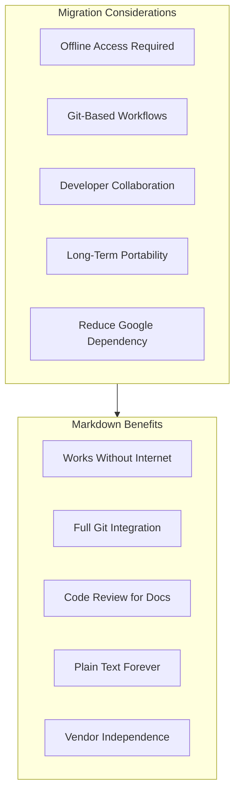
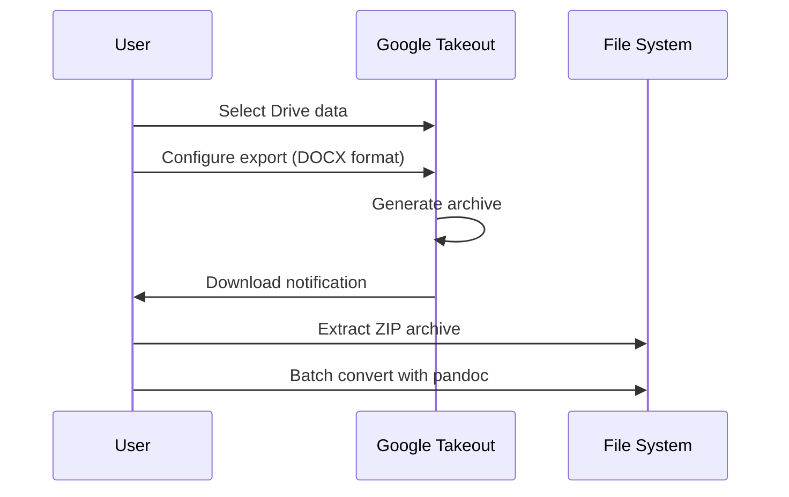
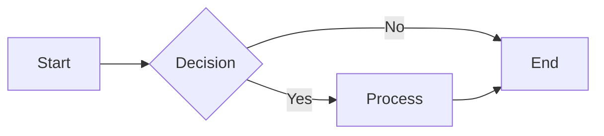

# Migrating from Google Docs

This guide covers exporting your documentation from Google Docs to platform-independent Markdown files.

## Google Docs Strengths

Google Docs is a capable platform with notable features:

- **Real-Time Collaboration**: Multiple users editing simultaneously
- **Cloud-Native**: Access from any device with a browser
- **Comments & Suggestions**: Built-in review workflow
- **Google Workspace Integration**: Seamless with Gmail, Drive, Meet
- **Sharing Controls**: Granular permission settings

## Why Consider Markdown?

While Google Docs excels at collaboration, Markdown offers distinct advantages for technical documentation:



**Key differentiator**: Markdown documentation lives alongside your code, gets version controlled, and doesn't require Google account access.

## Migration Overview


## Prerequisites

```bash
# Required tools
pandoc --version          # >= 2.x required

# Recommended
pip install gdocs-to-md   # Alternative converter
npm install mammoth       # DOCX to HTML (better table handling)
```

## Export Methods

### Method 1: Manual Export (Single Documents)

1. Open the Google Doc
2. Click **File** → **Download** → **Microsoft Word (.docx)**
3. Convert with pandoc

```bash
pandoc -f docx -t markdown "Document Name.docx" -o document-name.md
```

### Method 2: Google Takeout (Bulk Export)

Best for: Entire Drive migrations

1. Go to [Google Takeout](https://takeout.google.com/)
2. Deselect all, then select **Drive**
3. Click **All Drive data included** → Select specific folders
4. Choose **Export once** → **.zip** format
5. Under **File types**, keep as **DOCX** (not PDF)
6. Download and extract



### Method 3: Google Drive API (Automated)

Best for: Continuous sync, large document sets

```python
#!/usr/bin/env python3
"""google_docs_export.py - Export Google Docs via API."""

from google.oauth2.credentials import Credentials
from google_auth_oauthlib.flow import InstalledAppFlow
from googleapiclient.discovery import build
from googleapiclient.http import MediaIoBaseDownload
import io
import os
import subprocess

SCOPES = ['https://www.googleapis.com/auth/drive.readonly']

def get_credentials():
    """Get or refresh credentials."""
    creds = None
    if os.path.exists('token.json'):
        creds = Credentials.from_authorized_user_file('token.json', SCOPES)

    if not creds or not creds.valid:
        flow = InstalledAppFlow.from_client_secrets_file('credentials.json', SCOPES)
        creds = flow.run_local_server(port=0)
        with open('token.json', 'w') as token:
            token.write(creds.to_json())

    return creds

def export_google_doc(service, file_id, output_path):
    """Export a Google Doc to DOCX and convert to Markdown."""

    # Export as DOCX
    request = service.files().export_media(
        fileId=file_id,
        mimeType='application/vnd.openxmlformats-officedocument.wordprocessingml.document'
    )

    docx_path = output_path.replace('.md', '.docx')

    with open(docx_path, 'wb') as f:
        downloader = MediaIoBaseDownload(f, request)
        done = False
        while not done:
            status, done = downloader.next_chunk()

    # Convert to Markdown
    subprocess.run([
        'pandoc', '-f', 'docx', '-t', 'markdown',
        '--extract-media=./images',
        '--wrap=none',
        docx_path, '-o', output_path
    ], check=True)

    # Clean up DOCX
    os.remove(docx_path)
    print(f"Exported: {output_path}")

def export_folder(service, folder_id, output_dir):
    """Export all Google Docs in a folder."""

    os.makedirs(output_dir, exist_ok=True)

    # Query for Google Docs in folder
    query = f"'{folder_id}' in parents and mimeType='application/vnd.google-apps.document'"
    results = service.files().list(q=query, fields="files(id, name)").execute()

    for file in results.get('files', []):
        filename = file['name'].lower().replace(' ', '-') + '.md'
        output_path = os.path.join(output_dir, filename)
        export_google_doc(service, file['id'], output_path)

if __name__ == "__main__":
    creds = get_credentials()
    service = build('drive', 'v3', credentials=creds)

    # Export a specific folder
    FOLDER_ID = "your-folder-id-here"
    export_folder(service, FOLDER_ID, "./exported-docs")
```

## Step 1: Batch Convert DOCX to Markdown

```bash
#!/bin/bash
# convert_docx.sh - Batch convert DOCX files to Markdown

INPUT_DIR="$1"
OUTPUT_DIR="$2"

mkdir -p "$OUTPUT_DIR/images"

find "$INPUT_DIR" -name "*.docx" | while read docx; do
    filename=$(basename "$docx" .docx)
    # Convert to kebab-case
    kebab=$(echo "$filename" | tr '[:upper:]' '[:lower:]' | sed 's/[^a-z0-9]/-/g' | sed 's/--*/-/g' | sed 's/^-//' | sed 's/-$//')
    output="$OUTPUT_DIR/${kebab}.md"

    echo "Converting: $filename"
    pandoc -f docx -t markdown \
        --extract-media="$OUTPUT_DIR/images" \
        --wrap=none \
        --standalone \
        "$docx" -o "$output"
done

echo "Conversion complete!"
```

### Recommended Pandoc Options

```bash
pandoc -f docx -t markdown \
    --wrap=none \                    # Don't wrap lines
    --extract-media=./images \       # Extract embedded images
    --standalone \                   # Include metadata
    --reference-links \              # Use reference-style links
    input.docx -o output.md
```

## Step 2: Clean Up Google Docs Artifacts

```python
#!/usr/bin/env python3
"""clean_google_docs.py - Clean Google Docs export artifacts."""

import re
import sys
from pathlib import Path
from datetime import date

def clean_google_docs_markdown(content: str) -> str:
    """Remove Google Docs-specific artifacts from Markdown."""

    # Remove Google Docs comments
    content = re.sub(r'\[\[.*?\]\]\{\.comment-start.*?\}.*?\[\[.*?\]\]\{\.comment-end.*?\}', '', content, flags=re.DOTALL)

    # Remove tracked changes markup
    content = re.sub(r'\{\.insertion.*?\}', '', content)
    content = re.sub(r'\{\.deletion.*?\}', '', content)

    # Clean up span classes from pandoc
    content = re.sub(r'\{\.underline\}', '', content)
    content = re.sub(r'\{\.mark\}', '', content)
    content = re.sub(r'\{\.smallcaps\}', '', content)

    # Remove empty links
    content = re.sub(r'\[([^\]]+)\]\(\s*\)', r'\1', content)

    # Fix smart quotes to straight quotes
    content = content.replace('"', '"').replace('"', '"')
    content = content.replace(''', "'").replace(''', "'")

    # Fix em-dash and en-dash
    content = content.replace('—', ' -- ')
    content = content.replace('–', '-')

    # Clean up excessive whitespace
    content = re.sub(r'\n{3,}', '\n\n', content)

    # Remove Google Docs page breaks
    content = re.sub(r'\\newpage', '', content)
    content = re.sub(r'<div style="page-break-after: always;"></div>', '', content)

    # Fix bullet point indentation issues
    content = re.sub(r'^(\s*)-\s+', r'- ', content, flags=re.MULTILINE)

    # Fix numbered list formatting
    content = re.sub(r'^(\s*)\d+\\\.\s+', r'\g<1>1. ', content, flags=re.MULTILINE)

    return content.strip()

def add_front_matter(content: str, title: str) -> str:
    """Add YAML front matter to document."""

    front_matter = f"""---
title: "{title}"
status: draft
owner: TBD
created: {date.today().isoformat()}
updated: {date.today().isoformat()}
tags: [migrated-from-google-docs]
---

"""
    return front_matter + content

def extract_title(content: str, filename: str) -> str:
    """Extract title from first heading or filename."""
    match = re.search(r'^#\s+(.+)$', content, re.MULTILINE)
    if match:
        return match.group(1).strip()

    # Clean up filename as title
    return filename.replace('-', ' ').replace('.md', '').title()

if __name__ == "__main__":
    for filepath in sys.argv[1:]:
        path = Path(filepath)
        content = path.read_text(encoding='utf-8')

        title = extract_title(content, path.name)
        cleaned = clean_google_docs_markdown(content)
        final = add_front_matter(cleaned, title)

        path.write_text(final, encoding='utf-8')
        print(f"Cleaned: {filepath}")
```

## Step 3: Handle Images

Google Docs images are embedded and export with generic names:

```bash
# Images are extracted to: ./images/media/image1.png, image2.png, etc.

# Rename images based on document context (manual step)
# Or use a script to generate meaningful names:
```

```python
#!/usr/bin/env python3
"""rename_images.py - Rename exported images with meaningful names."""

import re
import sys
from pathlib import Path
import hashlib

def process_document(md_path: str, images_dir: str):
    """Rename images and update references in document."""

    path = Path(md_path)
    content = path.read_text(encoding='utf-8')
    images_path = Path(images_dir)

    # Find all image references
    pattern = r'!\[([^\]]*)\]\(([^)]+)\)'

    def rename_image(match):
        alt_text = match.group(1)
        original_path = match.group(2)

        if not Path(original_path).exists():
            return match.group(0)  # Keep as-is if not found

        # Generate new name from alt text or hash
        if alt_text:
            new_name = re.sub(r'[^a-z0-9]+', '-', alt_text.lower()).strip('-')
        else:
            # Use hash of file content
            with open(original_path, 'rb') as f:
                file_hash = hashlib.md5(f.read()).hexdigest()[:8]
            new_name = f"image-{file_hash}"

        ext = Path(original_path).suffix
        new_path = images_path / f"{new_name}{ext}"

        # Rename file
        if Path(original_path).exists() and not new_path.exists():
            Path(original_path).rename(new_path)

        return f''

    updated_content = re.sub(pattern, rename_image, content)
    path.write_text(updated_content, encoding='utf-8')
    print(f"Processed images in: {md_path}")

if __name__ == "__main__":
    if len(sys.argv) < 3:
        print("Usage: python rename_images.py <document.md> <images_dir>")
        sys.exit(1)

    process_document(sys.argv[1], sys.argv[2])
```

## Step 4: Convert Tables

Google Docs tables often export poorly. Options:

### Simple Tables

Pandoc handles simple tables well:

```markdown
| Column 1 | Column 2 | Column 3 |
|----------|----------|----------|
| Data 1   | Data 2   | Data 3   |
```

### Complex Tables

For complex tables (merged cells, nested content), use HTML:

```markdown
<table>
  <tr>
    <th colspan="2">Merged Header</th>
  </tr>
  <tr>
    <td>Cell 1</td>
    <td>Cell 2</td>
  </tr>
</table>
```

### Alternative: mammoth for Better Tables

```bash
npm install -g mammoth

# Convert DOCX to HTML (better table preservation)
mammoth document.docx --output-format=markdown > output.md
```

## Step 5: Convert Diagrams

Google Docs drawings MUST be converted to Mermaid:

### Identifying Diagrams

```bash
# Find exported images that might be diagrams
find ./images -name "*.png" -size +50k | while read img; do
    echo "Review for diagram conversion: $img"
done
```

### Conversion Process

1. **Identify diagram type** (flowchart, sequence, architecture)
2. **Extract structure** from the image
3. **Recreate in Mermaid**

**Before (Google Docs Drawing):**
```markdown

```

**After (Mermaid):**
```markdown

```

## Step 6: Fix Links

```python
#!/usr/bin/env python3
"""fix_google_links.py - Convert Google Docs links to relative paths."""

import re
import sys
from pathlib import Path

def fix_google_links(content: str, doc_mapping: dict) -> str:
    """Convert Google Docs links to relative Markdown links."""

    # Pattern for Google Docs links
    google_doc_pattern = r'\[([^\]]+)\]\(https://docs\.google\.com/document/d/([a-zA-Z0-9_-]+)/[^)]*\)'

    def replace_google_link(match):
        title = match.group(1)
        doc_id = match.group(2)

        if doc_id in doc_mapping:
            return f'[{title}](./{doc_mapping[doc_id]})'
        else:
            # Keep as external link with note
            return f'[{title}](https://docs.google.com/document/d/{doc_id}) <!-- TODO: migrate this doc -->'

    content = re.sub(google_doc_pattern, replace_google_link, content)

    # Fix Google Drive file links
    drive_pattern = r'\[([^\]]+)\]\(https://drive\.google\.com/[^)]+\)'
    content = re.sub(drive_pattern, r'[\1](./attachments/\1) <!-- TODO: download from Drive -->', content)

    return content

def to_kebab(s: str) -> str:
    return re.sub(r'[^a-z0-9]+', '-', s.lower()).strip('-')

if __name__ == "__main__":
    # Build doc mapping from command line or file
    doc_mapping = {}  # doc_id -> local_filename.md

    for filepath in sys.argv[1:]:
        path = Path(filepath)
        content = path.read_text(encoding='utf-8')

        fixed = fix_google_links(content, doc_mapping)

        path.write_text(fixed, encoding='utf-8')
        print(f"Fixed links: {filepath}")
```

## Step 7: Validate Migration

### Compliance Checklist

- [ ] Valid YAML front matter on all documents
- [ ] No Google Docs comments or tracked changes
- [ ] All images extracted and accessible
- [ ] Tables render correctly
- [ ] Diagrams converted to Mermaid
- [ ] Google Docs/Drive links converted to relative paths
- [ ] Smart quotes converted to straight quotes
- [ ] Documents render in GitHub, VS Code, Obsidian

### Validation Script

```bash
#!/bin/bash
# validate_google_docs_migration.sh

echo "=== Validating Google Docs Migration ==="

# Check front matter
echo "Checking front matter..."
for f in *.md; do
    if ! head -1 "$f" | grep -q "^---$"; then
        echo "ERROR: Missing front matter in $f"
    fi
done

# Check for Google Docs artifacts
echo "Checking for Google Docs artifacts..."
grep -l '{\.underline}\|{\.mark}\|{\.comment' *.md && \
    echo "WARNING: Found Google Docs artifacts" || \
    echo "OK: No Google Docs artifacts"

# Check for Google links
echo "Checking for Google links..."
grep -l 'docs\.google\.com\|drive\.google\.com' *.md && \
    echo "WARNING: Found Google links (review and update)" || \
    echo "OK: No Google links"

# Check image references
echo "Checking image references..."
grep -oh '!\[[^]]*\]([^)]*\.png)' *.md | tr -d '[]()!' | while read img; do
    if [ ! -f "$img" ]; then
        echo "WARNING: Missing image: $img"
    fi
done

echo "=== Validation Complete ==="
```

## Full Migration Script

```bash
#!/bin/bash
# migrate_google_docs.sh - Complete Google Docs migration

set -e

INPUT_DIR="$1"
OUTPUT_DIR="$2"

if [ -z "$INPUT_DIR" ] || [ -z "$OUTPUT_DIR" ]; then
    echo "Usage: $0 <google-takeout-dir> <output-dir>"
    exit 1
fi

echo "=== Starting Google Docs Migration ==="

mkdir -p "$OUTPUT_DIR/images"
mkdir -p "$OUTPUT_DIR/attachments"

# Convert all DOCX files
echo "Converting DOCX files..."
find "$INPUT_DIR" -name "*.docx" | while read docx; do
    filename=$(basename "$docx" .docx)
    kebab=$(echo "$filename" | tr '[:upper:]' '[:lower:]' | sed 's/[^a-z0-9]/-/g' | sed 's/--*/-/g')
    output="$OUTPUT_DIR/${kebab}.md"

    pandoc -f docx -t markdown \
        --extract-media="$OUTPUT_DIR/images" \
        --wrap=none \
        "$docx" -o "$output"

    echo "Converted: $filename"
done

# Clean up artifacts
echo "Cleaning artifacts..."
python3 clean_google_docs.py "$OUTPUT_DIR"/*.md

# Fix links
echo "Fixing links..."
python3 fix_google_links.py "$OUTPUT_DIR"/*.md

echo "=== Migration Complete ==="
echo ""
echo "Next steps:"
echo "  1. Review all files for formatting issues"
echo "  2. Convert diagrams to Mermaid"
echo "  3. Download referenced Google Drive files"
echo "  4. Update front matter (owner, status)"
echo "  5. Initialize git repository"
```

## Common Issues and Solutions

### Issue: Tables with Merged Cells

**Symptom:** Complex tables render as garbled text

**Solution:** Convert to HTML tables or simplify structure

### Issue: Embedded Google Drawings

**Symptom:** Drawings export as low-resolution images

**Solution:**
1. Open original Doc
2. Right-click drawing → "Open source"
3. File → Download as SVG
4. Convert to Mermaid or keep as SVG

### Issue: Comments and Suggestions

**Symptom:** Tracked changes appear as markup

**Solution:** Accept/reject all changes before export, or use cleanup script

### Issue: Linked Google Sheets

**Symptom:** Embedded sheets don't export

**Solution:** Export sheets separately as CSV, convert to Markdown tables

## References

- [Pandoc User's Guide](https://pandoc.org/MANUAL.html)
- [Google Drive API](https://developers.google.com/drive/api)
- [Google Takeout](https://takeout.google.com/)
- [PIMPyourDocs SPEC](../SPEC.md)
