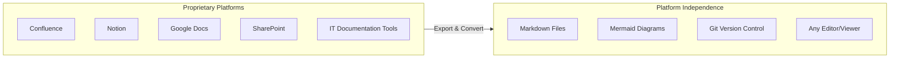
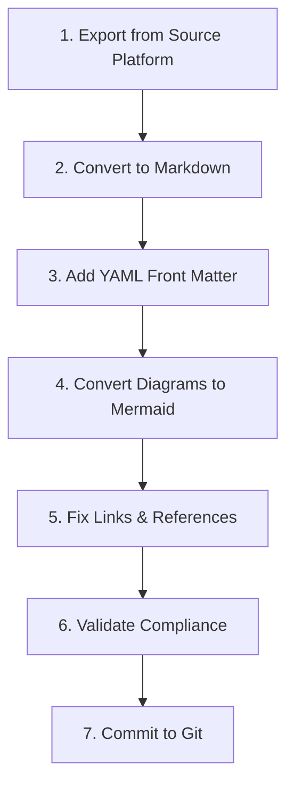

# Migration Guides

These guides help you adopt platform-independent documentation practices by migrating content from proprietary systems to Markdown.

## The PIMPyourDocs Philosophy

**PIMPyourDocs** (Practical, Independent Markdown Practices) isn't a platform—it's a framework and philosophy for documentation that:

- **Stays independent** from any single vendor
- **Uses Markdown** as the universal format
- **Treats diagrams as code** with Mermaid
- **Lives in Git** alongside your source code
- **Works anywhere** without special rendering

## Why Adopt Markdown?



**Key benefits:**
- **Portability**: Markdown works in GitHub, GitLab, VS Code, Obsidian, and hundreds of other tools
- **Version Control**: Full git history, diffs, branches, pull requests for docs
- **AI-Ready**: Plain text with semantic structure is optimal for LLMs
- **Zero Lock-in**: No vendor controls your documentation format
- **Offline-First**: No internet required to read or edit

## Migration Process Overview



## Available Migration Guides

### Wiki & Documentation Platforms

| Platform | Guide | Difficulty | Export Quality |
|----------|-------|------------|----------------|
| Confluence | [confluence.md](./confluence.md) | Medium | Poor |
| Notion | [notion.md](./notion.md) | Easy | Medium |
| Google Docs | [google-docs.md](./google-docs.md) | Easy | Medium |
| SharePoint | [sharepoint.md](./sharepoint.md) | Hard | Poor |

### IT Documentation & MSP Platforms

| Platform | Guide | Difficulty | Export Quality |
|----------|-------|------------|----------------|
| ITGlue | [itglue.md](./itglue.md) | Medium | Medium |
| NinjaOne | [ninjaone.md](./ninjaone.md) | Medium | Medium |
| SuperOps | [superops.md](./superops.md) | Medium | Medium |
| Atera | [atera.md](./atera.md) | Medium | Medium |
| N-able Passportal | [passportal.md](./passportal.md) | Hard | Poor |
| Faddom | [faddom.md](./faddom.md) | Easy | Good |
| ITBoost | [itboost.md](./itboost.md) | Medium | Medium |

## Prerequisites

Before starting any migration, ensure you have:

```bash
# Required tools
pandoc --version          # Document conversion (>= 2.x)
npm install -g @mermaid-js/mermaid-cli  # Mermaid validation
git --version             # Version control

# Optional but recommended
pip install markdownify   # HTML to Markdown (Python)
npm install -g turndown   # HTML to Markdown (Node.js)
```

## Migration Checklist

Use this checklist for every document migrated:

- [ ] YAML front matter is valid and complete
- [ ] All images extracted and referenced correctly
- [ ] Diagrams converted to Mermaid where possible
- [ ] All links converted to relative paths
- [ ] Code blocks have language identifiers
- [ ] Document renders correctly in raw Markdown
- [ ] RFC 2119 keywords used for requirements
- [ ] No proprietary formatting remnants

## Quick Reference: Pandoc Commands

```bash
# HTML to Markdown (Confluence, web exports)
pandoc -f html -t markdown input.html -o output.md

# DOCX to Markdown (Google Docs, Word)
pandoc -f docx -t markdown input.docx -o output.md

# With image extraction
pandoc -f html -t markdown --extract-media=./images input.html -o output.md

# Batch conversion
for f in *.html; do pandoc -f html -t markdown "$f" -o "${f%.html}.md"; done
```

## Getting Help

If you encounter issues during migration:

1. Check the platform-specific guide for known issues
2. Review the [SPEC.md](../SPEC.md) for formatting requirements
3. Use the compliance checklist in each guide
4. Open an issue with specific error details

## Contributing

Found a better migration approach? Please contribute:

1. Fork the repository
2. Add or update migration guides
3. Include real-world examples
4. Submit a pull request
