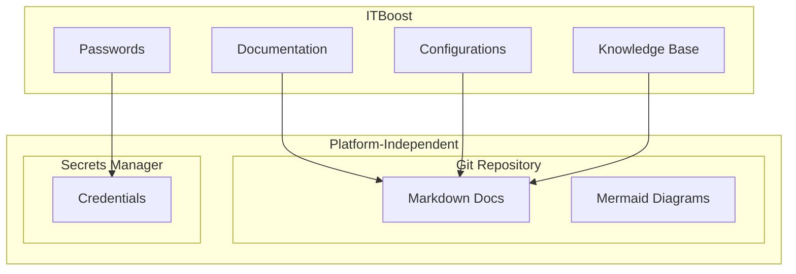
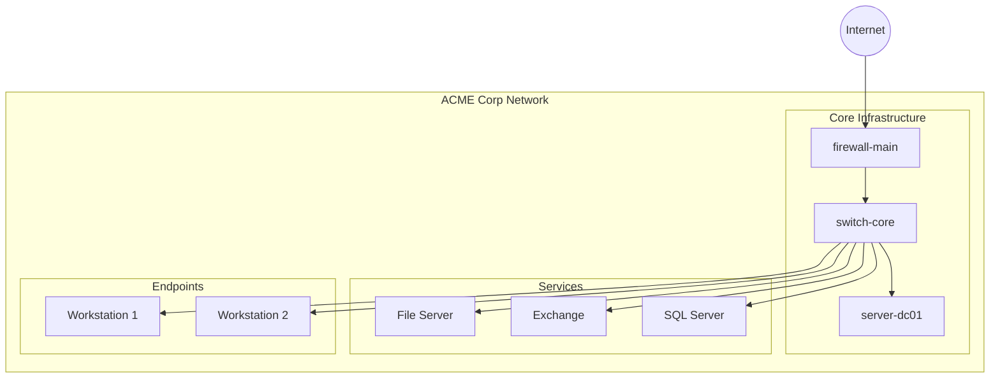

# Migrating from ITBoost

This guide covers exporting your IT documentation from ITBoost to platform-independent Markdown files.

## About ITBoost

ITBoost is a web-based documentation system owned by ConnectWise. It provides:

- **Client Documentation**: Per-client technical documentation
- **Configurations**: Device and service configurations
- **Passwords**: Secure credential management
- **Knowledge Base**: Company-wide documentation
- **Runbooks**: Standard operating procedures
- **ConnectWise Integration**: Deep integration with ConnectWise Manage/Automate

## ITBoost Strengths

- **ConnectWise Ecosystem**: Tight PSA/RMM integration
- **Structured Data**: Flexible assets and configurations
- **Password Management**: Built-in credential vault
- **Template System**: Standardized documentation
- **API Access**: REST API for automation

## Why Consider Markdown?

Moving documentation to Markdown provides independence from the ConnectWise ecosystem while keeping your technical documentation portable:



**Note**: Passwords should be migrated to a dedicated secrets manager, not Markdown.

## Migration Overview


## Prerequisites

```bash
# Required
python3 --version         # >= 3.8
pip install requests pyyaml

# ITBoost API access
# Navigate to: Settings > API to get credentials
```

## API Setup

### Step 1: Get API Credentials

1. Log into ITBoost
2. Navigate to **Settings** → **API**
3. Generate or copy your API Key
4. Note your ITBoost instance URL

## Export Script

```python
#!/usr/bin/env python3
"""itboost_export.py - Export ITBoost documentation via API."""

import os
import requests
from pathlib import Path
from datetime import date
import re
import time

class ITBoostExporter:
    def __init__(self, instance_url: str, api_key: str):
        self.base_url = f"{instance_url.rstrip('/')}/api/v1"
        self.headers = {
            "Authorization": f"Bearer {api_key}",
            "Content-Type": "application/json"
        }

    def _get(self, endpoint: str, params: dict = None) -> dict:
        """Make authenticated GET request."""
        time.sleep(0.5)  # Rate limiting
        url = f"{self.base_url}/{endpoint}"
        response = requests.get(url, headers=self.headers, params=params)
        response.raise_for_status()
        return response.json()

    def _get_paginated(self, endpoint: str) -> list:
        """Get all pages of a paginated endpoint."""
        all_data = []
        page = 1

        while True:
            result = self._get(endpoint, {"page": page, "per_page": 100})

            if isinstance(result, list):
                if not result:
                    break
                all_data.extend(result)
            elif isinstance(result, dict):
                data = result.get("data", result.get("items", []))
                all_data.extend(data)
                if page >= result.get("total_pages", result.get("totalPages", 1)):
                    break

            page += 1
            if not result:
                break

        return all_data

    def get_companies(self) -> list:
        """Get all companies/clients."""
        return self._get_paginated("companies")

    def get_company(self, company_id: int) -> dict:
        """Get a specific company."""
        return self._get(f"companies/{company_id}")

    def get_configurations(self, company_id: int = None) -> list:
        """Get configurations."""
        endpoint = "configurations"
        if company_id:
            endpoint = f"companies/{company_id}/configurations"
        return self._get_paginated(endpoint)

    def get_configuration_types(self) -> list:
        """Get configuration type definitions."""
        return self._get_paginated("configuration-types")

    def get_flexible_assets(self, company_id: int = None) -> list:
        """Get flexible assets."""
        endpoint = "flexible-assets"
        if company_id:
            endpoint = f"companies/{company_id}/flexible-assets"
        return self._get_paginated(endpoint)

    def get_documents(self, company_id: int = None) -> list:
        """Get documents."""
        endpoint = "documents"
        if company_id:
            endpoint = f"companies/{company_id}/documents"
        return self._get_paginated(endpoint)

    def get_knowledge_base(self) -> list:
        """Get knowledge base articles."""
        return self._get_paginated("knowledge-base")

    def get_runbooks(self, company_id: int = None) -> list:
        """Get runbooks/procedures."""
        endpoint = "runbooks"
        if company_id:
            endpoint = f"companies/{company_id}/runbooks"
        try:
            return self._get_paginated(endpoint)
        except Exception:
            return []

def to_kebab(s: str) -> str:
    """Convert string to kebab-case."""
    if not s:
        return "unnamed"
    return re.sub(r'[^a-z0-9]+', '-', s.lower()).strip('-')

def html_to_markdown(html: str) -> str:
    """
    Convert HTML to Markdown.

    For production use, prefer a robust library:
        pip install markdownify
        from markdownify import markdownify as md
        return md(html)

    Or use html2text:
        pip install html2text
        import html2text
        h = html2text.HTML2Text()
        return h.handle(html)

    This basic regex implementation handles simple cases but may fail on:
    - Nested tags (e.g., <strong><em>text</em></strong>)
    - HTML entities (&nbsp;, &lt;, etc.)
    - Malformed HTML
    """
    if not html:
        return ""

    # For robust conversion, uncomment:
    # from markdownify import markdownify as md
    # return md(html)

    text = html
    text = re.sub(r'<h1[^>]*>(.*?)</h1>', r'# \1\n', text, flags=re.DOTALL)
    text = re.sub(r'<h2[^>]*>(.*?)</h2>', r'## \1\n', text, flags=re.DOTALL)
    text = re.sub(r'<h3[^>]*>(.*?)</h3>', r'### \1\n', text, flags=re.DOTALL)
    text = re.sub(r'<p[^>]*>(.*?)</p>', r'\1\n\n', text, flags=re.DOTALL)
    text = re.sub(r'<br\s*/?>', '\n', text)
    text = re.sub(r'<strong>(.*?)</strong>', r'**\1**', text)
    text = re.sub(r'<b>(.*?)</b>', r'**\1**', text)
    text = re.sub(r'<em>(.*?)</em>', r'*\1*', text)
    text = re.sub(r'<code>(.*?)</code>', r'`\1`', text)
    text = re.sub(r'<pre[^>]*>(.*?)</pre>', r'```\n\1\n```', text, flags=re.DOTALL)
    text = re.sub(r'<a href="([^"]+)"[^>]*>(.*?)</a>', r'[\2](\1)', text)
    text = re.sub(r'<li[^>]*>(.*?)</li>', r'- \1\n', text)
    text = re.sub(r'<[^>]+>', '', text)
    text = re.sub(r'\n{3,}', '\n\n', text)

    return text.strip()

def export_company(exporter: ITBoostExporter, company: dict, output_dir: Path):
    """Export all documentation for a company."""

    company_id = company.get("id")
    company_name = company.get("name", f"company-{company_id}")
    company_dir = output_dir / to_kebab(company_name)
    company_dir.mkdir(parents=True, exist_ok=True)

    print(f"Exporting company: {company_name}")

    # Create company overview
    overview = f"""---
title: "{company_name}"
status: published
owner: msp-team
created: {date.today().isoformat()}
updated: {date.today().isoformat()}
tags: [client, company]
itboost_id: {company_id}
---

# {company_name}

## Overview

| Field | Value |
|-------|-------|
| Company ID | {company_id} |
| Website | {company.get('website', 'N/A')} |
| Phone | {company.get('phone', 'N/A')} |
| Address | {company.get('address', 'N/A')} |

## Credentials

> **Note**: Credentials stored in dedicated secrets manager.

## Documentation

- [Configurations](./configurations/)
- [Documents](./documents/)
- [Flexible Assets](./assets/)

"""
    (company_dir / "README.md").write_text(overview, encoding='utf-8')

    # Export configurations
    configs_dir = company_dir / "configurations"
    configs_dir.mkdir(exist_ok=True)

    configs = exporter.get_configurations(company_id)
    for config in configs:
        export_configuration(config, configs_dir)
    print(f"  Exported {len(configs)} configurations")

    # Export documents
    docs_dir = company_dir / "documents"
    docs_dir.mkdir(exist_ok=True)

    documents = exporter.get_documents(company_id)
    for doc in documents:
        export_document(doc, docs_dir)
    print(f"  Exported {len(documents)} documents")

    # Export flexible assets
    assets_dir = company_dir / "assets"
    assets_dir.mkdir(exist_ok=True)

    assets = exporter.get_flexible_assets(company_id)
    for asset in assets:
        export_flexible_asset(asset, assets_dir)
    print(f"  Exported {len(assets)} flexible assets")

    # Export runbooks
    runbooks_dir = company_dir / "runbooks"
    runbooks_dir.mkdir(exist_ok=True)

    runbooks = exporter.get_runbooks(company_id)
    for runbook in runbooks:
        export_runbook(runbook, runbooks_dir)
    print(f"  Exported {len(runbooks)} runbooks")

def export_configuration(config: dict, output_dir: Path):
    """Export a configuration to Markdown."""

    config_id = config.get("id")
    name = config.get("name", f"config-{config_id}")
    config_type = config.get("configuration_type", config.get("type", "General"))

    content = f"""---
title: "{name}"
status: published
owner: msp-team
created: {date.today().isoformat()}
updated: {date.today().isoformat()}
tags: [configuration, {to_kebab(str(config_type))}]
itboost_id: {config_id}
configuration_type: "{config_type}"
---

# {name}

## Overview

| Field | Value |
|-------|-------|
| Type | {config_type} |
| Hostname | {config.get('hostname', config.get('host_name', 'N/A'))} |
| IP Address | {config.get('ip_address', 'N/A')} |
| Serial Number | {config.get('serial_number', 'N/A')} |
| Manufacturer | {config.get('manufacturer', config.get('manufacturer_name', 'N/A'))} |
| Model | {config.get('model', config.get('model_name', 'N/A'))} |
| Location | {config.get('location', 'N/A')} |
| Status | {config.get('status', 'N/A')} |

"""

    # Add custom fields if present
    custom_fields = config.get("custom_fields", config.get("fields", {}))
    if custom_fields:
        content += "## Custom Fields\n\n"
        for key, value in custom_fields.items():
            if value:
                content += f"- **{key}**: {value}\n"
        content += "\n"

    # Add notes
    notes = config.get("notes", config.get("description", ""))
    if notes:
        content += f"""## Notes

{html_to_markdown(notes)}

"""

    filename = to_kebab(name) + ".md"
    (output_dir / filename).write_text(content, encoding='utf-8')

def export_document(doc: dict, output_dir: Path):
    """Export a document to Markdown."""

    doc_id = doc.get("id")
    title = doc.get("title") or doc.get("name") or f"document-{doc_id}"

    content = f"""---
title: "{title}"
status: published
owner: msp-team
created: {date.today().isoformat()}
updated: {date.today().isoformat()}
tags: [document]
itboost_id: {doc_id}
---

# {title}

{html_to_markdown(doc.get('content', doc.get('body', 'No content available.')))}

"""

    filename = to_kebab(title) + ".md"
    (output_dir / filename).write_text(content, encoding='utf-8')

def export_flexible_asset(asset: dict, output_dir: Path):
    """Export a flexible asset to Markdown."""

    asset_id = asset.get("id")
    name = asset.get("name", f"asset-{asset_id}")
    asset_type = asset.get("flexible_asset_type_name", asset.get("type", "General"))

    # Build fields from traits/attributes
    traits = asset.get("traits", asset.get("attributes", {}))

    fields_md = ""
    if traits:
        for key, value in traits.items():
            if value:
                if isinstance(value, dict):
                    value = value.get("name", str(value))
                elif isinstance(value, list):
                    value = ", ".join(str(v) for v in value)
                fields_md += f"| {key.replace('_', ' ').title()} | {value} |\n"

    content = f"""---
title: "{name}"
status: published
owner: msp-team
created: {date.today().isoformat()}
updated: {date.today().isoformat()}
tags: [flexible-asset, {to_kebab(asset_type)}]
itboost_id: {asset_id}
asset_type: "{asset_type}"
---

# {name}

**Type:** {asset_type}

## Fields

| Field | Value |
|-------|-------|
{fields_md}

"""

    # Organize by asset type
    type_dir = output_dir / to_kebab(asset_type)
    type_dir.mkdir(exist_ok=True)

    filename = to_kebab(name) + ".md"
    (type_dir / filename).write_text(content, encoding='utf-8')

def export_runbook(runbook: dict, output_dir: Path):
    """Export a runbook to Markdown."""

    runbook_id = runbook.get("id")
    name = runbook.get("name") or runbook.get("title") or f"runbook-{runbook_id}"

    content = f"""---
title: "{name}"
status: published
owner: msp-team
created: {date.today().isoformat()}
updated: {date.today().isoformat()}
tags: [runbook, procedure]
itboost_id: {runbook_id}
---

# {name}

## Overview

{runbook.get('description', runbook.get('summary', 'No description available.'))}

## Procedure

{html_to_markdown(runbook.get('content', runbook.get('steps', 'No steps defined.')))}

"""

    filename = to_kebab(name) + ".md"
    (output_dir / filename).write_text(content, encoding='utf-8')

def export_knowledge_base(exporter: ITBoostExporter, output_dir: Path):
    """Export knowledge base articles."""

    kb_dir = output_dir / "knowledge-base"
    kb_dir.mkdir(exist_ok=True)

    articles = exporter.get_knowledge_base()

    for article in articles:
        title = article.get("title", "Untitled")
        category = article.get("category", article.get("folder", "General"))

        content = f"""---
title: "{title}"
status: published
owner: msp-team
created: {date.today().isoformat()}
updated: {date.today().isoformat()}
tags: [knowledge-base, {to_kebab(str(category))}]
category: "{category}"
---

# {title}

{html_to_markdown(article.get('content', article.get('body', 'No content available.')))}
"""

        filename = to_kebab(title) + ".md"
        (kb_dir / filename).write_text(content, encoding='utf-8')

    print(f"Exported {len(articles)} knowledge base articles")

def main():
    # Configuration
    INSTANCE_URL = os.environ.get("ITBOOST_URL")
    API_KEY = os.environ.get("ITBOOST_API_KEY")
    OUTPUT_DIR = Path(os.environ.get("OUTPUT_DIR", "./itboost-export"))

    if not INSTANCE_URL or not API_KEY:
        print("Error: Set ITBOOST_URL and ITBOOST_API_KEY environment variables")
        return

    OUTPUT_DIR.mkdir(parents=True, exist_ok=True)

    print("Connecting to ITBoost API...")
    exporter = ITBoostExporter(INSTANCE_URL, API_KEY)

    print("Fetching companies...")
    companies = exporter.get_companies()
    print(f"Found {len(companies)} companies")

    for company in companies:
        export_company(exporter, company, OUTPUT_DIR)

    # Export global knowledge base
    print("\nExporting knowledge base...")
    export_knowledge_base(exporter, OUTPUT_DIR)

    print(f"\nExport complete! Files saved to: {OUTPUT_DIR}")
    print("\nReminder: Migrate passwords to a dedicated secrets manager!")

if __name__ == "__main__":
    main()
```

## Running the Export

```bash
export ITBOOST_URL="https://your-instance.itboost.com"
export ITBOOST_API_KEY="your-api-key"
export OUTPUT_DIR="./itboost-export"

python3 itboost_export.py
```

## Directory Structure

```
itboost-export/
├── acme-corp/
│   ├── README.md              # Company overview
│   ├── configurations/
│   │   ├── server-dc01.md
│   │   ├── firewall-main.md
│   │   └── switch-core.md
│   ├── documents/
│   │   ├── network-overview.md
│   │   └── onboarding.md
│   ├── assets/
│   │   ├── applications/
│   │   │   └── office-365.md
│   │   └── licenses/
│   │       └── microsoft-365.md
│   └── runbooks/
│       └── monthly-maintenance.md
├── another-company/
│   └── ...
└── knowledge-base/
    ├── password-policy.md
    └── security-procedures.md
```

## Post-Migration: Network Diagrams

Create infrastructure diagrams from exported configurations:



## Validation Checklist

- [ ] All companies exported
- [ ] Configurations include key fields
- [ ] Flexible assets organized by type
- [ ] Documents converted from HTML
- [ ] Runbooks have clear steps
- [ ] Knowledge base articles exported
- [ ] **No passwords in Markdown**
- [ ] Network diagrams created
- [ ] Front matter on all documents
- [ ] Documents render correctly

## Common Issues

### Issue: Rate Limiting

**Symptom:** API returns 429 errors

**Solution:** Increase delay between requests or implement exponential backoff.

### Issue: Missing Related Items

**Symptom:** Cross-references to other configurations are broken

**Solution:** Build a mapping of ITBoost IDs to Markdown filenames during export, then fix links in post-processing.

### Issue: ConnectWise References

**Symptom:** Links to ConnectWise Manage tickets don't work

**Solution:** Convert to static references:
```markdown
Related ticket: CW-12345 (ConnectWise Manage)
```

## References

- [ITBoost API Documentation](https://docs.itboost.com/api)
- [ConnectWise Developer](https://developer.connectwise.com/)
- [Mermaid Diagram Syntax](../diagrams/index.md)
