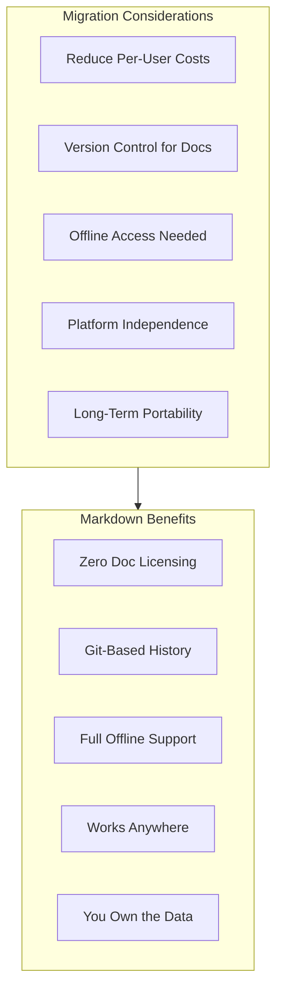
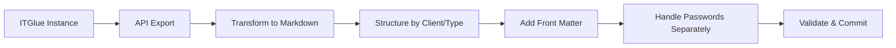
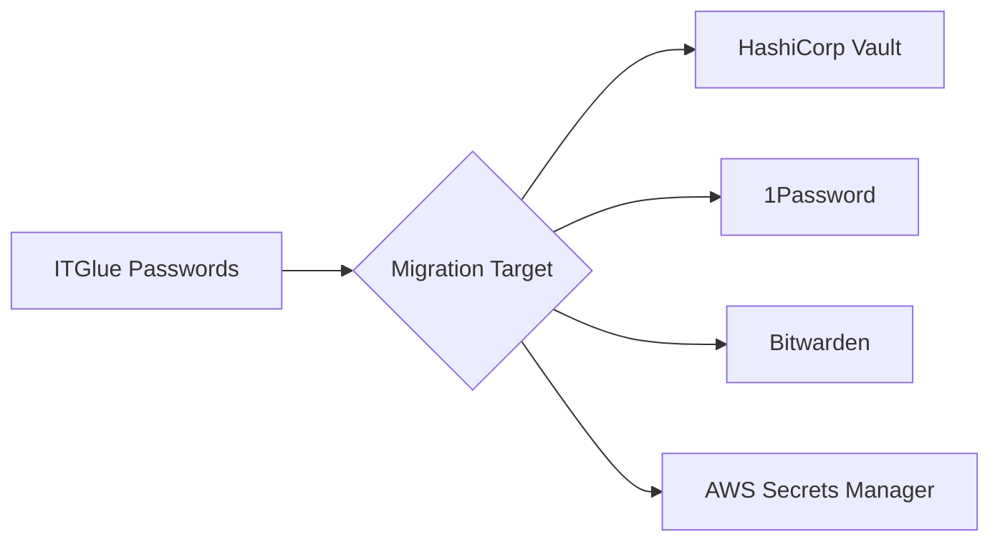
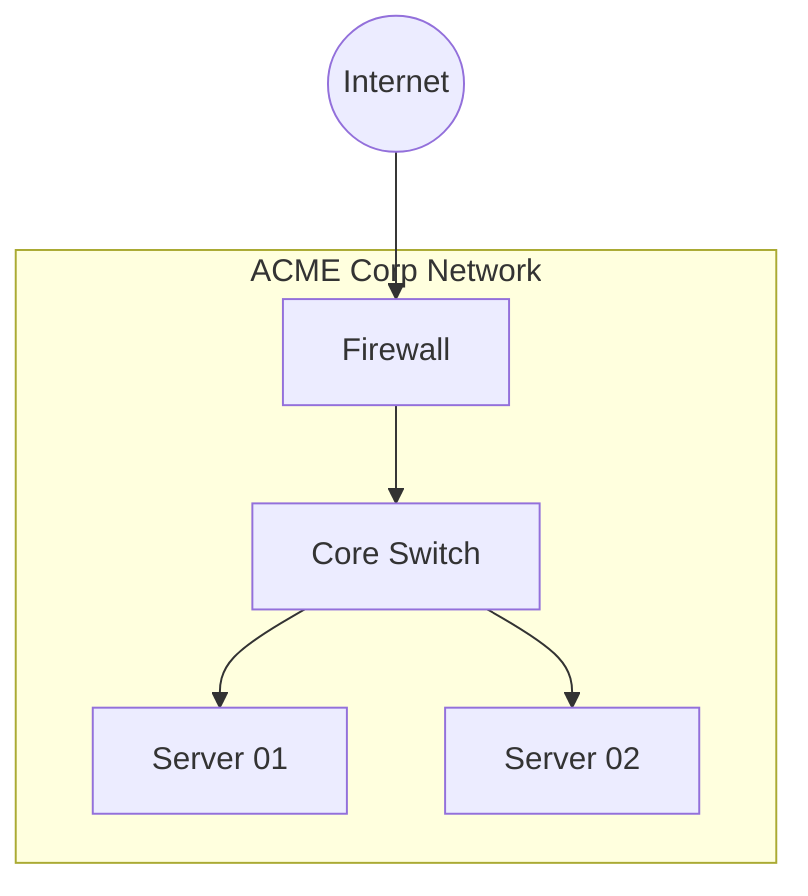

# Migrating from ITGlue

This guide covers exporting your IT documentation from ITGlue to platform-independent Markdown files.

## About ITGlue

ITGlue is a cloud-based IT documentation platform designed for Managed Service Providers (MSPs). It provides structured documentation for client organizations, including:

- **Flexible Assets**: Custom document types with defined fields
- **Configurations**: Hardware and software inventory
- **Passwords**: Secure credential storage
- **Documents**: Rich-text documentation
- **SOPs**: Standard Operating Procedures

## ITGlue Strengths

ITGlue is a capable platform with notable features:

- **Structured Data**: Flexible assets with defined field types
- **MSP-Focused**: Multi-tenant client organization
- **Password Management**: Built-in credential vault
- **Integrations**: ConnectWise, Datto, and other MSP tools
- **API Access**: REST API for automation

## Why Consider Markdown?

While ITGlue works well for MSPs, extracting documentation to Markdown provides independence:



**Note**: ITGlue's password vault should migrate to a dedicated secrets manager, not Markdown. This guide focuses on documentation export.

## Migration Overview



## Prerequisites

```bash
# Required
python3 --version         # >= 3.8
pip install requests pyyaml jinja2

# For password migration (optional)
pip install python-gnupg  # GPG encryption
```

## ITGlue API Setup

### Step 1: Generate API Key

1. Log into ITGlue
2. Navigate to **Account** → **Settings** → **API Keys**
3. Click **Generate API Key**
4. Copy the key immediately (shown only once)
5. Note your ITGlue subdomain (e.g., `yourcompany.itglue.com`)

### Step 2: Configure Export Script

```python
#!/usr/bin/env python3
"""itglue_export.py - Export ITGlue documentation via API."""

import os
import json
import requests
from pathlib import Path
from datetime import date
import re
import time

class ITGlueExporter:
    def __init__(self, subdomain: str, api_key: str):
        self.base_url = f"https://{subdomain}.itglue.com/api"
        self.headers = {
            "x-api-key": api_key,
            "Content-Type": "application/vnd.api+json"
        }
        self.rate_limit_delay = 0.5  # seconds between requests

    def _get(self, endpoint: str, params: dict = None) -> dict:
        """Make GET request to ITGlue API with rate limiting."""
        time.sleep(self.rate_limit_delay)

        url = f"{self.base_url}/{endpoint}"
        response = requests.get(url, headers=self.headers, params=params)
        response.raise_for_status()
        return response.json()

    def _get_all_pages(self, endpoint: str) -> list:
        """Fetch all pages of a paginated endpoint."""
        all_data = []
        page = 1

        while True:
            result = self._get(endpoint, {"page[number]": page, "page[size]": 50})
            all_data.extend(result.get("data", []))

            meta = result.get("meta", {})
            if page >= meta.get("total-pages", 1):
                break
            page += 1

        return all_data

    def get_organizations(self) -> list:
        """Get all organizations (clients)."""
        return self._get_all_pages("organizations")

    def get_flexible_asset_types(self) -> list:
        """Get all flexible asset type definitions."""
        return self._get_all_pages("flexible_asset_types")

    def get_flexible_assets(self, org_id: int = None) -> list:
        """Get flexible assets, optionally filtered by organization."""
        endpoint = "flexible_assets"
        if org_id:
            endpoint += f"?filter[organization_id]={org_id}"
        return self._get_all_pages(endpoint)

    def get_configurations(self, org_id: int = None) -> list:
        """Get configurations (devices)."""
        endpoint = "configurations"
        if org_id:
            endpoint += f"?filter[organization_id]={org_id}"
        return self._get_all_pages(endpoint)

    def get_documents(self, org_id: int = None) -> list:
        """Get documents."""
        endpoint = "documents"
        if org_id:
            endpoint += f"?filter[organization_id]={org_id}"
        return self._get_all_pages(endpoint)

    def get_passwords(self, org_id: int = None) -> list:
        """Get passwords (requires appropriate permissions)."""
        endpoint = "passwords"
        if org_id:
            endpoint += f"?filter[organization_id]={org_id}"
        return self._get_all_pages(endpoint)

def to_kebab(s: str) -> str:
    """Convert string to kebab-case filename."""
    return re.sub(r'[^a-z0-9]+', '-', s.lower()).strip('-')

def html_to_markdown(html: str) -> str:
    """Basic HTML to Markdown conversion."""
    if not html:
        return ""

    # Simple conversions
    text = html
    text = re.sub(r'<h1[^>]*>(.*?)</h1>', r'# \1\n', text)
    text = re.sub(r'<h2[^>]*>(.*?)</h2>', r'## \1\n', text)
    text = re.sub(r'<h3[^>]*>(.*?)</h3>', r'### \1\n', text)
    text = re.sub(r'<p[^>]*>(.*?)</p>', r'\1\n\n', text)
    text = re.sub(r'<br\s*/?>', '\n', text)
    text = re.sub(r'<strong>(.*?)</strong>', r'**\1**', text)
    text = re.sub(r'<b>(.*?)</b>', r'**\1**', text)
    text = re.sub(r'<em>(.*?)</em>', r'*\1*', text)
    text = re.sub(r'<i>(.*?)</i>', r'*\1*', text)
    text = re.sub(r'<code>(.*?)</code>', r'`\1`', text)
    text = re.sub(r'<a href="([^"]+)"[^>]*>(.*?)</a>', r'[\2](\1)', text)
    text = re.sub(r'<li[^>]*>(.*?)</li>', r'- \1\n', text)
    text = re.sub(r'<[^>]+>', '', text)  # Remove remaining tags
    text = re.sub(r'\n{3,}', '\n\n', text)  # Clean up whitespace

    return text.strip()

def export_organization(exporter: ITGlueExporter, org: dict, output_dir: Path):
    """Export all documentation for an organization."""

    org_id = org["id"]
    org_name = org["attributes"]["name"]
    org_dir = output_dir / to_kebab(org_name)
    org_dir.mkdir(parents=True, exist_ok=True)

    print(f"Exporting organization: {org_name}")

    # Create organization overview
    overview = f"""---
title: "{org_name}"
status: published
owner: msp-team
created: {date.today().isoformat()}
updated: {date.today().isoformat()}
tags: [client, organization]
itglue_id: {org_id}
---

# {org_name}

## Overview

| Field | Value |
|-------|-------|
| Short Name | {org["attributes"].get("short_name", "N/A")} |
| Description | {org["attributes"].get("description", "N/A")} |
| Created | {org["attributes"].get("created_at", "N/A")[:10]} |

## Documentation

- [Configurations](./configurations/)
- [Documents](./documents/)
- [Flexible Assets](./assets/)

"""
    (org_dir / "README.md").write_text(overview, encoding='utf-8')

    # Export configurations
    configs_dir = org_dir / "configurations"
    configs_dir.mkdir(exist_ok=True)

    configs = exporter.get_configurations(org_id)
    for config in configs:
        export_configuration(config, configs_dir)

    # Export documents
    docs_dir = org_dir / "documents"
    docs_dir.mkdir(exist_ok=True)

    documents = exporter.get_documents(org_id)
    for doc in documents:
        export_document(doc, docs_dir)

    # Export flexible assets
    assets_dir = org_dir / "assets"
    assets_dir.mkdir(exist_ok=True)

    assets = exporter.get_flexible_assets(org_id)
    for asset in assets:
        export_flexible_asset(asset, assets_dir)

def export_configuration(config: dict, output_dir: Path):
    """Export a configuration (device) to Markdown."""

    attrs = config["attributes"]
    name = attrs.get("name", "Unnamed")

    content = f"""---
title: "{name}"
status: published
owner: msp-team
created: {date.today().isoformat()}
updated: {date.today().isoformat()}
tags: [configuration, device]
itglue_id: {config["id"]}
configuration_type: {attrs.get("configuration_type_name", "Unknown")}
---

# {name}

## Overview

| Field | Value |
|-------|-------|
| Type | {attrs.get("configuration_type_name", "N/A")} |
| Hostname | {attrs.get("hostname", "N/A")} |
| Serial Number | {attrs.get("serial_number", "N/A")} |
| Asset Tag | {attrs.get("asset_tag", "N/A")} |
| Primary IP | {attrs.get("primary_ip", "N/A")} |
| MAC Address | {attrs.get("mac_address", "N/A")} |
| Manufacturer | {attrs.get("manufacturer_name", "N/A")} |
| Model | {attrs.get("model_name", "N/A")} |
| Operating System | {attrs.get("operating_system_name", "N/A")} |
| Warranty Expires | {attrs.get("warranty_expires_at", "N/A")} |

## Notes

{html_to_markdown(attrs.get("notes", "No notes available."))}

"""

    filename = to_kebab(name) + ".md"
    (output_dir / filename).write_text(content, encoding='utf-8')

def export_document(doc: dict, output_dir: Path):
    """Export a document to Markdown."""

    attrs = doc["attributes"]
    name = attrs.get("name", "Unnamed Document")

    content = f"""---
title: "{name}"
status: published
owner: msp-team
created: {date.today().isoformat()}
updated: {date.today().isoformat()}
tags: [document]
itglue_id: {doc["id"]}
---

# {name}

{html_to_markdown(attrs.get("content", "No content available."))}

"""

    filename = to_kebab(name) + ".md"
    (output_dir / filename).write_text(content, encoding='utf-8')

def export_flexible_asset(asset: dict, output_dir: Path):
    """Export a flexible asset to Markdown."""

    attrs = asset["attributes"]
    name = attrs.get("name", "Unnamed Asset")
    asset_type = attrs.get("flexible_asset_type_name", "Unknown")

    # Build fields table
    traits = attrs.get("traits", {})
    fields_table = "| Field | Value |\n|-------|-------|\n"
    for key, value in traits.items():
        if value:
            # Handle complex field types
            if isinstance(value, dict):
                value = value.get("name", str(value))
            elif isinstance(value, list):
                value = ", ".join(str(v) for v in value)
            fields_table += f"| {key.replace('_', ' ').title()} | {value} |\n"

    content = f"""---
title: "{name}"
status: published
owner: msp-team
created: {date.today().isoformat()}
updated: {date.today().isoformat()}
tags: [flexible-asset, {to_kebab(asset_type)}]
itglue_id: {asset["id"]}
asset_type: "{asset_type}"
---

# {name}

**Type:** {asset_type}

## Fields

{fields_table}

"""

    # Create subdirectory by asset type
    type_dir = output_dir / to_kebab(asset_type)
    type_dir.mkdir(exist_ok=True)

    filename = to_kebab(name) + ".md"
    (type_dir / filename).write_text(content, encoding='utf-8')

def main():
    # Configuration
    SUBDOMAIN = os.environ.get("ITGLUE_SUBDOMAIN")
    API_KEY = os.environ.get("ITGLUE_API_KEY")
    OUTPUT_DIR = Path(os.environ.get("OUTPUT_DIR", "./itglue-export"))

    if not SUBDOMAIN or not API_KEY:
        print("Error: Set ITGLUE_SUBDOMAIN and ITGLUE_API_KEY environment variables")
        return

    OUTPUT_DIR.mkdir(parents=True, exist_ok=True)

    exporter = ITGlueExporter(SUBDOMAIN, API_KEY)

    print("Fetching organizations...")
    organizations = exporter.get_organizations()
    print(f"Found {len(organizations)} organizations")

    for org in organizations:
        export_organization(exporter, org, OUTPUT_DIR)

    print(f"\nExport complete! Files saved to: {OUTPUT_DIR}")

if __name__ == "__main__":
    main()
```

## Step 3: Run Export

```bash
export ITGLUE_SUBDOMAIN="yourcompany"
export ITGLUE_API_KEY="your-api-key"
export OUTPUT_DIR="./itglue-export"

python3 itglue_export.py
```

## Handling Passwords

**IMPORTANT:** Passwords require special handling for security.

### Option 1: Exclude Passwords (Recommended for Most Cases)

Don't export passwords to Markdown. Instead, migrate to a dedicated secrets manager:



### Option 2: GPG-Encrypted Password Export

```python
#!/usr/bin/env python3
"""export_passwords_encrypted.py - Export passwords with GPG encryption."""

import gnupg
import json
from itglue_export import ITGlueExporter
import os

def export_passwords_encrypted(exporter, gpg_recipient: str, output_file: str):
    """Export passwords as GPG-encrypted JSON."""

    gpg = gnupg.GPG()

    passwords = exporter.get_passwords()

    # Structure password data
    password_data = []
    for pw in passwords:
        attrs = pw["attributes"]
        password_data.append({
            "id": pw["id"],
            "name": attrs.get("name"),
            "username": attrs.get("username"),
            "password": attrs.get("password"),
            "url": attrs.get("url"),
            "notes": attrs.get("notes"),
            "organization": attrs.get("organization_name")
        })

    # Encrypt
    json_data = json.dumps(password_data, indent=2)
    encrypted = gpg.encrypt(json_data, gpg_recipient, armor=True)

    if encrypted.ok:
        with open(output_file, 'w') as f:
            f.write(str(encrypted))
        print(f"Passwords exported to: {output_file}")
    else:
        print(f"Encryption failed: {encrypted.stderr}")

# Usage
exporter = ITGlueExporter(
    os.environ["ITGLUE_SUBDOMAIN"],
    os.environ["ITGLUE_API_KEY"]
)
export_passwords_encrypted(exporter, "security@company.com", "passwords.gpg")
```

## Directory Structure

After migration, your documentation will be organized:

```
itglue-export/
├── acme-corp/
│   ├── README.md              # Organization overview
│   ├── configurations/
│   │   ├── server-01.md
│   │   ├── firewall-main.md
│   │   └── switch-core.md
│   ├── documents/
│   │   ├── onboarding-guide.md
│   │   └── network-diagram.md
│   └── assets/
│       ├── applications/
│       │   └── office-365.md
│       ├── network-segments/
│       │   └── corporate-lan.md
│       └── contacts/
│           └── john-smith.md
├── another-client/
│   └── ...
└── passwords.gpg              # Encrypted passwords (optional)
```

## Post-Migration Tasks

### 1. Convert Diagrams to Mermaid

ITGlue doesn't support Mermaid. Create new diagrams:



### 2. Update Cross-References

Replace ITGlue internal links with relative Markdown links:

```markdown
<!-- Before -->
Related configuration: [See ITGlue](https://company.itglue.com/configurations/12345)

<!-- After -->
Related configuration: [Server-01](./configurations/server-01.md)
```

### 3. Consolidate Flexible Asset Types

Review flexible asset types and standardize:

```bash
# List all asset types
find . -name "*.md" -exec grep -l "^asset_type:" {} \; | \
    xargs grep "^asset_type:" | sort | uniq -c
```

## Validation Checklist

- [ ] All organizations exported
- [ ] Configurations include key fields (hostname, IP, serial)
- [ ] Documents converted from HTML to Markdown
- [ ] Flexible assets organized by type
- [ ] Passwords handled securely (encrypted or migrated to vault)
- [ ] Cross-references updated to relative links
- [ ] Network diagrams recreated in Mermaid
- [ ] Front matter present on all documents

## Common Issues

### Issue: Rate Limiting

**Symptom:** API returns 429 errors

**Solution:** Increase delay between requests:
```python
self.rate_limit_delay = 1.0  # Increase to 1 second
```

### Issue: HTML Not Converting Properly

**Symptom:** Complex HTML tables break

**Solution:** Use dedicated HTML-to-Markdown library:
```bash
pip install markdownify
```

### Issue: Missing Relationships

**Symptom:** Related items not linked

**Solution:** Post-process to add relationship links based on ITGlue IDs in front matter.

## References

- [ITGlue API Documentation](https://api.itglue.com/developer/)
- [PIMPyourDocs SPEC](../SPEC.md)
- [Mermaid Diagram Syntax](../diagrams/index.md)
