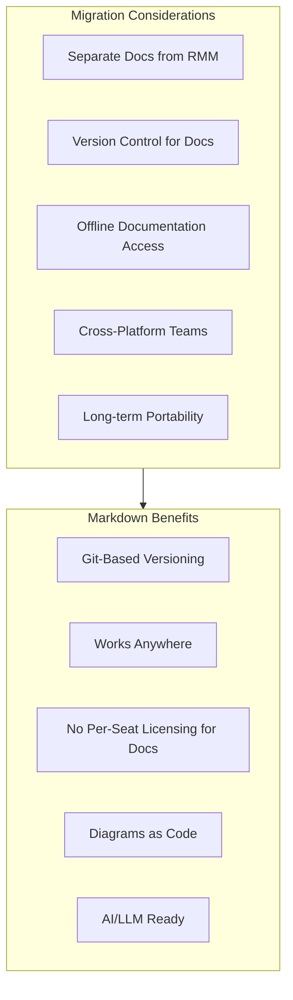
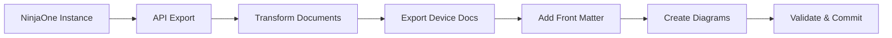
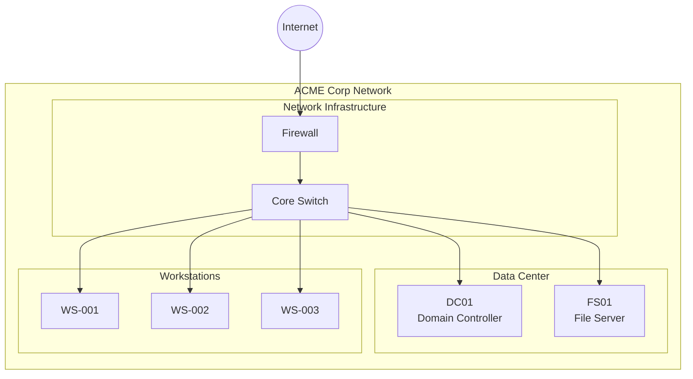

# Migrating from NinjaOne

This guide provides a comprehensive approach to migrating your documentation from NinjaOne to PIMPyourDocs.

## About NinjaOne

NinjaOne (formerly NinjaRMM) is a cloud-based platform for MSP technicians that includes:

- **Documentation Library**: Templates for client systems and corporate best practices
- **Device Documentation**: Automated inventory and configuration capture
- **Knowledge Base**: Searchable documentation repository
- **Custom Fields**: Flexible data capture for devices and organizations
- **Runbooks**: Automated task documentation and execution

## NinjaOne Strengths

- **Unified RMM + Documentation**: Single platform for monitoring and docs
- **Automated Device Documentation**: Auto-discovery and inventory
- **Template System**: Standardized documentation across clients
- **API Access**: REST API for automation and integration
- **Cloud-Based**: Accessible from anywhere

## Why Consider Markdown?



**Note**: NinjaOne's device inventory and RMM features remain valuable. This migration focuses on the documentation/knowledge base content.

## Migration Overview



## Prerequisites

```bash
# Required
python3 --version         # >= 3.8
pip install requests pyyaml

# NinjaOne API access
# Navigate to: Administration > Apps > API > Add
# Scopes needed: monitoring, management, documentation
```

## API Setup

### Step 1: Create API Credentials

1. Log into NinjaOne
2. Navigate to **Administration** → **Apps** → **API**
3. Click **Add** to create new API credentials
4. Select required scopes:
   - `monitoring` (for device data)
   - `management` (for organization data)
   - Documentation access
5. Save and note the Client ID and Client Secret

### Step 2: OAuth Authentication

```python
#!/usr/bin/env python3
"""ninjaone_auth.py - NinjaOne OAuth2 authentication."""

import requests
import os

def get_access_token(client_id: str, client_secret: str, region: str = "app") -> str:
    """
    Get OAuth2 access token from NinjaOne.

    Regions: 'app' (US), 'eu' (EU), 'oc' (Oceania), 'ca' (Canada)
    """
    token_url = f"https://{region}.ninjarmm.com/oauth/token"

    response = requests.post(token_url, data={
        "grant_type": "client_credentials",
        "client_id": client_id,
        "client_secret": client_secret,
        "scope": "monitoring management"
    })

    response.raise_for_status()
    return response.json()["access_token"]

if __name__ == "__main__":
    token = get_access_token(
        os.environ["NINJAONE_CLIENT_ID"],
        os.environ["NINJAONE_CLIENT_SECRET"],
        os.environ.get("NINJAONE_REGION", "app")
    )
    print(f"Access token: {token[:20]}...")
```

## Export Script

```python
#!/usr/bin/env python3
"""ninjaone_export.py - Export NinjaOne documentation via API."""

import os
import requests
import json
from pathlib import Path
from datetime import date
import re
import time

class NinjaOneExporter:
    def __init__(self, client_id: str, client_secret: str, region: str = "app"):
        self.base_url = f"https://{region}.ninjarmm.com/api/v2"
        self.access_token = self._get_token(client_id, client_secret, region)
        self.headers = {
            "Authorization": f"Bearer {self.access_token}",
            "Content-Type": "application/json"
        }

    def _get_token(self, client_id: str, client_secret: str, region: str) -> str:
        """Authenticate and get access token."""
        token_url = f"https://{region}.ninjarmm.com/oauth/token"

        response = requests.post(token_url, data={
            "grant_type": "client_credentials",
            "client_id": client_id,
            "client_secret": client_secret,
            "scope": "monitoring management"
        })
        response.raise_for_status()
        return response.json()["access_token"]

    def _get(self, endpoint: str, params: dict = None) -> dict:
        """Make authenticated GET request with rate limiting."""
        time.sleep(0.5)  # Rate limiting
        url = f"{self.base_url}/{endpoint}"
        response = requests.get(url, headers=self.headers, params=params)
        response.raise_for_status()
        return response.json()

    def get_organizations(self) -> list:
        """Get all organizations."""
        return self._get("organizations")

    def get_organization(self, org_id: int) -> dict:
        """Get a specific organization."""
        return self._get(f"organization/{org_id}")

    def get_devices(self, org_id: int = None) -> list:
        """Get devices, optionally filtered by organization."""
        endpoint = "devices"
        params = {}
        if org_id:
            params["df"] = f"org = {org_id}"
        return self._get(endpoint, params)

    def get_device(self, device_id: int) -> dict:
        """Get detailed device information."""
        return self._get(f"device/{device_id}")

    def get_device_custom_fields(self, device_id: int) -> dict:
        """Get custom fields for a device."""
        return self._get(f"device/{device_id}/custom-fields")

    def get_organization_custom_fields(self, org_id: int) -> dict:
        """Get custom fields for an organization."""
        return self._get(f"organization/{org_id}/custom-fields")

    def get_knowledge_base_articles(self) -> list:
        """Get knowledge base articles (if available via API)."""
        try:
            return self._get("knowledgebase/articles")
        except Exception:
            print("Note: Knowledge base API may require additional permissions")
            return []

    def get_documentation_templates(self) -> list:
        """Get documentation templates."""
        try:
            return self._get("documentation/templates")
        except Exception:
            print("Note: Documentation templates may require additional API access")
            return []

def to_kebab(s: str) -> str:
    """Convert string to kebab-case filename."""
    if not s:
        return "unnamed"
    return re.sub(r'[^a-z0-9]+', '-', s.lower()).strip('-')

def html_to_markdown(html: str) -> str:
    """Basic HTML to Markdown conversion."""
    if not html:
        return ""

    text = html
    text = re.sub(r'<h1[^>]*>(.*?)</h1>', r'# \1\n', text)
    text = re.sub(r'<h2[^>]*>(.*?)</h2>', r'## \1\n', text)
    text = re.sub(r'<h3[^>]*>(.*?)</h3>', r'### \1\n', text)
    text = re.sub(r'<p[^>]*>(.*?)</p>', r'\1\n\n', text, flags=re.DOTALL)
    text = re.sub(r'<br\s*/?>', '\n', text)
    text = re.sub(r'<strong>(.*?)</strong>', r'**\1**', text)
    text = re.sub(r'<em>(.*?)</em>', r'*\1*', text)
    text = re.sub(r'<code>(.*?)</code>', r'`\1`', text)
    text = re.sub(r'<a href="([^"]+)"[^>]*>(.*?)</a>', r'[\2](\1)', text)
    text = re.sub(r'<li[^>]*>(.*?)</li>', r'- \1\n', text)
    text = re.sub(r'<[^>]+>', '', text)
    text = re.sub(r'\n{3,}', '\n\n', text)

    return text.strip()

def export_organization(exporter: NinjaOneExporter, org: dict, output_dir: Path):
    """Export all documentation for an organization."""

    org_id = org["id"]
    org_name = org.get("name", f"org-{org_id}")
    org_dir = output_dir / to_kebab(org_name)
    org_dir.mkdir(parents=True, exist_ok=True)

    print(f"Exporting organization: {org_name}")

    # Get organization details
    try:
        org_details = exporter.get_organization(org_id)
    except Exception:
        org_details = org

    # Get custom fields
    try:
        custom_fields = exporter.get_organization_custom_fields(org_id)
    except Exception:
        custom_fields = {}

    # Create organization overview
    overview = f"""---
title: "{org_name}"
status: published
owner: msp-team
created: {date.today().isoformat()}
updated: {date.today().isoformat()}
tags: [client, organization]
ninjaone_id: {org_id}
---

# {org_name}

## Overview

| Field | Value |
|-------|-------|
| Organization ID | {org_id} |
| Description | {org_details.get('description', 'N/A')} |

## Custom Fields

"""

    if custom_fields:
        for key, value in custom_fields.items():
            if value:
                overview += f"- **{key}**: {value}\n"
    else:
        overview += "_No custom fields configured_\n"

    overview += """
## Documentation

- [Devices](./devices/)
- [Procedures](./procedures/)

"""

    (org_dir / "README.md").write_text(overview, encoding='utf-8')

    # Export devices
    devices_dir = org_dir / "devices"
    devices_dir.mkdir(exist_ok=True)

    devices = exporter.get_devices(org_id)
    for device in devices:
        export_device(exporter, device, devices_dir)

    print(f"  Exported {len(devices)} devices")

def export_device(exporter: NinjaOneExporter, device: dict, output_dir: Path):
    """Export device documentation."""

    device_id = device["id"]
    device_name = device.get("systemName") or device.get("dnsName") or f"device-{device_id}"

    # Get detailed device info
    try:
        details = exporter.get_device(device_id)
    except Exception:
        details = device

    # Get custom fields
    try:
        custom_fields = exporter.get_device_custom_fields(device_id)
    except Exception:
        custom_fields = {}

    # Build device document
    system = details.get("system", {})
    os_info = details.get("os", {})
    network = details.get("network", {})

    content = f"""---
title: "{device_name}"
status: published
owner: msp-team
created: {date.today().isoformat()}
updated: {date.today().isoformat()}
tags: [device, {to_kebab(details.get('nodeClass', 'unknown'))}]
ninjaone_id: {device_id}
device_type: "{details.get('nodeClass', 'Unknown')}"
---

# {device_name}

## System Information

| Field | Value |
|-------|-------|
| Device Type | {details.get('nodeClass', 'N/A')} |
| System Name | {device.get('systemName', 'N/A')} |
| DNS Name | {device.get('dnsName', 'N/A')} |
| Manufacturer | {system.get('manufacturer', 'N/A')} |
| Model | {system.get('model', 'N/A')} |
| Serial Number | {system.get('serialNumber', 'N/A')} |
| BIOS Version | {system.get('biosVersion', 'N/A')} |

## Operating System

| Field | Value |
|-------|-------|
| OS Name | {os_info.get('name', 'N/A')} |
| Version | {os_info.get('version', 'N/A')} |
| Architecture | {os_info.get('architecture', 'N/A')} |
| Build | {os_info.get('buildNumber', 'N/A')} |

## Network

| Field | Value |
|-------|-------|
| Public IP | {details.get('publicIP', 'N/A')} |
| Last Contact | {details.get('lastContact', 'N/A')} |

"""

    # Add custom fields section
    if custom_fields:
        content += "## Custom Fields\n\n"
        for key, value in custom_fields.items():
            if value:
                content += f"- **{key}**: {value}\n"
        content += "\n"

    # Add notes if present
    notes = details.get("notes", "")
    if notes:
        content += f"""## Notes

{html_to_markdown(notes)}

"""

    filename = to_kebab(device_name) + ".md"
    (output_dir / filename).write_text(content, encoding='utf-8')

def export_knowledge_base(exporter: NinjaOneExporter, output_dir: Path):
    """Export knowledge base articles."""

    kb_dir = output_dir / "knowledge-base"
    kb_dir.mkdir(exist_ok=True)

    articles = exporter.get_knowledge_base_articles()

    for article in articles:
        title = article.get("title", "Untitled")
        content_html = article.get("content", "")

        md_content = f"""---
title: "{title}"
status: published
owner: msp-team
created: {date.today().isoformat()}
updated: {date.today().isoformat()}
tags: [knowledge-base]
---

# {title}

{html_to_markdown(content_html)}
"""

        filename = to_kebab(title) + ".md"
        (kb_dir / filename).write_text(md_content, encoding='utf-8')

    print(f"Exported {len(articles)} knowledge base articles")

def main():
    # Configuration
    CLIENT_ID = os.environ.get("NINJAONE_CLIENT_ID")
    CLIENT_SECRET = os.environ.get("NINJAONE_CLIENT_SECRET")
    REGION = os.environ.get("NINJAONE_REGION", "app")
    OUTPUT_DIR = Path(os.environ.get("OUTPUT_DIR", "./ninjaone-export"))

    if not CLIENT_ID or not CLIENT_SECRET:
        print("Error: Set NINJAONE_CLIENT_ID and NINJAONE_CLIENT_SECRET environment variables")
        return

    OUTPUT_DIR.mkdir(parents=True, exist_ok=True)

    print("Connecting to NinjaOne API...")
    exporter = NinjaOneExporter(CLIENT_ID, CLIENT_SECRET, REGION)

    print("Fetching organizations...")
    organizations = exporter.get_organizations()
    print(f"Found {len(organizations)} organizations")

    for org in organizations:
        export_organization(exporter, org, OUTPUT_DIR)

    # Export knowledge base
    print("\nExporting knowledge base...")
    export_knowledge_base(exporter, OUTPUT_DIR)

    print(f"\nExport complete! Files saved to: {OUTPUT_DIR}")

if __name__ == "__main__":
    main()
```

## Running the Export

```bash
export NINJAONE_CLIENT_ID="your-client-id"
export NINJAONE_CLIENT_SECRET="your-client-secret"
export NINJAONE_REGION="app"  # or 'eu', 'oc', 'ca'
export OUTPUT_DIR="./ninjaone-export"

python3 ninjaone_export.py
```

## Directory Structure

```
ninjaone-export/
├── acme-corp/
│   ├── README.md              # Organization overview
│   ├── devices/
│   │   ├── server-dc01.md
│   │   ├── workstation-001.md
│   │   └── firewall-main.md
│   └── procedures/
│       └── README.md
├── another-client/
│   └── ...
└── knowledge-base/
    ├── password-reset.md
    ├── vpn-setup.md
    └── ...
```

## Post-Migration: Creating Network Diagrams

NinjaOne provides device data but not diagrams. Create Mermaid diagrams from the exported data:



## Validation Checklist

- [ ] All organizations exported
- [ ] Device documentation includes key fields
- [ ] Custom fields preserved
- [ ] Knowledge base articles converted
- [ ] Network diagrams created in Mermaid
- [ ] Front matter added to all documents
- [ ] Documents render correctly in multiple viewers

## Common Issues

### Issue: Rate Limiting

**Symptom:** API returns 429 errors

**Solution:** Increase delay between requests:
```python
time.sleep(1.0)  # Increase delay
```

### Issue: Missing Permissions

**Symptom:** 403 errors on certain endpoints

**Solution:** Ensure API credentials have all required scopes in NinjaOne administration.

### Issue: Custom Fields Not Exporting

**Symptom:** Custom fields appear empty

**Solution:** Custom fields may require specific API endpoints. Check NinjaOne API documentation for your version.

## References

- [NinjaOne API Documentation](https://app.ninjarmm.com/apidocs/)
- [NinjaOne OAuth2 Guide](https://app.ninjarmm.com/apidocs-beta/authorization)
- [PIMPyourDocs SPEC](../SPEC.md)
- [Mermaid Diagram Syntax](../diagrams/index.md)
