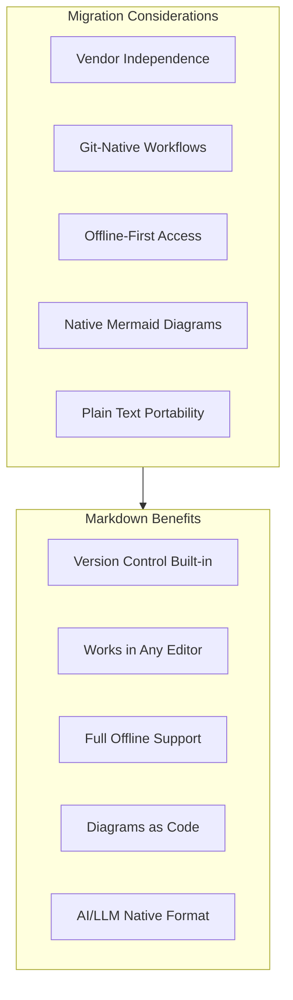
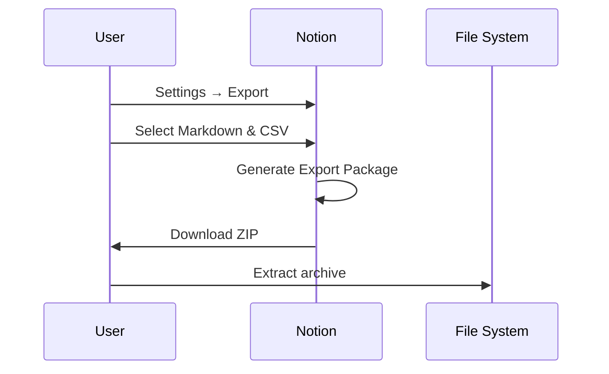
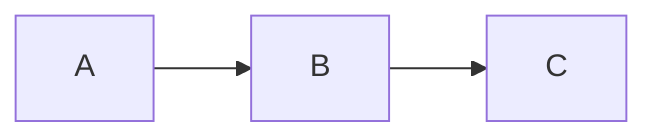

# Migrating from Notion

This guide covers exporting your documentation from Notion to platform-independent Markdown files.

## Notion Strengths

Notion is a capable platform with several strengths:

- **Flexible Blocks**: Rich content types and embeds
- **Database Views**: Multiple ways to visualize data
- **Collaboration**: Real-time editing and comments
- **Templates**: Reusable page structures
- **API Access**: Programmatic content access

## Why Consider Markdown?

While Notion works well for many teams, Markdown offers distinct advantages:



**Key differentiator**: With Markdown, your docs live in git, render anywhere, and aren't tied to Notion's proprietary block format.

## Migration Overview


## Prerequisites

```bash
# Required tools
node --version            # >= 16.x
python3 --version         # >= 3.8

# Install notion-to-md (recommended)
npm install -g notion-to-md

# Alternative: notion-backup
pip install notion-backup
```

## Export Methods

### Method 1: Native Notion Export (Quick)

Best for: Small workspaces, one-time migrations

1. Navigate to **Settings & Members** → **Settings**
2. Scroll to **Export all workspace content**
3. Select **Markdown & CSV** format
4. Choose **Include subpages**
5. Click **Export** and download ZIP



### Method 2: Notion API Export (Recommended)

Best for: Large workspaces, automated migrations, preserving structure

```bash
# Install the official Notion SDK
npm install @notionhq/client

# Create export script
```

```javascript
// notion_export.js
const { Client } = require("@notionhq/client");
const fs = require("fs");
const path = require("path");

const notion = new Client({ auth: process.env.NOTION_API_KEY });

async function exportDatabase(databaseId, outputDir) {
  const pages = await notion.databases.query({ database_id: databaseId });

  for (const page of pages.results) {
    const blocks = await notion.blocks.children.list({ block_id: page.id });
    const markdown = blocksToMarkdown(blocks.results);

    const title = getPageTitle(page);
    const filename = toKebabCase(title) + ".md";

    fs.writeFileSync(path.join(outputDir, filename), markdown);
    console.log(`Exported: ${filename}`);
  }
}

function blocksToMarkdown(blocks) {
  return blocks.map(block => {
    switch (block.type) {
      case "paragraph":
        return richTextToMarkdown(block.paragraph.rich_text);
      case "heading_1":
        return "# " + richTextToMarkdown(block.heading_1.rich_text);
      case "heading_2":
        return "## " + richTextToMarkdown(block.heading_2.rich_text);
      case "heading_3":
        return "### " + richTextToMarkdown(block.heading_3.rich_text);
      case "bulleted_list_item":
        return "- " + richTextToMarkdown(block.bulleted_list_item.rich_text);
      case "numbered_list_item":
        return "1. " + richTextToMarkdown(block.numbered_list_item.rich_text);
      case "code":
        return "```" + (block.code.language || "") + "\n" +
               richTextToMarkdown(block.code.rich_text) + "\n```";
      case "quote":
        return "> " + richTextToMarkdown(block.quote.rich_text);
      case "divider":
        return "---";
      case "image":
        const url = block.image.file?.url || block.image.external?.url;
        return ``;
      default:
        return `<!-- Unsupported block type: ${block.type} -->`;
    }
  }).join("\n\n");
}

function richTextToMarkdown(richText) {
  return richText.map(text => {
    let content = text.plain_text;
    if (text.annotations.bold) content = `**${content}**`;
    if (text.annotations.italic) content = `*${content}*`;
    if (text.annotations.code) content = "`" + content + "`";
    if (text.annotations.strikethrough) content = `~~${content}~~`;
    if (text.href) content = `[${content}](${text.href})`;
    return content;
  }).join("");
}

function getPageTitle(page) {
  const titleProp = Object.values(page.properties).find(p => p.type === "title");
  return titleProp?.title[0]?.plain_text || "Untitled";
}

function toKebabCase(str) {
  return str.toLowerCase().replace(/[^a-z0-9]+/g, "-").replace(/(^-|-$)/g, "");
}

// Run export
const DATABASE_ID = process.env.NOTION_DATABASE_ID;
const OUTPUT_DIR = "./exported";
fs.mkdirSync(OUTPUT_DIR, { recursive: true });
exportDatabase(DATABASE_ID, OUTPUT_DIR);
```

Usage:
```bash
export NOTION_API_KEY="secret_xxx"
export NOTION_DATABASE_ID="xxx"
node notion_export.js
```

### Method 3: notion-to-md Package

```bash
npm install notion-to-md @notionhq/client
```

```javascript
// notion_to_md_export.js
const { Client } = require("@notionhq/client");
const { NotionToMarkdown } = require("notion-to-md");
const fs = require("fs");

const notion = new Client({ auth: process.env.NOTION_API_KEY });
const n2m = new NotionToMarkdown({ notionClient: notion });

async function exportPage(pageId, outputPath) {
  const mdBlocks = await n2m.pageToMarkdown(pageId);
  const mdString = n2m.toMarkdownString(mdBlocks);

  fs.writeFileSync(outputPath, mdString.parent);
  console.log(`Exported: ${outputPath}`);
}

// Export specific page
exportPage(process.env.NOTION_PAGE_ID, "./output.md");
```

## Step 1: Process Native Export

After downloading the Notion export ZIP:

```bash
# Extract the archive
unzip Export-*.zip -d notion-export

# Flatten nested directory structure
find notion-export -name "*.md" -exec mv {} ./flat-export/ \;

# Rename files to kebab-case
for f in flat-export/*.md; do
    newname=$(echo "$f" | sed 's/ /-/g' | tr '[:upper:]' '[:lower:]')
    mv "$f" "$newname" 2>/dev/null
done
```

## Step 2: Clean Up Notion Artifacts

```python
#!/usr/bin/env python3
"""clean_notion.py - Clean Notion export artifacts."""

import re
import sys
from pathlib import Path
from datetime import date

def clean_notion_markdown(content: str) -> str:
    """Remove Notion-specific artifacts from Markdown."""

    # Remove Notion page IDs from links
    # [Page Name](Page%20Name%20abc123def456.md) -> [Page Name](./page-name.md)
    content = re.sub(
        r'\[([^\]]+)\]\(([^)]+)%20[a-f0-9]{32}\.md\)',
        lambda m: f'[{m.group(1)}](./{to_kebab(m.group(1))}.md)',
        content
    )

    # Remove Notion IDs from inline references
    content = re.sub(r'%20[a-f0-9]{32}', '', content)

    # Clean up exported callout blocks
    content = re.sub(r'^>\s*[📌💡⚠️🔥ℹ️]\s*', '> **Note:** ', content, flags=re.MULTILINE)

    # Remove empty toggle blocks
    content = re.sub(r'^<details>\s*<summary></summary>\s*</details>\s*$', '', content, flags=re.MULTILINE)

    # Fix image paths (Notion exports images with spaces)
    content = re.sub(r'!\[([^\]]*)\]\(([^)]+)\)',
                     lambda m: f'.replace(" ", "%20")})',
                     content)

    # Clean up excessive whitespace
    content = re.sub(r'\n{3,}', '\n\n', content)

    # Remove Notion-specific metadata comments
    content = re.sub(r'<!--\s*notionId:[^>]+-->', '', content)

    return content.strip()

def to_kebab(s: str) -> str:
    """Convert string to kebab-case."""
    return re.sub(r'[^a-z0-9]+', '-', s.lower()).strip('-')

def add_front_matter(content: str, title: str) -> str:
    """Add YAML front matter to document."""

    front_matter = f"""---
title: "{title}"
status: draft
owner: TBD
created: {date.today().isoformat()}
updated: {date.today().isoformat()}
tags: [migrated-from-notion]
---

"""
    return front_matter + content

def extract_title(content: str, filename: str) -> str:
    """Extract title from content or filename."""
    match = re.search(r'^#\s+(.+)$', content, re.MULTILINE)
    if match:
        return match.group(1)
    return filename.replace('-', ' ').replace('.md', '').title()

if __name__ == "__main__":
    for filepath in sys.argv[1:]:
        path = Path(filepath)
        content = path.read_text(encoding='utf-8')

        title = extract_title(content, path.name)
        cleaned = clean_notion_markdown(content)
        final = add_front_matter(cleaned, title)

        path.write_text(final, encoding='utf-8')
        print(f"Cleaned: {filepath}")
```

## Step 3: Convert Notion Databases to Markdown

Notion databases export as CSV. Convert them to Markdown tables or individual pages:

```python
#!/usr/bin/env python3
"""convert_notion_db.py - Convert Notion database CSV to Markdown."""

import csv
import sys
from pathlib import Path
from datetime import date

def csv_to_markdown_table(csv_path: str, output_path: str):
    """Convert CSV to Markdown table."""

    with open(csv_path, 'r', encoding='utf-8') as f:
        reader = csv.DictReader(f)
        headers = reader.fieldnames
        rows = list(reader)

    if not rows:
        print(f"Empty CSV: {csv_path}")
        return

    # Build Markdown table
    md_lines = []

    # Header row
    md_lines.append("| " + " | ".join(headers) + " |")
    md_lines.append("| " + " | ".join(["---"] * len(headers)) + " |")

    # Data rows
    for row in rows:
        cells = [row.get(h, "").replace("|", "\\|").replace("\n", " ") for h in headers]
        md_lines.append("| " + " | ".join(cells) + " |")

    # Add front matter
    title = Path(csv_path).stem.replace("-", " ").title()
    content = f"""---
title: "{title}"
status: draft
owner: TBD
created: {date.today().isoformat()}
updated: {date.today().isoformat()}
tags: [migrated-from-notion, database]
---

# {title}

{chr(10).join(md_lines)}
"""

    with open(output_path, 'w', encoding='utf-8') as f:
        f.write(content)

    print(f"Converted: {csv_path} -> {output_path}")

def csv_to_individual_pages(csv_path: str, output_dir: str, title_field: str):
    """Convert each CSV row to an individual Markdown page."""

    Path(output_dir).mkdir(parents=True, exist_ok=True)

    with open(csv_path, 'r', encoding='utf-8') as f:
        reader = csv.DictReader(f)

        for row in reader:
            title = row.get(title_field, "Untitled")
            filename = re.sub(r'[^a-z0-9]+', '-', title.lower()).strip('-') + '.md'

            content = f"""---
title: "{title}"
status: draft
owner: TBD
created: {date.today().isoformat()}
updated: {date.today().isoformat()}
tags: [migrated-from-notion]
---

# {title}

"""
            for key, value in row.items():
                if key != title_field and value:
                    content += f"## {key}\n\n{value}\n\n"

            output_path = Path(output_dir) / filename
            output_path.write_text(content, encoding='utf-8')
            print(f"Created: {output_path}")

if __name__ == "__main__":
    import re

    if len(sys.argv) < 3:
        print("Usage: python convert_notion_db.py <input.csv> <output.md>")
        print("   or: python convert_notion_db.py <input.csv> <output_dir/> <title_field>")
        sys.exit(1)

    csv_path = sys.argv[1]
    output = sys.argv[2]

    if output.endswith('/'):
        title_field = sys.argv[3] if len(sys.argv) > 3 else "Name"
        csv_to_individual_pages(csv_path, output, title_field)
    else:
        csv_to_markdown_table(csv_path, output)
```

## Step 4: Handle Notion-Specific Content

### Converting Callout Blocks

**Before (Notion export):**
```markdown
> 💡 This is a tip callout in Notion
```

**After (Standard Markdown):**
```markdown
> **Tip:** This is a tip callout in Notion
```

### Converting Toggle Blocks

**Before (Notion export):**
```html
<details>
<summary>Click to expand</summary>

Hidden content here

</details>
```

**After (Keep as-is - HTML details works in most renderers):**
```markdown
<details>
<summary>Click to expand</summary>

Hidden content here

</details>
```

### Converting Embedded Databases

Notion inline databases don't export well. Convert to:

1. **Simple table** for small datasets
2. **Linked separate file** for complex databases
3. **Mermaid diagram** for relationship data

### Converting Mermaid Embeds

Notion requires mermaid.live embeds. Convert to native:

**Before (Notion):**
```markdown
[Diagram](https://mermaid.live/edit#pako:eNpVkE...)
```

**After (Native Mermaid):**
```markdown

```

## Step 5: Fix Links

```python
#!/usr/bin/env python3
"""fix_notion_links.py - Convert Notion links to relative paths."""

import re
import sys
from pathlib import Path

def fix_notion_links(content: str, available_files: set) -> str:
    """Convert Notion-style links to relative Markdown links."""

    # Pattern: [Title](Title%20abc123.md) or [Title](path/Title%20abc123.md)
    pattern = r'\[([^\]]+)\]\(([^)]*?)(%20)?[a-f0-9]{32}\.md\)'

    def replace_link(match):
        title = match.group(1)
        kebab = re.sub(r'[^a-z0-9]+', '-', title.lower()).strip('-')
        target = f"{kebab}.md"

        if target in available_files:
            return f'[{title}](./{target})'
        else:
            # Keep original text, remove broken link
            return title

    content = re.sub(pattern, replace_link, content)

    # Fix Notion internal links (notion://...) - preserve with TODO for manual review
    content = re.sub(
        r'\[([^\]]+)\]\(notion://[^)]+\)',
        r'[\1](<!-- TODO: restore notion:// link -->)',
        content
    )

    # Fix workspace links
    content = re.sub(
        r'\[([^\]]+)\]\(https://www\.notion\.so/[^)]+\)',
        lambda m: f'[{m.group(1)}](./{to_kebab(m.group(1))}.md)',
        content
    )

    return content

def to_kebab(s: str) -> str:
    return re.sub(r'[^a-z0-9]+', '-', s.lower()).strip('-')

if __name__ == "__main__":
    directory = Path(sys.argv[1]) if len(sys.argv) > 1 else Path('.')

    # Build list of available files
    available_files = {f.name for f in directory.glob('*.md')}

    for filepath in directory.glob('*.md'):
        content = filepath.read_text(encoding='utf-8')
        fixed = fix_notion_links(content, available_files)
        filepath.write_text(fixed, encoding='utf-8')
        print(f"Fixed links: {filepath}")
```

## Step 6: Validate Migration

### Compliance Checklist

- [ ] All pages have valid YAML front matter
- [ ] No Notion page IDs in filenames or links
- [ ] Databases converted to tables or individual pages
- [ ] Callouts converted to standard blockquotes
- [ ] Images accessible at referenced paths
- [ ] Mermaid embeds converted to native code blocks
- [ ] All internal links use relative paths
- [ ] Documents render in GitHub, VS Code, Obsidian

### Validation Script

```bash
#!/bin/bash
# validate_notion_migration.sh

echo "=== Validating Notion Migration ==="

# Check for Notion IDs in filenames
echo "Checking filenames..."
ls *.md | grep -E '[a-f0-9]{32}' && \
    echo "WARNING: Found Notion IDs in filenames" || \
    echo "OK: No Notion IDs in filenames"

# Check for Notion IDs in content
echo "Checking content for Notion artifacts..."
grep -l '%20[a-f0-9]\{32\}' *.md && \
    echo "WARNING: Found Notion IDs in content" || \
    echo "OK: No Notion IDs in content"

# Check for notion:// links
grep -l 'notion://' *.md && \
    echo "WARNING: Found notion:// links" || \
    echo "OK: No notion:// links"

# Check front matter
echo "Checking front matter..."
for f in *.md; do
    if ! head -1 "$f" | grep -q "^---$"; then
        echo "ERROR: Missing front matter in $f"
    fi
done

echo "=== Validation Complete ==="
```

## Common Issues and Solutions

### Issue: Nested Page Structure Lost

**Symptom:** All pages exported to flat structure

**Solution:** Recreate hierarchy with directories or explicit navigation:
```markdown
## Navigation

- [↑ Parent: Project Overview](../project-overview.md)
- [→ Next: Implementation Details](./implementation-details.md)
```

### Issue: Linked Databases Show as Empty

**Symptom:** Database views export without content

**Solution:** Export the source database separately, link to it:
```markdown
See the full [Task Database](./databases/tasks.md) for details.
```

### Issue: Synced Blocks Not Exported

**Symptom:** Synced content missing or duplicated

**Solution:** Manually consolidate synced content into single source of truth.

### Issue: Embedded Content (Figma, Google Docs, etc.)

**Symptom:** Embeds show as broken links

**Solution:** Convert to explicit external links:
```markdown
## Design Assets

- [Figma Mockups](https://figma.com/file/xxx) (external)
- [Requirements Doc](https://docs.google.com/document/xxx) (external)
```

## Full Migration Script

```bash
#!/bin/bash
# migrate_notion.sh - Complete Notion migration automation

set -e

EXPORT_ZIP="$1"
OUTPUT_DIR="$2"

if [ -z "$EXPORT_ZIP" ] || [ -z "$OUTPUT_DIR" ]; then
    echo "Usage: $0 <notion-export.zip> <output-dir>"
    exit 1
fi

echo "=== Starting Notion Migration ==="

# Create output directory
mkdir -p "$OUTPUT_DIR"

# Extract archive
echo "Extracting archive..."
unzip -q "$EXPORT_ZIP" -d temp-notion-export

# Flatten and rename files
echo "Flattening structure..."
find temp-notion-export -name "*.md" | while read f; do
    # Generate clean filename
    basename=$(basename "$f" .md)
    clean_name=$(echo "$basename" | sed 's/ [a-f0-9]\{32\}$//' | tr '[:upper:]' '[:lower:]' | tr ' ' '-')

    cp "$f" "$OUTPUT_DIR/${clean_name}.md"
done

# Copy images
echo "Copying images..."
mkdir -p "$OUTPUT_DIR/images"
find temp-notion-export -type f \( -name "*.png" -o -name "*.jpg" -o -name "*.gif" -o -name "*.svg" \) \
    -exec cp {} "$OUTPUT_DIR/images/" \;

# Convert CSVs (databases)
echo "Converting databases..."
find temp-notion-export -name "*.csv" | while read csv; do
    basename=$(basename "$csv" .csv)
    clean_name=$(echo "$basename" | tr '[:upper:]' '[:lower:]' | tr ' ' '-')
    python3 convert_notion_db.py "$csv" "$OUTPUT_DIR/${clean_name}.md"
done

# Clean up artifacts
echo "Cleaning artifacts..."
python3 clean_notion.py "$OUTPUT_DIR"/*.md

# Fix links
echo "Fixing links..."
python3 fix_notion_links.py "$OUTPUT_DIR"

# Cleanup temp files
rm -rf temp-notion-export

echo "=== Migration Complete ==="
echo "Output directory: $OUTPUT_DIR"
echo "Next steps:"
echo "  1. Review all files for formatting issues"
echo "  2. Convert diagrams to Mermaid"
echo "  3. Update front matter (owner, status, tags)"
echo "  4. Initialize git repository"
```

## References

- [Notion API Documentation](https://developers.notion.com/)
- [notion-to-md Package](https://github.com/souvikinator/notion-to-md)
- [PIMPyourDocs SPEC](../SPEC.md)
- [Mermaid Diagram Syntax](../diagrams/index.md)
