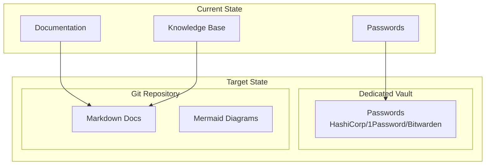
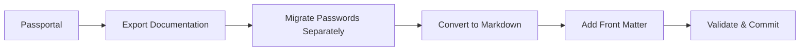
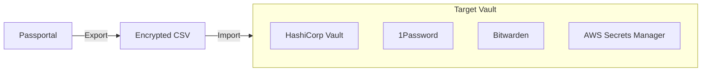

# Migrating from N-able Passportal

This guide covers exporting your documentation from N-able Passportal to platform-independent Markdown files.

## About N-able Passportal

Passportal is a team password protection system with a cloud-based document store. It provides:

- **Password Vault**: Secure credential storage with sharing
- **Documentation Store**: Cloud-based document management
- **Client Records**: Per-client documentation
- **Knowledge Base**: Searchable documentation
- **Audit Logs**: Access and change tracking

## Passportal Strengths

- **Security Focus**: Strong encryption for credentials
- **MSP-Oriented**: Multi-tenant client management
- **Audit Trail**: Compliance-ready logging
- **Browser Extension**: Quick credential access
- **API Access**: REST API for automation

## Why Consider Markdown?

The goal isn't to replace Passportal's password management (you'll want a dedicated secrets manager for that). Instead, consider extracting the **documentation** component to Markdown:



**Key point**: Separate concerns. Passwords stay in a proper vault. Documentation moves to version-controlled Markdown.

## Migration Overview



## Prerequisites

```bash
# Required
python3 --version         # >= 3.8
pip install requests pyyaml

# For password migration (separate process)
# Choose a dedicated secrets manager
```

## Security Warning

> **CRITICAL**: Do NOT export passwords to plain text Markdown files.
>
> Passwords MUST be migrated to a dedicated secrets management solution:
> - HashiCorp Vault
> - 1Password Business
> - Bitwarden
> - AWS Secrets Manager
> - Azure Key Vault

## API Setup

### Step 1: Get API Credentials

1. Log into Passportal
2. Navigate to **Settings** → **API**
3. Generate API credentials
4. Note your instance URL

## Export Script (Documentation Only)

```python
#!/usr/bin/env python3
"""passportal_export.py - Export Passportal documentation (NOT passwords)."""

import os
import requests
from pathlib import Path
from datetime import date
import re
import time
import json

class PassportalExporter:
    """Export documentation from Passportal. DOES NOT export passwords."""

    def __init__(self, instance_url: str, api_key: str, api_secret: str):
        self.base_url = f"{instance_url.rstrip('/')}/api/v1"
        self.auth = (api_key, api_secret)
        self.headers = {"Content-Type": "application/json"}

    def _get(self, endpoint: str, params: dict = None) -> dict:
        """Make authenticated GET request."""
        time.sleep(0.5)  # Rate limiting
        url = f"{self.base_url}/{endpoint}"
        response = requests.get(url, auth=self.auth, headers=self.headers, params=params)
        response.raise_for_status()
        return response.json()

    def _get_paginated(self, endpoint: str) -> list:
        """Get all pages of a paginated endpoint."""
        all_data = []
        page = 1

        while True:
            result = self._get(endpoint, {"page": page, "per_page": 100})
            data = result if isinstance(result, list) else result.get("data", [])
            all_data.extend(data)

            if len(data) < 100:
                break
            page += 1

        return all_data

    def get_clients(self) -> list:
        """Get all clients."""
        return self._get_paginated("clients")

    def get_client(self, client_id: int) -> dict:
        """Get a specific client."""
        return self._get(f"clients/{client_id}")

    def get_documents(self, client_id: int = None) -> list:
        """Get documents (NOT passwords)."""
        endpoint = "documents"
        if client_id:
            endpoint = f"clients/{client_id}/documents"
        return self._get_paginated(endpoint)

    def get_knowledge_base_articles(self) -> list:
        """Get knowledge base articles."""
        try:
            return self._get_paginated("knowledge_base")
        except Exception:
            return []

    # NOTE: We intentionally do NOT have a get_passwords method
    # Passwords should be migrated via Passportal's export to
    # a dedicated secrets manager, NOT to Markdown files

def to_kebab(s: str) -> str:
    """Convert string to kebab-case."""
    if not s:
        return "unnamed"
    return re.sub(r'[^a-z0-9]+', '-', s.lower()).strip('-')

def html_to_markdown(html: str) -> str:
    """Basic HTML to Markdown conversion."""
    if not html:
        return ""

    text = html
    text = re.sub(r'<h1[^>]*>(.*?)</h1>', r'# \1\n', text, flags=re.DOTALL)
    text = re.sub(r'<h2[^>]*>(.*?)</h2>', r'## \1\n', text, flags=re.DOTALL)
    text = re.sub(r'<h3[^>]*>(.*?)</h3>', r'### \1\n', text, flags=re.DOTALL)
    text = re.sub(r'<p[^>]*>(.*?)</p>', r'\1\n\n', text, flags=re.DOTALL)
    text = re.sub(r'<br\s*/?>', '\n', text)
    text = re.sub(r'<strong>(.*?)</strong>', r'**\1**', text)
    text = re.sub(r'<em>(.*?)</em>', r'*\1*', text)
    text = re.sub(r'<code>(.*?)</code>', r'`\1`', text)
    text = re.sub(r'<a href="([^"]+)"[^>]*>(.*?)</a>', r'[\2](\1)', text)
    text = re.sub(r'<li[^>]*>(.*?)</li>', r'- \1\n', text)
    text = re.sub(r'<[^>]+>', '', text)
    text = re.sub(r'\n{3,}', '\n\n', text)

    return text.strip()

def export_client(exporter: PassportalExporter, client: dict, output_dir: Path):
    """Export documentation for a client (NOT passwords)."""

    client_id = client.get("id")
    client_name = client.get("name", f"client-{client_id}")
    client_dir = output_dir / to_kebab(client_name)
    client_dir.mkdir(parents=True, exist_ok=True)

    print(f"Exporting client: {client_name}")

    # Create client overview
    overview = f"""---
title: "{client_name}"
status: published
owner: msp-team
created: {date.today().isoformat()}
updated: {date.today().isoformat()}
tags: [client]
---

# {client_name}

## Overview

| Field | Value |
|-------|-------|
| Client ID | {client_id} |
| Contact | {client.get('contact_name', 'N/A')} |
| Email | {client.get('email', 'N/A')} |
| Phone | {client.get('phone', 'N/A')} |

## Credentials

> **Note**: Credentials are stored in [Your Secrets Manager].
> See the vault entry for this client.

## Documentation

- [Documents](./documents/)

"""
    (client_dir / "README.md").write_text(overview, encoding='utf-8')

    # Export documents
    docs_dir = client_dir / "documents"
    docs_dir.mkdir(exist_ok=True)

    documents = exporter.get_documents(client_id)
    for doc in documents:
        export_document(doc, docs_dir)
    print(f"  Exported {len(documents)} documents")

def export_document(doc: dict, output_dir: Path):
    """Export a document to Markdown."""

    doc_id = doc.get("id")
    title = doc.get("title") or doc.get("name") or f"document-{doc_id}"
    category = doc.get("category", "General")

    content = f"""---
title: "{title}"
status: published
owner: msp-team
created: {date.today().isoformat()}
updated: {date.today().isoformat()}
tags: [document, {to_kebab(category)}]
category: "{category}"
---

# {title}

{html_to_markdown(doc.get('content', doc.get('body', 'No content available.')))}

"""

    filename = to_kebab(title) + ".md"
    (output_dir / filename).write_text(content, encoding='utf-8')

def export_knowledge_base(exporter: PassportalExporter, output_dir: Path):
    """Export knowledge base articles."""

    kb_dir = output_dir / "knowledge-base"
    kb_dir.mkdir(exist_ok=True)

    articles = exporter.get_knowledge_base_articles()

    for article in articles:
        title = article.get("title", "Untitled")
        category = article.get("category", "General")

        content = f"""---
title: "{title}"
status: published
owner: msp-team
created: {date.today().isoformat()}
updated: {date.today().isoformat()}
tags: [knowledge-base, {to_kebab(category)}]
---

# {title}

{html_to_markdown(article.get('content', 'No content available.'))}
"""

        filename = to_kebab(title) + ".md"
        (kb_dir / filename).write_text(content, encoding='utf-8')

    print(f"Exported {len(articles)} knowledge base articles")

def main():
    # Configuration
    INSTANCE_URL = os.environ.get("PASSPORTAL_URL")
    API_KEY = os.environ.get("PASSPORTAL_API_KEY")
    API_SECRET = os.environ.get("PASSPORTAL_API_SECRET")
    OUTPUT_DIR = Path(os.environ.get("OUTPUT_DIR", "./passportal-export"))

    if not all([INSTANCE_URL, API_KEY, API_SECRET]):
        print("Error: Set PASSPORTAL_URL, PASSPORTAL_API_KEY, PASSPORTAL_API_SECRET")
        return

    print("=" * 60)
    print("IMPORTANT: This script exports DOCUMENTATION ONLY")
    print("Passwords must be migrated to a dedicated secrets manager")
    print("=" * 60)
    print()

    OUTPUT_DIR.mkdir(parents=True, exist_ok=True)

    exporter = PassportalExporter(INSTANCE_URL, API_KEY, API_SECRET)

    print("Fetching clients...")
    clients = exporter.get_clients()
    print(f"Found {len(clients)} clients")

    for client in clients:
        export_client(exporter, client, OUTPUT_DIR)

    print("\nExporting knowledge base...")
    export_knowledge_base(exporter, OUTPUT_DIR)

    print(f"\nExport complete! Documentation saved to: {OUTPUT_DIR}")
    print("\nREMINDER: Migrate passwords to a dedicated secrets manager!")

if __name__ == "__main__":
    main()
```

## Password Migration Strategy

Passwords should NOT go to Markdown. Instead:



### Option 1: Export to 1Password

1. Export from Passportal to CSV
2. Import into 1Password using their import tool
3. Set up 1Password CLI for automation

### Option 2: Export to Bitwarden

1. Export from Passportal to CSV
2. Import into Bitwarden
3. Use Bitwarden CLI for scripts

### Option 3: Export to HashiCorp Vault

```bash
# Example: Import credentials to Vault
vault kv put secret/clients/acme/admin \
    username="admin@acme.com" \
    password="$(cat password.txt)"
```

## Referencing Credentials in Markdown

In your Markdown documentation, reference credentials by location, not value:

```markdown
## Server Access

| Server | Credential Location |
|--------|---------------------|
| DC01 | `vault:clients/acme/dc01-admin` |
| SQL01 | `1password:ACME Corp/SQL Server` |
| Firewall | `bitwarden:acme-firewall` |

To retrieve credentials:
```bash
# HashiCorp Vault
vault kv get secret/clients/acme/dc01-admin

# 1Password CLI
op item get "DC01 Admin" --vault "ACME Corp"

# Bitwarden CLI
bw get item acme-firewall
```
```

## Directory Structure

```
passportal-export/
├── acme-corp/
│   ├── README.md              # Client overview (references vault)
│   └── documents/
│       ├── network-overview.md
│       └── onboarding-process.md
├── another-client/
│   └── ...
└── knowledge-base/
    ├── password-policy.md
    └── security-procedures.md
```

## Validation Checklist

- [ ] Documentation exported to Markdown
- [ ] **NO passwords in Markdown files**
- [ ] Credentials migrated to dedicated vault
- [ ] Markdown docs reference vault locations
- [ ] Front matter added to all documents
- [ ] Documents render correctly
- [ ] Old Passportal docs marked as deprecated

## Security Reminders

1. **Audit exported files** - Grep for passwords, API keys, secrets
2. **Use .gitignore** - Exclude any credential files
3. **Rotate credentials** - After migration, rotate all passwords
4. **Access control** - Ensure vault has proper permissions

```bash
# Audit for accidentally exported secrets
grep -r -i "password\|secret\|api.key\|token" ./passportal-export/
```

## References

- [N-able Passportal API](https://documentation.n-able.com/passportal/api/)
- [HashiCorp Vault](https://www.vaultproject.io/)
- [1Password CLI](https://developer.1password.com/docs/cli/)
- [Bitwarden CLI](https://bitwarden.com/help/cli/)
