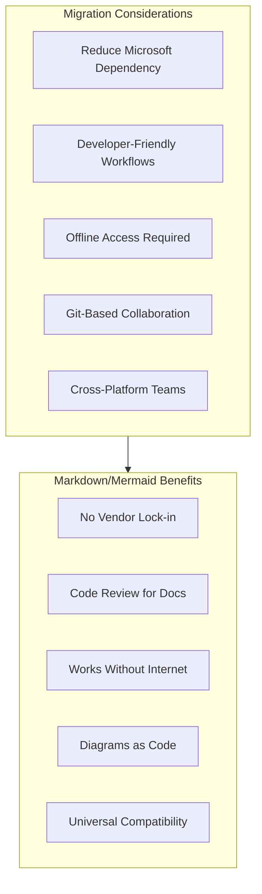

# Migrating from SharePoint

This guide provides a comprehensive approach to migrating your documentation from Microsoft SharePoint to PIMPyourDocs.

## SharePoint Strengths

SharePoint is a powerful enterprise platform with notable capabilities:

- **Microsoft 365 Integration**: Deep integration with Office apps, Teams, and OneDrive
- **Enterprise Security**: Azure AD authentication, compliance, and governance
- **Workflow Automation**: Power Automate integration for document workflows
- **Search**: Microsoft Search across all Microsoft 365 content
- **Permissions**: Granular access control at site, library, and item levels

## Why Consider Markdown?

While SharePoint excels in enterprise environments, Markdown offers complementary benefits:



**Key differentiator**: Markdown documentation travels with your code, renders anywhere, and doesn't require Microsoft licensing.

## Migration Overview


## Prerequisites

```bash
# Required
pandoc --version          # >= 2.x
python3 --version         # >= 3.8

# For SharePoint API access
pip install msal requests
pip install Office365-REST-Python-Client  # Optional: PnP library
```

## Export Methods

### Method 1: Manual Download (Small Sites)

For small documentation sites:

1. Navigate to the SharePoint document library
2. Select all documents
3. Click **Download** (creates a ZIP)
4. Extract and convert

```bash
# Convert downloaded DOCX files
find ./sharepoint-export -name "*.docx" -exec sh -c '
    pandoc -f docx -t markdown "$1" -o "${1%.docx}.md"
' _ {} \;
```

### Method 2: SharePoint REST API (Recommended)

```python
#!/usr/bin/env python3
"""sharepoint_export.py - Export SharePoint documents via REST API."""

import os
import requests
from msal import ConfidentialClientApplication
from pathlib import Path
import subprocess
import re
from datetime import date

class SharePointExporter:
    def __init__(self, tenant_id: str, client_id: str, client_secret: str, site_url: str):
        self.site_url = site_url.rstrip('/')
        self.access_token = self._get_token(tenant_id, client_id, client_secret)

    def _get_token(self, tenant_id: str, client_id: str, client_secret: str) -> str:
        """Authenticate and get access token."""
        app = ConfidentialClientApplication(
            client_id,
            authority=f"https://login.microsoftonline.com/{tenant_id}",
            client_credential=client_secret
        )

        result = app.acquire_token_for_client(
            scopes=["https://graph.microsoft.com/.default"]
        )

        if "access_token" in result:
            return result["access_token"]
        else:
            raise Exception(f"Auth failed: {result.get('error_description')}")

    def _get(self, endpoint: str) -> dict:
        """Make authenticated GET request."""
        headers = {"Authorization": f"Bearer {self.access_token}"}
        response = requests.get(endpoint, headers=headers)
        response.raise_for_status()
        return response.json()

    def _download_file(self, download_url: str, output_path: str):
        """Download a file from SharePoint."""
        headers = {"Authorization": f"Bearer {self.access_token}"}
        response = requests.get(download_url, headers=headers, stream=True)
        response.raise_for_status()

        with open(output_path, 'wb') as f:
            for chunk in response.iter_content(chunk_size=8192):
                f.write(chunk)

    def get_site_id(self) -> str:
        """Get the SharePoint site ID from the site URL."""
        # Extract hostname and site path from URL
        import urllib.parse
        parsed = urllib.parse.urlparse(self.site_url)
        hostname = parsed.netloc
        site_path = parsed.path

        endpoint = f"https://graph.microsoft.com/v1.0/sites/{hostname}:{site_path}"
        result = self._get(endpoint)
        return result["id"]

    def list_document_libraries(self, site_id: str) -> list:
        """List all document libraries in the site."""
        endpoint = f"https://graph.microsoft.com/v1.0/sites/{site_id}/drives"
        result = self._get(endpoint)
        return result.get("value", [])

    def list_items(self, drive_id: str, folder_path: str = "") -> list:
        """List items in a document library or folder."""
        if folder_path:
            endpoint = f"https://graph.microsoft.com/v1.0/drives/{drive_id}/root:/{folder_path}:/children"
        else:
            endpoint = f"https://graph.microsoft.com/v1.0/drives/{drive_id}/root/children"

        result = self._get(endpoint)
        return result.get("value", [])

    def export_library(self, drive_id: str, output_dir: Path, folder_path: str = ""):
        """Recursively export a document library."""
        items = self.list_items(drive_id, folder_path)

        for item in items:
            name = item["name"]
            current_path = f"{folder_path}/{name}" if folder_path else name

            if "folder" in item:
                # Recurse into folder
                subdir = output_dir / to_kebab(name)
                subdir.mkdir(parents=True, exist_ok=True)
                self.export_library(drive_id, subdir, current_path)
            elif "file" in item:
                # Download file
                download_url = item.get("@microsoft.graph.downloadUrl")
                if download_url:
                    self._export_file(item, download_url, output_dir)

    def _export_file(self, item: dict, download_url: str, output_dir: Path):
        """Download and convert a file."""
        name = item["name"]
        mime_type = item.get("file", {}).get("mimeType", "")

        # Handle different file types
        if name.endswith(".docx") or "wordprocessing" in mime_type:
            # Download DOCX
            docx_path = output_dir / name
            self._download_file(download_url, str(docx_path))

            # Convert to Markdown
            md_path = output_dir / (to_kebab(name.replace(".docx", "")) + ".md")
            convert_docx_to_md(docx_path, md_path)
            docx_path.unlink()  # Remove DOCX after conversion

        elif name.endswith(".aspx"):
            # SharePoint page - export via API
            print(f"Note: SharePoint page {name} requires manual export")

        elif name.endswith((".png", ".jpg", ".gif", ".svg", ".pdf")):
            # Keep binary files
            file_path = output_dir / name
            self._download_file(download_url, str(file_path))

        else:
            print(f"Skipping unsupported file: {name}")

def to_kebab(s: str) -> str:
    """Convert string to kebab-case."""
    return re.sub(r'[^a-z0-9]+', '-', s.lower()).strip('-')

def convert_docx_to_md(docx_path: Path, md_path: Path):
    """Convert DOCX to Markdown with front matter."""
    # Run pandoc
    subprocess.run([
        'pandoc', '-f', 'docx', '-t', 'markdown',
        '--wrap=none',
        '--extract-media=./images',
        str(docx_path), '-o', str(md_path)
    ], check=True)

    # Add front matter
    content = md_path.read_text(encoding='utf-8')

    # Extract title from first heading
    title_match = re.search(r'^#\s+(.+)$', content, re.MULTILINE)
    title = title_match.group(1) if title_match else md_path.stem.replace('-', ' ').title()

    front_matter = f"""---
title: "{title}"
status: draft
owner: TBD
created: {date.today().isoformat()}
updated: {date.today().isoformat()}
tags: [migrated-from-sharepoint]
---

"""
    md_path.write_text(front_matter + content, encoding='utf-8')
    print(f"Converted: {md_path}")

def main():
    # Configuration from environment
    TENANT_ID = os.environ.get("AZURE_TENANT_ID")
    CLIENT_ID = os.environ.get("AZURE_CLIENT_ID")
    CLIENT_SECRET = os.environ.get("AZURE_CLIENT_SECRET")
    SITE_URL = os.environ.get("SHAREPOINT_SITE_URL")
    OUTPUT_DIR = Path(os.environ.get("OUTPUT_DIR", "./sharepoint-export"))

    if not all([TENANT_ID, CLIENT_ID, CLIENT_SECRET, SITE_URL]):
        print("Error: Set environment variables:")
        print("  AZURE_TENANT_ID, AZURE_CLIENT_ID, AZURE_CLIENT_SECRET, SHAREPOINT_SITE_URL")
        return

    OUTPUT_DIR.mkdir(parents=True, exist_ok=True)

    exporter = SharePointExporter(TENANT_ID, CLIENT_ID, CLIENT_SECRET, SITE_URL)

    # Get site ID
    site_id = exporter.get_site_id()
    print(f"Site ID: {site_id}")

    # List and export document libraries
    libraries = exporter.list_document_libraries(site_id)

    for lib in libraries:
        lib_name = lib["name"]
        if lib_name in ["Documents", "Shared Documents", "Site Assets"]:
            print(f"\nExporting library: {lib_name}")
            lib_dir = OUTPUT_DIR / to_kebab(lib_name)
            lib_dir.mkdir(exist_ok=True)
            exporter.export_library(lib["id"], lib_dir)

    print(f"\nExport complete! Files saved to: {OUTPUT_DIR}")

if __name__ == "__main__":
    main()
```

### Method 3: PnP PowerShell (Windows)

For Windows environments with PnP PowerShell:

```powershell
# Install PnP PowerShell
Install-Module -Name PnP.PowerShell -Scope CurrentUser

# Connect to SharePoint
Connect-PnPOnline -Url "https://tenant.sharepoint.com/sites/YourSite" -Interactive

# Export all documents from a library
$items = Get-PnPListItem -List "Documents" -PageSize 500

foreach ($item in $items) {
    if ($item.FileSystemObjectType -eq "File") {
        $fileName = $item.FieldValues.FileLeafRef
        $serverRelativeUrl = $item.FieldValues.FileRef

        # Download file
        Get-PnPFile -Url $serverRelativeUrl -Path "./export" -Filename $fileName -AsFile
        Write-Host "Downloaded: $fileName"
    }
}
```

## Handling SharePoint Pages

SharePoint modern pages (.aspx) require special handling:

### Option 1: Copy Content Manually

1. Open the SharePoint page
2. Click **Edit** to see all content
3. Select All (Ctrl+A) and copy
4. Paste into a Markdown editor
5. Clean up formatting

### Option 2: SharePoint API for Pages

```python
def export_sharepoint_page(exporter, site_id: str, page_name: str, output_path: Path):
    """Export a SharePoint modern page to Markdown."""

    # Get page content via Site Pages API
    endpoint = f"https://graph.microsoft.com/v1.0/sites/{site_id}/pages/{page_name}"

    try:
        page = exporter._get(endpoint)

        title = page.get("title", "Untitled")
        content = page.get("webParts", [])

        # Build Markdown content
        md_content = f"""---
title: "{title}"
status: draft
owner: TBD
created: {date.today().isoformat()}
updated: {date.today().isoformat()}
tags: [migrated-from-sharepoint, page]
---

# {title}

"""

        for part in content:
            # Handle different web part types
            part_type = part.get("type", "")
            inner_html = part.get("innerHtml", "")

            if inner_html:
                md_content += html_to_markdown(inner_html) + "\n\n"

        output_path.write_text(md_content, encoding='utf-8')
        print(f"Exported page: {page_name}")

    except Exception as e:
        print(f"Error exporting page {page_name}: {e}")
```

## Handling Wiki Pages (Classic)

Classic SharePoint wiki pages:

```python
def export_wiki_page(content_html: str, output_path: Path, title: str):
    """Convert SharePoint wiki HTML to Markdown."""

    # Clean SharePoint-specific markup
    content = content_html

    # Remove SharePoint DIVs
    content = re.sub(r'<div[^>]*class="[^"]*ExternalClass[^"]*"[^>]*>', '', content)
    content = re.sub(r'</div>', '', content)

    # Convert wiki links [[Page Name]] to Markdown links
    content = re.sub(r'\[\[([^\]]+)\]\]', lambda m: f'[{m.group(1)}](./{to_kebab(m.group(1))}.md)', content)

    # Basic HTML to Markdown conversion
    md_content = html_to_markdown(content)

    # Add front matter
    final = f"""---
title: "{title}"
status: draft
owner: TBD
created: {date.today().isoformat()}
updated: {date.today().isoformat()}
tags: [migrated-from-sharepoint, wiki]
---

# {title}

{md_content}
"""

    output_path.write_text(final, encoding='utf-8')
```

## Handling Lists and Libraries

SharePoint lists can be exported to Markdown tables:

```python
def export_list_to_markdown(exporter, site_id: str, list_name: str, output_path: Path):
    """Export a SharePoint list to a Markdown table."""

    endpoint = f"https://graph.microsoft.com/v1.0/sites/{site_id}/lists/{list_name}/items?expand=fields"
    result = exporter._get(endpoint)
    items = result.get("value", [])

    if not items:
        return

    # Get column names from first item
    fields = items[0].get("fields", {})
    columns = [k for k in fields.keys() if not k.startswith("@")]

    # Build table
    md_content = f"""---
title: "{list_name}"
status: draft
owner: TBD
created: {date.today().isoformat()}
updated: {date.today().isoformat()}
tags: [migrated-from-sharepoint, list]
---

# {list_name}

| {' | '.join(columns)} |
| {' | '.join(['---'] * len(columns))} |
"""

    for item in items:
        fields = item.get("fields", {})
        values = [str(fields.get(col, "")).replace("|", "\\|").replace("\n", " ") for col in columns]
        md_content += f"| {' | '.join(values)} |\n"

    output_path.write_text(md_content, encoding='utf-8')
    print(f"Exported list: {list_name}")
```

## Post-Migration Cleanup

```python
#!/usr/bin/env python3
"""clean_sharepoint.py - Clean SharePoint export artifacts."""

import re
import sys
from pathlib import Path

def clean_sharepoint_markdown(content: str) -> str:
    """Remove SharePoint-specific artifacts."""

    # Remove SharePoint CSS classes
    content = re.sub(r'\{\.ms-[^}]+\}', '', content)

    # Remove SharePoint DIV wrappers
    content = re.sub(r'<div[^>]*data-sp-[^>]*>', '', content)
    content = re.sub(r'</div>', '', content)

    # Clean SharePoint image paths
    content = re.sub(
        r'!\[([^\]]*)\]\(/sites/[^/]+/[^)]+/([^)]+)\)',
        r'',
        content
    )

    # Remove SharePoint metadata
    content = re.sub(r'<!--\s*SharePoint[^>]*-->', '', content)

    # Fix smart quotes
    content = content.replace('"', '"').replace('"', '"')
    content = content.replace(''', "'").replace(''', "'")

    # Clean excessive whitespace
    content = re.sub(r'\n{3,}', '\n\n', content)

    return content.strip()

if __name__ == "__main__":
    for filepath in sys.argv[1:]:
        path = Path(filepath)
        content = path.read_text(encoding='utf-8')
        cleaned = clean_sharepoint_markdown(content)
        path.write_text(cleaned, encoding='utf-8')
        print(f"Cleaned: {filepath}")
```

## Validation Checklist

- [ ] All document libraries exported
- [ ] DOCX files converted to Markdown
- [ ] SharePoint pages migrated (manually or via API)
- [ ] Lists converted to tables where appropriate
- [ ] Images downloaded and paths updated
- [ ] Wiki links converted to relative Markdown links
- [ ] Front matter added to all documents
- [ ] SharePoint-specific markup removed
- [ ] Documents render in GitHub, VS Code, Obsidian

## Common Issues

### Issue: Access Denied

**Symptom:** API returns 403 errors

**Solution:** Ensure Azure AD app has these permissions:
- `Sites.Read.All` (Application)
- `Files.Read.All` (Application)

### Issue: Large Document Libraries

**Symptom:** API timeout or pagination issues

**Solution:** Implement pagination:
```python
def list_all_items(self, drive_id: str):
    """Paginate through all items."""
    all_items = []
    endpoint = f"https://graph.microsoft.com/v1.0/drives/{drive_id}/root/children"

    while endpoint:
        result = self._get(endpoint)
        all_items.extend(result.get("value", []))
        endpoint = result.get("@odata.nextLink")

    return all_items
```

### Issue: Complex Page Layouts

**Symptom:** Modern pages with multiple columns lose structure

**Solution:** Flatten to single-column Markdown or use HTML for complex layouts.

## References

- [Microsoft Graph API - Sites](https://docs.microsoft.com/en-us/graph/api/resources/site)
- [Microsoft Graph API - DriveItem](https://docs.microsoft.com/en-us/graph/api/resources/driveitem)
- [PnP PowerShell](https://pnp.github.io/powershell/)
- [PIMPyourDocs SPEC](../SPEC.md)
