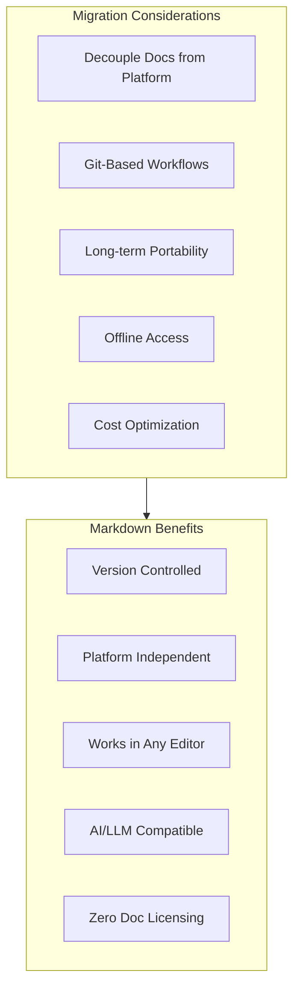
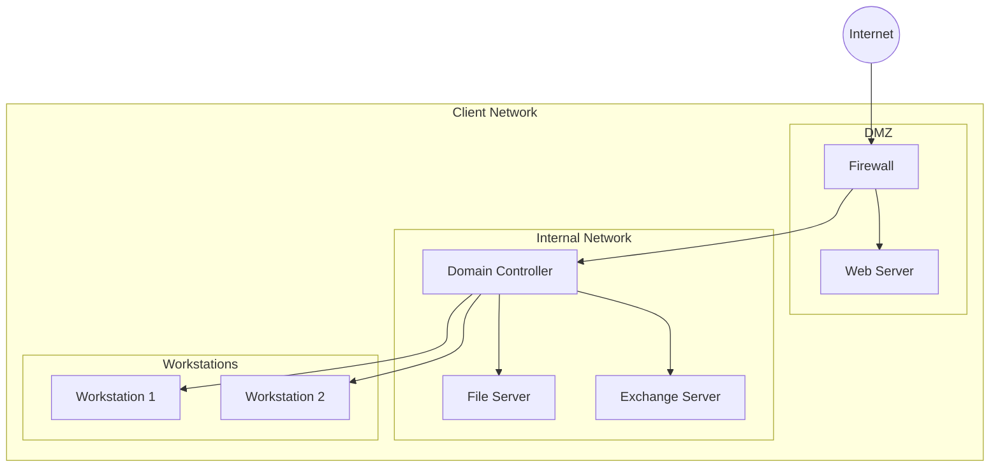

# Migrating from SuperOps

This guide provides a comprehensive approach to migrating your IT documentation from SuperOps to PIMPyourDocs.

## About SuperOps

SuperOps is a SaaS platform that provides both RMM (Remote Monitoring and Management) and PSA (Professional Services Automation) functions for MSPs. Its documentation features include:

- **Asset Documentation**: Records for both managed and unmanaged assets
- **Client Runbooks**: Standard procedures per client
- **Knowledge Base**: Internal documentation repository
- **Configuration Records**: Device and service configurations
- **Network Documentation**: Infrastructure mapping
- **Password Management**: Secure credential storage

## SuperOps Strengths

- **Unified PSA + RMM + Docs**: All-in-one platform
- **Modern Interface**: Clean, intuitive UI
- **Asset Relationships**: Link configurations to assets
- **Template System**: Standardized documentation
- **API Access**: REST API for automation

## Why Consider Markdown?



## Migration Overview


## Prerequisites

```bash
# Required
python3 --version         # >= 3.8
pip install requests pyyaml

# SuperOps API access
# Navigate to: Settings > API > Generate Token
```

## API Setup

### Step 1: Generate API Token

1. Log into SuperOps
2. Navigate to **Settings** → **API**
3. Click **Generate Token**
4. Copy the token immediately
5. Note your instance URL

## Export Script

```python
#!/usr/bin/env python3
"""superops_export.py - Export SuperOps documentation via API."""

import os
import requests
import json
from pathlib import Path
from datetime import date
import re
import time

class SuperOpsExporter:
    def __init__(self, instance_url: str, api_token: str):
        self.base_url = f"{instance_url.rstrip('/')}/api/v1"
        self.headers = {
            "Authorization": f"Bearer {api_token}",
            "Content-Type": "application/json"
        }

    def _get(self, endpoint: str, params: dict = None) -> dict:
        """Make authenticated GET request."""
        time.sleep(0.5)  # Rate limiting
        url = f"{self.base_url}/{endpoint}"
        response = requests.get(url, headers=self.headers, params=params)
        response.raise_for_status()
        return response.json()

    def _get_paginated(self, endpoint: str) -> list:
        """Get all pages of a paginated endpoint."""
        all_data = []
        page = 1

        while True:
            result = self._get(endpoint, {"page": page, "per_page": 100})

            if isinstance(result, list):
                if not result:
                    break
                all_data.extend(result)
                page += 1
            elif isinstance(result, dict):
                data = result.get("data", result.get("items", []))
                all_data.extend(data)

                if not result.get("has_more", False) and page >= result.get("total_pages", 1):
                    break
                page += 1

            if not result:
                break

        return all_data

    def get_clients(self) -> list:
        """Get all clients/organizations."""
        return self._get_paginated("clients")

    def get_client(self, client_id: int) -> dict:
        """Get a specific client."""
        return self._get(f"clients/{client_id}")

    def get_assets(self, client_id: int = None) -> list:
        """Get assets, optionally filtered by client."""
        endpoint = "assets"
        if client_id:
            endpoint = f"clients/{client_id}/assets"
        return self._get_paginated(endpoint)

    def get_asset(self, asset_id: int) -> dict:
        """Get detailed asset information."""
        return self._get(f"assets/{asset_id}")

    def get_configurations(self, client_id: int = None) -> list:
        """Get configurations/documentation items."""
        endpoint = "configurations"
        if client_id:
            endpoint = f"clients/{client_id}/configurations"
        return self._get_paginated(endpoint)

    def get_runbooks(self, client_id: int = None) -> list:
        """Get runbooks/procedures."""
        endpoint = "runbooks"
        if client_id:
            endpoint = f"clients/{client_id}/runbooks"
        return self._get_paginated(endpoint)

    def get_knowledge_base(self) -> list:
        """Get knowledge base articles."""
        return self._get_paginated("knowledge-base")

    def get_passwords(self, client_id: int = None) -> list:
        """Get passwords (requires permission)."""
        endpoint = "passwords"
        if client_id:
            endpoint = f"clients/{client_id}/passwords"
        try:
            return self._get_paginated(endpoint)
        except Exception as e:
            print(f"Note: Password export may require additional permissions: {e}")
            return []

def to_kebab(s: str) -> str:
    """Convert string to kebab-case."""
    if not s:
        return "unnamed"
    return re.sub(r'[^a-z0-9]+', '-', s.lower()).strip('-')

def html_to_markdown(html: str) -> str:
    """Basic HTML to Markdown conversion."""
    if not html:
        return ""

    text = html
    text = re.sub(r'<h1[^>]*>(.*?)</h1>', r'# \1\n', text, flags=re.DOTALL)
    text = re.sub(r'<h2[^>]*>(.*?)</h2>', r'## \1\n', text, flags=re.DOTALL)
    text = re.sub(r'<h3[^>]*>(.*?)</h3>', r'### \1\n', text, flags=re.DOTALL)
    text = re.sub(r'<p[^>]*>(.*?)</p>', r'\1\n\n', text, flags=re.DOTALL)
    text = re.sub(r'<br\s*/?>', '\n', text)
    text = re.sub(r'<strong>(.*?)</strong>', r'**\1**', text)
    text = re.sub(r'<em>(.*?)</em>', r'*\1*', text)
    text = re.sub(r'<code>(.*?)</code>', r'`\1`', text)
    text = re.sub(r'<pre[^>]*>(.*?)</pre>', r'```\n\1\n```', text, flags=re.DOTALL)
    text = re.sub(r'<a href="([^"]+)"[^>]*>(.*?)</a>', r'[\2](\1)', text)
    text = re.sub(r'<li[^>]*>(.*?)</li>', r'- \1\n', text)
    text = re.sub(r'<[^>]+>', '', text)
    text = re.sub(r'\n{3,}', '\n\n', text)

    return text.strip()

def export_client(exporter: SuperOpsExporter, client: dict, output_dir: Path):
    """Export all documentation for a client."""

    client_id = client.get("id")
    client_name = client.get("name", f"client-{client_id}")
    client_dir = output_dir / to_kebab(client_name)
    client_dir.mkdir(parents=True, exist_ok=True)

    print(f"Exporting client: {client_name}")

    # Create client overview
    overview = f"""---
title: "{client_name}"
status: published
owner: msp-team
created: {date.today().isoformat()}
updated: {date.today().isoformat()}
tags: [client, organization]
superops_id: {client_id}
---

# {client_name}

## Overview

| Field | Value |
|-------|-------|
| Client ID | {client_id} |
| Email | {client.get('email', 'N/A')} |
| Phone | {client.get('phone', 'N/A')} |
| Address | {client.get('address', 'N/A')} |

## Documentation

- [Assets](./assets/)
- [Configurations](./configurations/)
- [Runbooks](./runbooks/)

"""
    (client_dir / "README.md").write_text(overview, encoding='utf-8')

    # Export assets
    assets_dir = client_dir / "assets"
    assets_dir.mkdir(exist_ok=True)

    assets = exporter.get_assets(client_id)
    for asset in assets:
        export_asset(asset, assets_dir)
    print(f"  Exported {len(assets)} assets")

    # Export configurations
    configs_dir = client_dir / "configurations"
    configs_dir.mkdir(exist_ok=True)

    configs = exporter.get_configurations(client_id)
    for config in configs:
        export_configuration(config, configs_dir)
    print(f"  Exported {len(configs)} configurations")

    # Export runbooks
    runbooks_dir = client_dir / "runbooks"
    runbooks_dir.mkdir(exist_ok=True)

    runbooks = exporter.get_runbooks(client_id)
    for runbook in runbooks:
        export_runbook(runbook, runbooks_dir)
    print(f"  Exported {len(runbooks)} runbooks")

def export_asset(asset: dict, output_dir: Path):
    """Export an asset to Markdown."""

    asset_id = asset.get("id")
    name = asset.get("name") or asset.get("hostname") or f"asset-{asset_id}"
    asset_type = asset.get("type", "Unknown")

    content = f"""---
title: "{name}"
status: published
owner: msp-team
created: {date.today().isoformat()}
updated: {date.today().isoformat()}
tags: [asset, {to_kebab(asset_type)}]
superops_id: {asset_id}
asset_type: "{asset_type}"
---

# {name}

## Overview

| Field | Value |
|-------|-------|
| Type | {asset_type} |
| Hostname | {asset.get('hostname', 'N/A')} |
| IP Address | {asset.get('ip_address', 'N/A')} |
| MAC Address | {asset.get('mac_address', 'N/A')} |
| Serial Number | {asset.get('serial_number', 'N/A')} |
| Manufacturer | {asset.get('manufacturer', 'N/A')} |
| Model | {asset.get('model', 'N/A')} |
| Operating System | {asset.get('operating_system', 'N/A')} |
| Status | {asset.get('status', 'N/A')} |

"""

    # Add custom fields
    custom_fields = asset.get("custom_fields", {})
    if custom_fields:
        content += "## Custom Fields\n\n"
        for key, value in custom_fields.items():
            if value:
                content += f"- **{key}**: {value}\n"
        content += "\n"

    # Add notes
    notes = asset.get("notes", "")
    if notes:
        content += f"""## Notes

{html_to_markdown(notes)}

"""

    filename = to_kebab(name) + ".md"
    (output_dir / filename).write_text(content, encoding='utf-8')

def export_configuration(config: dict, output_dir: Path):
    """Export a configuration to Markdown."""

    config_id = config.get("id")
    name = config.get("name", f"config-{config_id}")
    config_type = config.get("type", "General")

    content = f"""---
title: "{name}"
status: published
owner: msp-team
created: {date.today().isoformat()}
updated: {date.today().isoformat()}
tags: [configuration, {to_kebab(config_type)}]
superops_id: {config_id}
config_type: "{config_type}"
---

# {name}

**Type:** {config_type}

## Configuration Details

{html_to_markdown(config.get('content', config.get('description', 'No content available.')))}

"""

    # Add related assets
    related = config.get("related_assets", [])
    if related:
        content += "## Related Assets\n\n"
        for asset in related:
            asset_name = asset.get("name", "Unknown")
            content += f"- [{asset_name}](../assets/{to_kebab(asset_name)}.md)\n"
        content += "\n"

    filename = to_kebab(name) + ".md"
    (output_dir / filename).write_text(content, encoding='utf-8')

def export_runbook(runbook: dict, output_dir: Path):
    """Export a runbook to Markdown."""

    runbook_id = runbook.get("id")
    name = runbook.get("name", f"runbook-{runbook_id}")

    content = f"""---
title: "{name}"
status: published
owner: msp-team
created: {date.today().isoformat()}
updated: {date.today().isoformat()}
tags: [runbook, procedure]
superops_id: {runbook_id}
---

# {name}

## Overview

{runbook.get('description', 'No description available.')}

## Procedure

{html_to_markdown(runbook.get('content', runbook.get('steps', 'No steps defined.')))}

"""

    filename = to_kebab(name) + ".md"
    (output_dir / filename).write_text(content, encoding='utf-8')

def export_knowledge_base(exporter: SuperOpsExporter, output_dir: Path):
    """Export knowledge base articles."""

    kb_dir = output_dir / "knowledge-base"
    kb_dir.mkdir(exist_ok=True)

    articles = exporter.get_knowledge_base()

    for article in articles:
        title = article.get("title", "Untitled")
        category = article.get("category", "General")

        content = f"""---
title: "{title}"
status: published
owner: msp-team
created: {date.today().isoformat()}
updated: {date.today().isoformat()}
tags: [knowledge-base, {to_kebab(category)}]
category: "{category}"
---

# {title}

{html_to_markdown(article.get('content', 'No content available.'))}
"""

        filename = to_kebab(title) + ".md"
        (kb_dir / filename).write_text(content, encoding='utf-8')

    print(f"Exported {len(articles)} knowledge base articles")

def main():
    # Configuration
    INSTANCE_URL = os.environ.get("SUPEROPS_URL")
    API_TOKEN = os.environ.get("SUPEROPS_API_TOKEN")
    OUTPUT_DIR = Path(os.environ.get("OUTPUT_DIR", "./superops-export"))

    if not INSTANCE_URL or not API_TOKEN:
        print("Error: Set SUPEROPS_URL and SUPEROPS_API_TOKEN environment variables")
        return

    OUTPUT_DIR.mkdir(parents=True, exist_ok=True)

    print("Connecting to SuperOps API...")
    exporter = SuperOpsExporter(INSTANCE_URL, API_TOKEN)

    print("Fetching clients...")
    clients = exporter.get_clients()
    print(f"Found {len(clients)} clients")

    for client in clients:
        export_client(exporter, client, OUTPUT_DIR)

    # Export global knowledge base
    print("\nExporting knowledge base...")
    export_knowledge_base(exporter, OUTPUT_DIR)

    print(f"\nExport complete! Files saved to: {OUTPUT_DIR}")

if __name__ == "__main__":
    main()
```

## Running the Export

```bash
export SUPEROPS_URL="https://your-instance.superops.ai"
export SUPEROPS_API_TOKEN="your-api-token"
export OUTPUT_DIR="./superops-export"

python3 superops_export.py
```

## Directory Structure

```
superops-export/
├── acme-corp/
│   ├── README.md              # Client overview
│   ├── assets/
│   │   ├── server-01.md
│   │   └── workstation-001.md
│   ├── configurations/
│   │   ├── network-config.md
│   │   └── backup-settings.md
│   └── runbooks/
│       ├── onboarding.md
│       └── monthly-maintenance.md
├── another-client/
│   └── ...
└── knowledge-base/
    ├── vpn-setup.md
    └── password-policy.md
```

## Creating Network Diagrams

Convert network documentation to Mermaid:



## Validation Checklist

- [ ] All clients exported
- [ ] Assets include key identification fields
- [ ] Configurations converted from HTML
- [ ] Runbooks have clear procedure steps
- [ ] Knowledge base articles exported
- [ ] Network diagrams created
- [ ] Front matter on all documents
- [ ] Documents render correctly

## References

- [SuperOps API Documentation](https://docs.superops.ai/api)
- [PIMPyourDocs SPEC](../SPEC.md)
- [Mermaid Diagram Syntax](../diagrams/index.md)
