# Incident Report: {INCIDENT_TITLE}

---
title: "{INCIDENT_TITLE}"
status: draft | review | published
owner: "{INCIDENT_COMMANDER}"
created: {YYYY-MM-DD}
updated: {YYYY-MM-DD}
tags: [incident, {severity}, {service}]
incident_id: INC-{NUMBER}
---

## Summary

| Field | Value |
|-------|-------|
| **Incident ID** | INC-{NUMBER} |
| **Severity** | SEV1 / SEV2 / SEV3 |
| **Status** | Resolved |
| **Duration** | {X hours Y minutes} |
| **Affected Services** | {service1}, {service2} |
| **Customer Impact** | {description} |
| **Incident Commander** | @{name} |

### One-Line Summary

{One sentence describing what happened and the impact.}

---

## Timeline

All times in UTC.

```mermaid
gantt
    title Incident Timeline
    dateFormat HH:mm
    axisFormat %H:%M
    
    section Detection
    Alert fired           :milestone, 14:30, 0m
    
    section Response
    IC assigned           :14:35, 5m
    Investigation         :14:40, 20m
    Root cause identified :milestone, 15:00, 0m
    
    section Mitigation
    Fix deployed          :15:00, 15m
    Verification          :15:15, 10m
    Incident resolved     :milestone, 15:25, 0m
```



| Time (UTC) | Event |
|------------|-------|
| 14:30 | Alert fired: {alert_name} |
| 14:32 | On-call paged |
| 14:35 | IC assigned: @{name} |
| 14:40 | Investigation began |
| 15:00 | Root cause identified |
| 15:15 | Fix deployed |
| 15:25 | Incident resolved |
| 15:30 | All-clear communicated |

---

## Impact

### Customer Impact

- **Users affected:** {N} users / {X}% of traffic
- **Duration of impact:** {X minutes}
- **Error rate:** Increased from {X}% to {Y}%
- **Failed requests:** ~{N} requests

### Business Impact

- **Revenue impact:** ${X} estimated
- **SLA breach:** Yes/No
- **Support tickets:** {N} tickets created

### Internal Impact

- **Teams involved:** {team1}, {team2}
- **Person-hours spent:** {N} hours

---

## Root Cause

### What Happened

{Detailed technical explanation of what caused the incident.}

### Contributing Factors

1. **Primary cause:** {description}
2. **Contributing factor:** {description}
3. **Contributing factor:** {description}

### Why Detection Was Delayed (if applicable)

{Explanation of any gaps in monitoring or alerting.}

---

## Resolution

### Immediate Mitigation

{What was done to stop the bleeding.}

```bash
# Commands executed
{command}
```

### Permanent Fix

{What was done to fully resolve the issue.}

**PR/Commit:** {link}

---

## Detection

### How Was This Detected?

- [ ] Automated alerting
- [ ] Customer report
- [ ] Internal report
- [ ] Monitoring dashboard
- [ ] Other: {specify}

### Alert Performance

| Metric | Value |
|--------|-------|
| Time to alert | {X minutes} |
| Alert accuracy | Correct / False positive |
| Alert actionability | Clear / Unclear |

---

## Response Analysis

### What Went Well

- {Positive aspect of response}
- {Positive aspect of response}

### What Could Be Improved

- {Area for improvement}
- {Area for improvement}

### Luck Factors

{Things that could have made this worse or better by chance.}

---

## Lessons Learned

### Key Takeaways

1. {Lesson 1}
2. {Lesson 2}
3. {Lesson 3}

---

## Action Items

| ID | Action | Owner | Priority | Due Date | Status |
|----|--------|-------|----------|----------|--------|
| 1 | {action} | @{name} | P0 | {date} | Open |
| 2 | {action} | @{name} | P1 | {date} | Open |
| 3 | {action} | @{name} | P2 | {date} | Open |

### Prevention

Actions to prevent this class of incident:

- [ ] {action}
- [ ] {action}

### Detection

Actions to detect this faster:

- [ ] {action}
- [ ] {action}

### Response

Actions to respond better:

- [ ] {action}
- [ ] {action}

---

## Supporting Information

### Relevant Logs

```
{key log entries}
```

### Relevant Metrics

{Screenshots or links to dashboards}

### Related Incidents

| Incident | Relationship |
|----------|--------------|
| INC-{N} | Similar root cause |
| INC-{N} | Same service |

### External References

- [Slack thread]({link})
- [PagerDuty incident]({link})
- [Fix PR]({link})

---

## Review

### Reviewers

- [ ] @{technical_reviewer}
- [ ] @{team_lead}
- [ ] @{stakeholder}

### Review Comments

{Space for reviewer feedback}

---

## Appendix

### Glossary

| Term | Definition |
|------|------------|
| {term} | {definition} |

### Technical Details

{Any additional technical context that doesn't fit above.}

---

*This incident report follows the [PIMPyourDocs](../README.md) incident template.*
