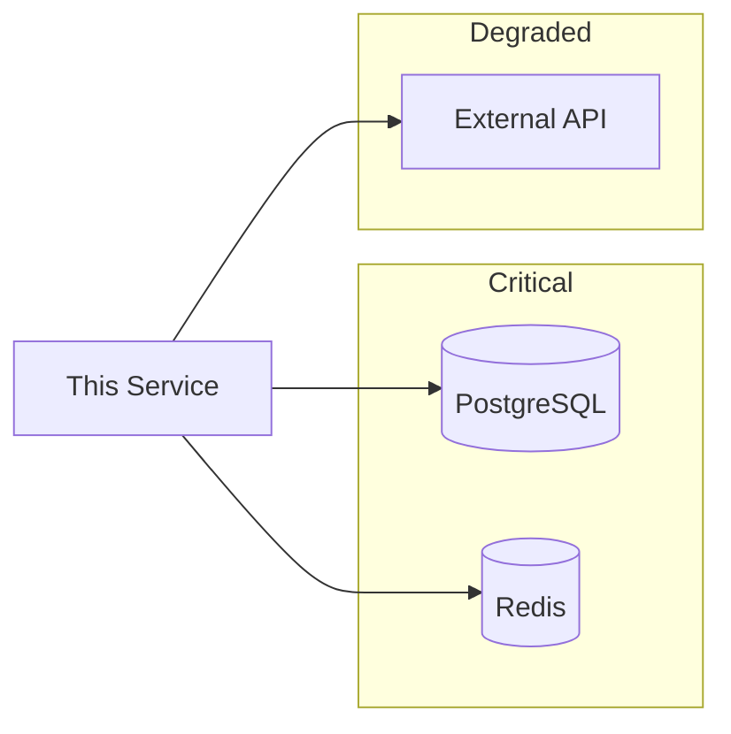

# {SERVICE_NAME} Runbook

---
title: "{SERVICE_NAME} Runbook"
status: published
owner: "{TEAM_NAME}"
created: {YYYY-MM-DD}
updated: {YYYY-MM-DD}
tags: [runbook, operations, {service}]
---

## Quick Reference

| Resource | Link |
|----------|------|
| Dashboards | {grafana-link} |
| Logs | {logging-link} |
| Alerts | {alertmanager-link} |
| On-call | {pagerduty-link} |
| Slack | #{channel} |

---

## Service Overview

Brief reminder of what this service does and its critical functions.

### SLOs

| SLO | Target | Current Dashboard |
|-----|--------|-------------------|
| Availability | 99.9% | [Link] |
| Latency (p99) | < 200ms | [Link] |
| Error Rate | < 0.1% | [Link] |

### Dependencies



---

## Common Alerts

### 🔴 {ALERT_NAME}: High Error Rate

**Severity:** Critical  
**Threshold:** Error rate > 1% for 5 minutes

**Symptoms:**
- Increased 5xx responses
- User-facing errors

**Investigation:**
1. Check error logs: `{log-query}`
2. Check dependent services
3. Check recent deployments

**Resolution:**

```bash
# Check pod status
kubectl get pods -n {namespace} -l app={service}

# Check recent logs
kubectl logs -n {namespace} -l app={service} --tail=100

# Rollback if recent deploy
kubectl rollout undo deployment/{service} -n {namespace}
```

**Escalation:** If unresolved after 15 minutes, escalate to {team}.

---

### 🟡 {ALERT_NAME}: High Latency

**Severity:** Warning  
**Threshold:** p99 latency > 500ms for 10 minutes

**Symptoms:**
- Slow API responses
- Timeout errors in clients

**Investigation:**
1. Check database query times
2. Check external API latency
3. Check pod resource usage

**Resolution:**

```bash
# Check resource usage
kubectl top pods -n {namespace} -l app={service}

# Check database connections
kubectl exec -it {pod} -- psql -c "SELECT * FROM pg_stat_activity;"

# Scale if needed
kubectl scale deployment/{service} -n {namespace} --replicas=5
```

---

### 🟡 {ALERT_NAME}: Database Connection Pool Exhausted

**Severity:** Warning  
**Threshold:** Available connections < 10%

**Investigation:**
1. Check for connection leaks
2. Check for long-running transactions
3. Check for sudden traffic spike

**Resolution:**

```bash
# Kill idle connections
kubectl exec -it {pod} -- psql -c "
  SELECT pg_terminate_backend(pid) 
  FROM pg_stat_activity 
  WHERE state = 'idle' 
  AND query_start < NOW() - INTERVAL '10 minutes';
"

# Restart pods to reset connections
kubectl rollout restart deployment/{service} -n {namespace}
```

---

## Common Procedures

### Restarting the Service

```bash
# Rolling restart (zero downtime)
kubectl rollout restart deployment/{service} -n {namespace}

# Watch progress
kubectl rollout status deployment/{service} -n {namespace}
```

### Scaling the Service

```bash
# Scale up
kubectl scale deployment/{service} -n {namespace} --replicas={N}

# Auto-scale (if HPA configured)
kubectl get hpa -n {namespace}
```

### Checking Logs

```bash
# Recent logs
kubectl logs -n {namespace} -l app={service} --tail=100

# Logs with timestamp filter
kubectl logs -n {namespace} -l app={service} --since=1h

# Stream logs
kubectl logs -n {namespace} -l app={service} -f
```

### Database Operations

```bash
# Connect to database
kubectl exec -it {pod} -- psql $DATABASE_URL

# Check slow queries
SELECT pid, now() - pg_stat_activity.query_start AS duration, query
FROM pg_stat_activity
WHERE state != 'idle'
ORDER BY duration DESC;

# Kill a query
SELECT pg_cancel_backend({pid});
```

### Cache Operations

```bash
# Connect to Redis
kubectl exec -it {redis-pod} -- redis-cli

# Check memory usage
INFO memory

# Flush cache (DANGER)
FLUSHALL
```

---

## Rollback Procedures

### Application Rollback

```bash
# View rollout history
kubectl rollout history deployment/{service} -n {namespace}

# Rollback to previous version
kubectl rollout undo deployment/{service} -n {namespace}

# Rollback to specific revision
kubectl rollout undo deployment/{service} -n {namespace} --to-revision={N}
```

### Database Rollback

**⚠️ DANGER: Coordinate with team before executing**

```bash
# List available backups
{backup-list-command}

# Restore from backup
{restore-command}
```

### Feature Flag Rollback

```bash
# Disable feature flag
{feature-flag-disable-command}
```

---

## Maintenance Procedures

### Scheduled Maintenance Window

1. Notify stakeholders (Slack: #{channel})
2. Enable maintenance mode: `{command}`
3. Perform maintenance
4. Disable maintenance mode: `{command}`
5. Verify service health
6. Notify completion

### Database Migrations

```bash
# Check migration status
{migration-status-command}

# Run migrations
{migration-run-command}

# Rollback migration (if needed)
{migration-rollback-command}
```

---

## Disaster Recovery

### Complete Service Failure

1. **Assess:** Confirm all pods are down
2. **Notify:** Alert #incident-response
3. **Isolate:** If cascading, isolate affected services
4. **Recover:** Follow recovery steps below
5. **Verify:** Confirm service health
6. **Document:** Create incident report

### Recovery Steps

```bash
# 1. Check cluster health
kubectl get nodes

# 2. Redeploy service
kubectl apply -f {manifest-path}

# 3. Verify deployment
kubectl get pods -n {namespace} -l app={service}

# 4. Check service health
curl https://{service-url}/health
```

### Data Recovery

1. Contact DBA team
2. Identify backup to restore
3. Follow database restore procedure
4. Verify data integrity

---

## Useful Queries

### Log Queries

```
# Errors in last hour
{logging-query-errors}

# Slow requests
{logging-query-slow}

# By trace ID
{logging-query-trace}
```

### Metric Queries

```promql
# Request rate
rate(http_requests_total{service="{service}"}[5m])

# Error rate
rate(http_requests_total{service="{service}", status=~"5.."}[5m])
/ rate(http_requests_total{service="{service}"}[5m])

# Latency p99
histogram_quantile(0.99, rate(http_request_duration_seconds_bucket{service="{service}"}[5m]))
```

---

## Contacts

| Role | Contact | When to Escalate |
|------|---------|------------------|
| Primary On-call | {pagerduty} | First responder |
| Team Lead | @{name} | Decisions needed |
| DBA | @{name} | Database issues |
| Platform | @{name} | Infrastructure issues |

---

*Last verified: {DATE}*
