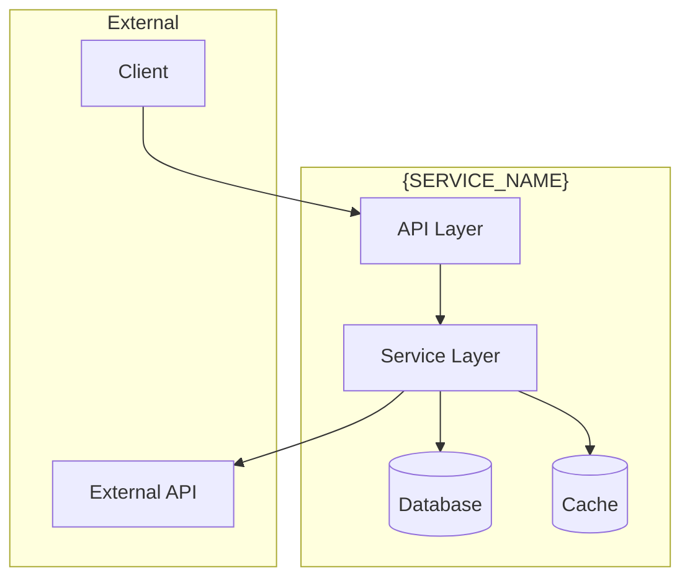
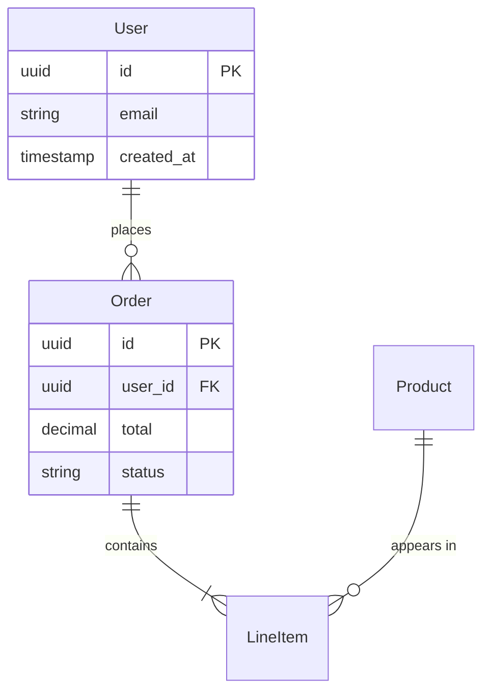
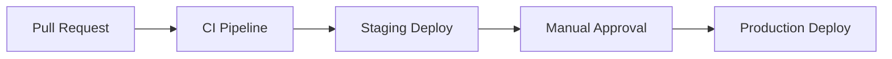

# {SERVICE_NAME}

---
title: "{SERVICE_NAME}"
status: draft | published
owner: "{TEAM_NAME}"
created: {YYYY-MM-DD}
updated: {YYYY-MM-DD}
tags: [service, {domain}]
repo: https://github.com/org/repo
---

## Overview

One paragraph description of what this service does and why it exists.

## Architecture



## Responsibilities

What this service MUST do:
- Responsibility 1
- Responsibility 2

What this service MUST NOT do:
- Anti-responsibility 1

## Dependencies

### Upstream (this service depends on)

| Service | Purpose | Criticality |
|---------|---------|-------------|
| {service} | {why} | Critical / Degraded / Optional |

### Downstream (depends on this service)

| Service | Purpose | 
|---------|---------|
| {service} | {why} |

## Configuration

### Environment Variables

| Variable | Required | Default | Description |
|----------|----------|---------|-------------|
| `DATABASE_URL` | Yes | — | PostgreSQL connection string |
| `REDIS_URL` | No | `redis://localhost:6379` | Redis connection string |
| `LOG_LEVEL` | No | `info` | Logging verbosity |

### Feature Flags

| Flag | Default | Description |
|------|---------|-------------|
| `ENABLE_NEW_FEATURE` | `false` | Enables experimental feature X |

## API

See [api.md](./api.md) for full API documentation.

### Quick Reference

| Endpoint | Method | Description |
|----------|--------|-------------|
| `/health` | GET | Health check |
| `/api/v1/resource` | GET | List resources |
| `/api/v1/resource/{id}` | GET | Get resource |

## Data

### Schema Overview



### Data Retention

| Data Type | Retention | Reason |
|-----------|-----------|--------|
| User data | 7 years | Legal requirement |
| Logs | 90 days | Debugging |
| Metrics | 13 months | Capacity planning |

## Operations

### Health Checks

| Check | Endpoint | Expected |
|-------|----------|----------|
| Liveness | `/health/live` | HTTP 200 |
| Readiness | `/health/ready` | HTTP 200 |

### Key Metrics

| Metric | Type | Alert Threshold |
|--------|------|-----------------|
| `request_duration_seconds` | Histogram | p99 > 500ms |
| `error_rate` | Counter | > 1% over 5min |
| `db_connection_pool` | Gauge | < 10% available |

### Runbook

See [runbook.md](./runbook.md) for operational procedures.

## Development

### Local Setup

```bash
# Clone repository
git clone {REPO_URL}
cd {SERVICE_NAME}

# Install dependencies
make install

# Run locally
make dev

# Run tests
make test
```

### Testing

```bash
# Unit tests
make test-unit

# Integration tests
make test-integration

# All tests
make test
```

## Deployment

### Requirements

- Kubernetes 1.28+
- PostgreSQL 14+
- Redis 7+

### Deployment Process



## Contacts

| Role | Contact |
|------|---------|
| Team | {team-name} |
| Slack | #{channel} |
| On-call | {pagerduty-link} |

## Related Documentation

- [Architecture Decision Records](../architecture/decisions/)
- [API Documentation](./api.md)
- [Runbook](./runbook.md)
